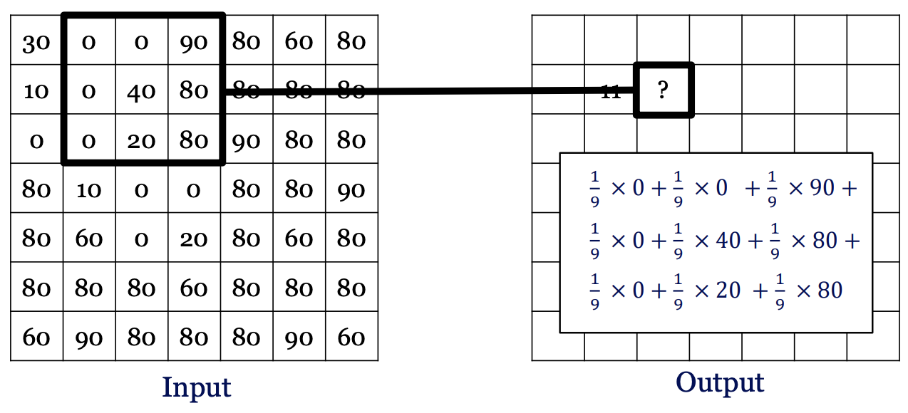
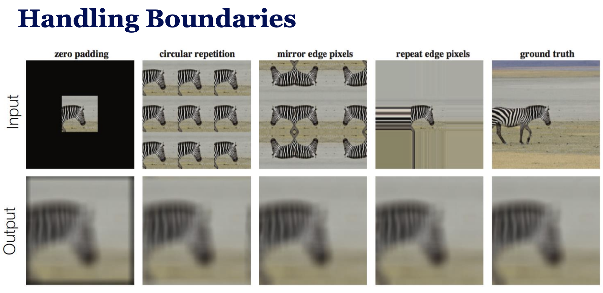
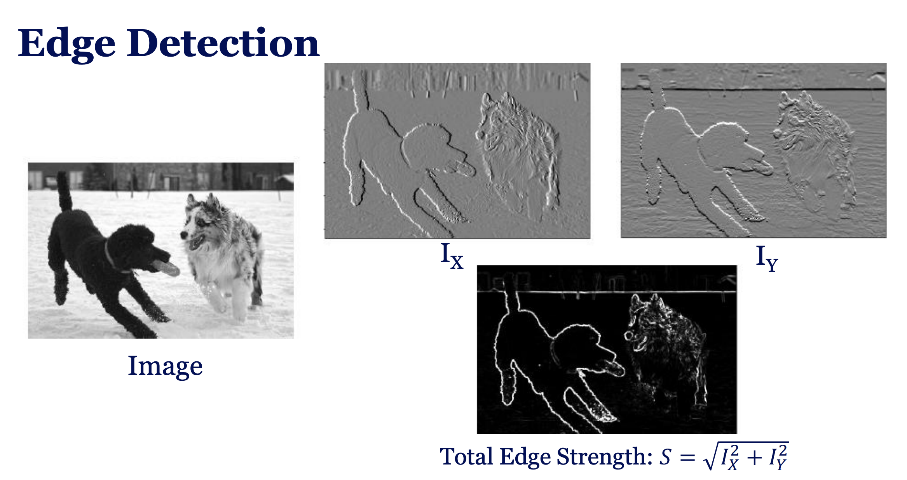
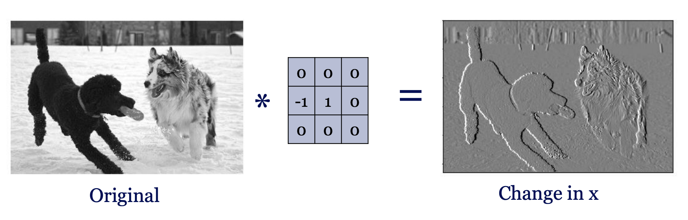
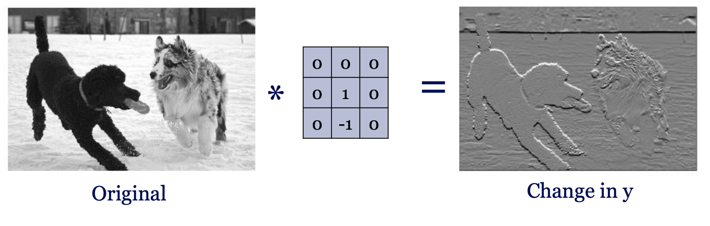

### *Image Filtering* in Computer Vision.
* Two big problems we try to solve with filters:
  1. **Denoising** → remove random noise by averaging.
  2. **Edge Detection** → find boundaries of objects by detecting intensity changes.
* They both solved using **neighborhood filtering** (convolution) so CNNs are based on them.

---

### Denoising

#### **Solution: Moving Average Filter**

**Filter kernel** $\to$ Weighted Average of Neighbors like

$$K = \frac{1}{9} \begin{bmatrix} 1 & 1 & 1 \\ 1 & 1 & 1 \\ 1 & 1 & 1 \end{bmatrix}$$

and we apply it to each pixel:

#### Issues:

1- **Boundries will be empty this way** $\to$ Handling Boundaries:

2- **Bigger filters** $\to$ More Smoothing (over blur) but more computation.

#### Other Filters:
##### Sharpening Filters

* Instead of averaging, we can design filters to **highlight changes**. Example sharpening filter:

$$\text{Filter Kernel} = \begin{bmatrix} 0 & 0 & 0 \\ 0 & 2 & 0 \\ 0 & 0 & 0 \end{bmatrix} - \frac{1}{9} \begin{bmatrix} 1 & 1 & 1 \\ 1 & 1 & 1 \\ 1 & 1 & 1 \end{bmatrix}$$

This keeps the center pixel strong but subtracts the average of neighbors → edges stand out.

---

### Edge Detection

* Goal: detect object boundaries. 
* Steps:

  1. Convert to grayscale by averaging R, G, B values:

$$I_\text{gray}(x,y) = \frac{1}{3}(I_r + I_g + I_b)$$

2. Compute **gradients** (changes in intensity):

$$\nabla I = \left(\frac{dI}{dx}, \frac{dI}{dy}\right)$$

Approximation:
     $\frac{dI}{dx} \approx I(x,y) - I(x-1,y)$.
  3. Edge strength:

$$E(x,y) = \sqrt{\left(\frac{dI}{dx}\right)^2 + \left(\frac{dI}{dy}\right)^2}$$

4. Edge orientation:

$$\theta(x,y) = \arctan\left(\frac{\partial I / \partial y}{\partial I / \partial x}\right)$$

---

## Edge Detection with Filters

* Gradient in **x** direction:

$$\begin{bmatrix} 0 & 0 & 0 \\ -1 & 1 & 0 \\ 0 & 0 & 0 \end{bmatrix}$$

* Gradient in **y** direction:

$$\begin{bmatrix} 0 & 0 & 0 \\ 0 & 1 & 0 \\ 0 & -1 & 0 \end{bmatrix}$$

Apply these filters → gives maps of intensity change → edges.

 

