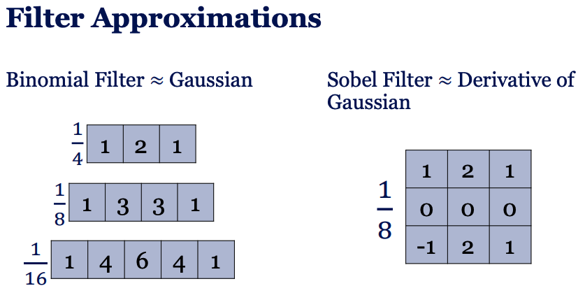
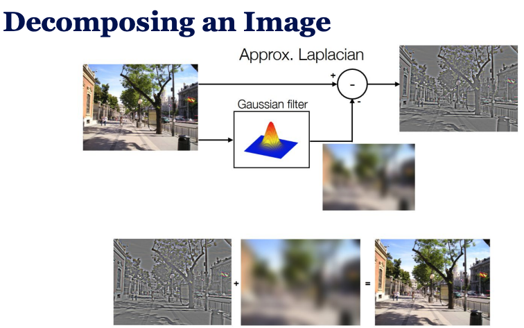
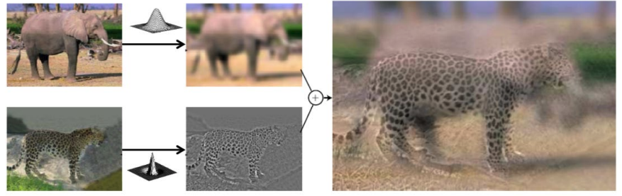
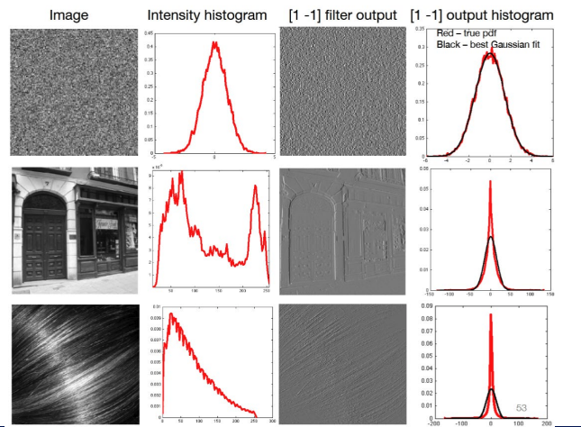

### Linear Filtering

**Basic Operations like**: Rotation, Scaling, rgb2gray, Defocus, Denoising, Edge Detection

Liner transformations

$$f[n,m] = \sum_{k=0}^{N-1} \sum_{l=0}^{M-1} h[n,m,k,l] g[k,l]$$

or equivalent matrix multiplications $H: f = H g$ output pixel at `(n,m)` depends on **all input pixels `(k,l)`** with weights given by `h`

So here the filter $h[n,m,k,l]$ is depandent on input and output coordinates **can behave differently at every pixel**

The **solution** is **translation invariance**: We want the same filter everywhere in the image.

### Linear Translation Invariant (LTI) Systems

**Cross-correlation** and **convolution** are both linear and **translation invariant** operations when applied with a fixed kernel. They differ only by a kernel flip.

#### Cross-Correlation

$$f[n,m] = g o h = \sum_{k=-N}^{N} \sum_{l=-N}^{N} g[n+k,m+l] h[k,l]$$

**h** kernel is $(-N,N) \times (-N,N)$ sized.

Example usage: **Zero padding**

#### Convolution

The **kernel is flipped** in comparison to cross-correlation.

**Properties of Convolution:**
- Commutative (no distinction between filter and image $hog = goh$)
- Associative (order of 2 convolutions doesnt matter $f o (g o h) = (f o g) o h$)
- Distributive over addition $f o (g + h) = f o g + f o h$

$$f[n,m] = g o h = \sum_{k=-N}^{N} \sum_{l=-N}^{N} g[n - k,m - l] h[k,l]$$

Index goes backwards in g and nicer in mathematics.

If **filter is symmetric**, convolution and cross-correlation are the **same**.
### More Neighborhood Filters

Many real-world image problems =  unknown convolution kernel + clean image

Blurring removes high-frequency details

- **Rectangular filters (box filters)**
    - **Horizontal rectangular filter**: Kernel is wide and short → horizontal motion blur
    - **Vertical rectangular filter**: Kernel is tall and thin → vertical motion blur

Box filters make image ugly as problems are:
- All neighbors get equal weight
- Sharp edges are destroyed
- Looks unnatural

**Solution** is a **fuzzy blob** kernel (In mathematics: **Gaussian kernel**)

#### Gaussian Kernel

$$G(x,y) = \frac{1}{2\pi\sigma^2} \exp\left(-\frac{x^2 + y^2}{2\sigma^2}\right)$$

$σ$ = how strong the blur is

- The center pixel has the highest weight
- Neighbor pixels have smaller weights
- Weights decrease smoothly with distance
- The shape is round and smooth

Gaussian filtering produces smoother and more natural blur than box filtering because it weights pixels based on distance.

The convolution of two Gaussian filters results in another Gaussian filter with increased standard deviation.

$σ$ o $σ$ = $σ\sqrt{2}$

Blurring many times with small σ ≈ blurring once with a larger σ

##### Gaussian filters are separable

A 2D Gaussian filter can be separated into two 1D filters (x and y)

Applying two 1D filters $O(2N)$ is more efficient than applying one 2D filter $O(N^2)$

---

#### Derivative Filters

Measure rate of change in an image

- If two neighboring pixels are similar → small value
- If very different → large value → edge

##### Problem with simple derivative filters
- They react to everything, Noise, Texture, Tiny changes
- So the derivative image looks: Very noisy, Hard to tell where the real edge is

##### Solution: Smooth first
- Step 1: Smooth first using **Gaussian filter**
- Step 2: Then apply derivative filter: Removes noise, keeps important edges
- Easier way: **Derivative of Gaussian filter (DoG)**

Combine steps 1 and 2 into one filter by convolving Gaussian + derivative filter:

$$\frac{d}{dx}(f*h) = f * \frac{d}{dx}h$$

Can happen in :
- x-direction → detects vertical edges
- y-direction → detects horizontal edges
- $σ$ controls smoothing and edge scale
    - Small $σ$ → Sensitive to noise
    - Large $σ$ → Ignores small details and detects stronger edges

To capture edges in all directions, we compute filter in x and y then using **Steerable filters** to combine them at any angle with sin and cos weights.

Images are discrete (pixels) but Gaussian is a continuous function, hence we do **filter approximation** using **Bionomial filters** like **Gaussian** and **Sobel Filter** to approximate derivatives of Gaussian.

---

- **First derivative filters** → detect edges
- **Second derivative filters** → detect lines and ridges (changes)

#### Laplacian filter

Also detects edges using second derivatives in both x and y directions but Very sensitive to noise

- Will subtract blurred image from original image to get edges

Hence we apply **Laplacian of Gaussian (LoG)**: Smooth with Gaussian then apply Laplacian filter or combine both into one filter by convolving Gaussian + Laplacian filter.

---

#### Hybrid Images

- Combine low frequencies of one image with high frequencies of another image to create a hybrid image that changes based on viewing distance.
- It's an application of laplacian and gaussian filters.

---

####  Non-linear Filters

A filter is non-linear if:
- The output is not a weighted sum of pixels
- You cannot write it as convolution
- Superposition does not hold

Salt-and-pepper noise, Random B/W pixles -> Median filter better than Gaussian filter

Examples and solutions:
- Median filter
    - Edges preserved better than Gaussian
    - Window size effect:
        - Small window → light denoising
        - Large window → strong denoising
        - Too large → loss of detail
- Bilateral filter (edge-preserving smoothing):
    - Smooths flat regions, Preserves edges and Removes noise without strong blur with two weights:
        - Spatial Gaussian : Near pixels matter more
        - Range Gaussian : Similar intensity pixels matter more
    - Issue: Applying bilateral filter multiple times makes Flattens regions more and more + Edges become stronger relative to regions (Cartoonish effect)

---

#### Image patches as filters (image matches)

- **Raw correlation**: Slide the patch over image like kernel filter with dot product
    - Issue: Sensitive to brightness → bright areas give high response
- **Zero-mean correlation**: Subtract mean from patch and image region before dot product
    - Solves brightness issue
    - Issue: Sensitive to contrast → high contrast areas give high response
- **Normalized cross-correlation** (NCC): Divide by norm of patch and image region after zero-mean
    - Solves contrast issue
    - Invariant to brightness and contrast changes
    - Peaks = true matches

Main Issues:
- Works only for same scale and appearance

---

### Pattern matching
- With filters (cross-correlation / convolution) we can do pattern matching but the main issues are:
    - Works only for same scale and appearance
    - Sensitive to rotation and viewpoint changes
    - So we need translation and scale invariant features

#### Image Pyramids

Create multiple scaled versions of the image (downsampling) and Perform matching at each scale

Build downsampled of images each smaller than previous = multi-scale pyramid

#### Subsampling and aliasing

When downsampling, high-frequency details can cause aliasing artifacts means when downsampling
- Details dissapear
- New false patterns appear

Solution: Remove high-frequency details by blurring (Gaussian pyramid) before

#### Laplacian Pyramids

We have Gaussian pyramid but we can also create Laplacian pyramid by subtracting each level of Gaussian pyramid from the next lower level (upsampled). Basically:
- Gaussian pyramid:
    - Smooth image
    - Low-frequency content
- Laplacian pyramid:
    - Difference image
    - Edges + details at that scale

Applications:
- Image compression: Store Laplacian pyramid levels + smallest Gaussian level
- Texture synthesis: Manipulate Laplacian levels to change texture details
- Noise reduction: Threshold Laplacian levels to remove noise
- Computing image features/keypoints
- Connection to NN

It's reversible and we can upsample and add levels to reconstruct original image.

#### Upsampling

We add zeros between pixels and then apply Gaussian filter with compatible small kernel to interpolate missing pixels.

#### Image Blending with the Laplacian Pyramid
$I = ml^A + (1 - m)l^B$

Different scales blended with different masks to get smooth transition between two images.

Gaussian and Laplacian pyramids are linear transformations.

---

### Image Statistics

We use **Intensity histograms** to analyze image statistics. which for rel images looks to noise for fake images or noisy images looks smoother.

The distribution of filter responses (especially gradients) is very consistent across natural images.

Blurry images (like motion blur) have different gradient statistics than sharp images

---

### Texture Analysis

Humans are sensitive to simple statistics (not exact pixels)

Julesz conjecture (historical idea):

> Textures look the same if their 1st and 2nd order statistics match
(later shown to be incomplete, but useful)

**Texture statistics**:
- 1st order: Probability of pixel values (histogram)
- 2nd order: Probability of pairs of pixel values at distance

We apply **filter bank** (edges, orientations, scales) to image and compute statistics of filter responses (mean, variance, histogram) to capture texture information.

**Steerable pyramid** is a multi-scale filter bank used to analyze, compare and synthesize textures.

**Encoder** decomposes the image using a steerable pyramid (not Gaussian/Laplacian), then computes statistics.

**Decoder** synthesizes texture from statistics by starting from noise and iteratively adjusting to match statistics.

**Texture Synthesis (Parametric)**
- Start with a noise
- Match pixel histogram
- Match filter response histograms
- Reconstruct and repeat

**Non-parametric texture synthesis**:
- Copy pixels from the input image based on similar neighborhoods
    - Grow image pixel by pixel
    - For each pixel, find similar neighborhoods in input
    - Randomly sample from them

Two ways to synthesize texture:
- Parametric: match filter statistics (pyramids).
- Non-parametric: copy pixels using similar neighborhoods.