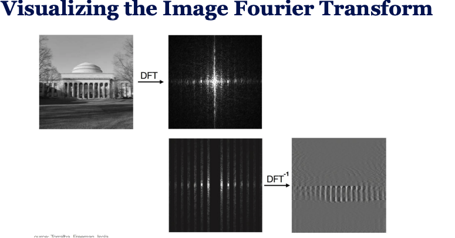
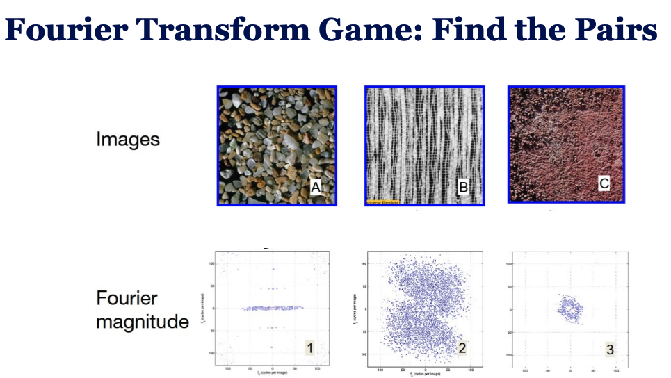
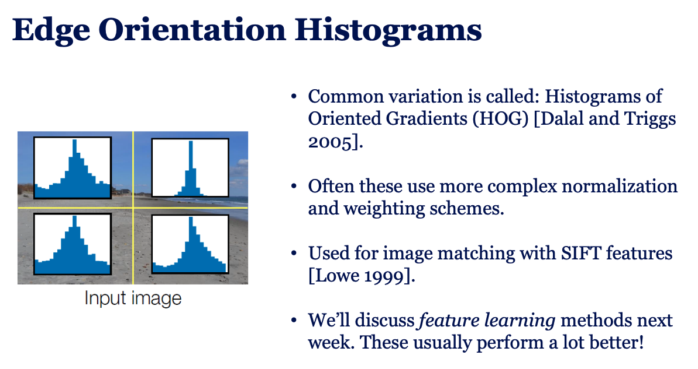

**Fourier** = Change of basis vector space from standard basis (pixels) to sinusoidal basis (frequencies)

- **Fourier Series**: any periodic signal can be represented as a sum of sinusoids.
    - **Discrete Fourier Transform (DFT)**: represents discrete signals as sums of discrete sinusoids.
        - **Inverse DFT**: reconstructs the original signal from its frequency components.
        - **1D DFT**: transforms a 1D discrete signal into its frequency representation.
- **Image and Fourier Transform**: Apply 1D DFT concepts to each row/column to make 2D DFT
    - **Magnitude**: how strong each frequency component is.
    - **Phase**: where each frequency are located.
    - Most natural image energy is in low frequencies
    - High frequencies = edges and fine details $\to$ remove = blur, keep = edges

**Convolution Theorem**: Convolution in image space = multiplication in frequency space
    - Fast convolution using FFT
    - Used for large filters and some CNN operations
    - Explains blurring, sharpening, edge detection
    - Connects filtering ↔ frequency removal
    - Basis for:
        - Image compression
        - Image restoration
        - Understanding CNN filters

- **Gaussian blur** → removes high frequencies
- **Laplacian** → emphasizes high frequencies
- **Image pyramids** → multi-scale frequency representation
- **Hybrid images** → mix low/high frequencies
- **Texture** → statistics of frequency/filter responses

We can revers transform from frequency to image space using Inverse DFT.

Real images have most energy in low frequencies (center of the image) and more details in Fourier magnitude

B = 1, A = 2, C = 3

---
### Inpainting
Inpainting means filling in missing or damaged parts of something, usually an image.

- Old idea (Efros & Leung): copy similar patches → works sometimes.
- New idea (Hays & Efros):
    - Search millions of images
    - Find nearest neighbors
    - Paste plausible content

- **Learning**: Data is given → find the model
- **Inference**: Model is given → answer questions

- **K-Nearest Neighbors (KNN)**: Store all data and for new image, find the k closest matches.
    - Dataset should be large and similar images really mean same class.
    - Slow, Feature sensitive, Hard to define distance metric
    - Features are more important than classifiers here.
    - Better feratures → Tiny images(downsample + normalize), Color histograms, Histogram of Oriented Gradients
    - Blurred doesn't make much distance.
- **Regression** (Linear least squares): Output is a linear function of input features. $\to$ Empirical Risk Minimization
    - **one-hot vectors**: String labels are converted to binary vectors.
    - **Softmax**: convert scores to probabilities.
    - **Cross-entropy loss**: measure difference between true and predicted distributions.

**Capicity**: How complex the model is (number of parameters).
    - **Underfitting**: add more parameters (more features, layers)
    - **Overfitting**: remove parameters, add regularization

More capacity = more complex functions = more likely to overfit.

