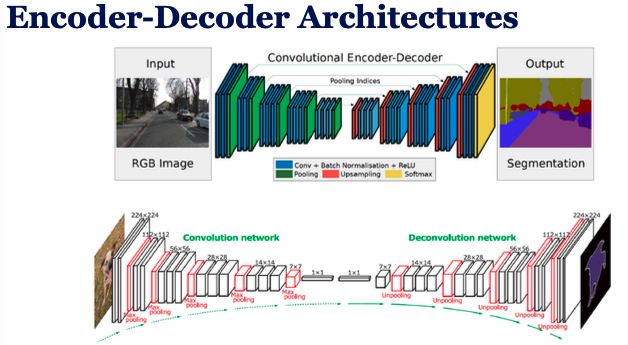
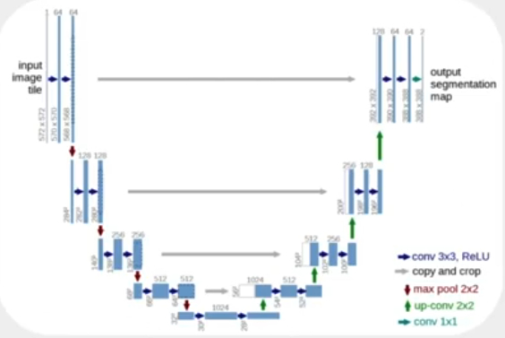
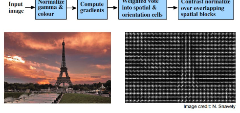
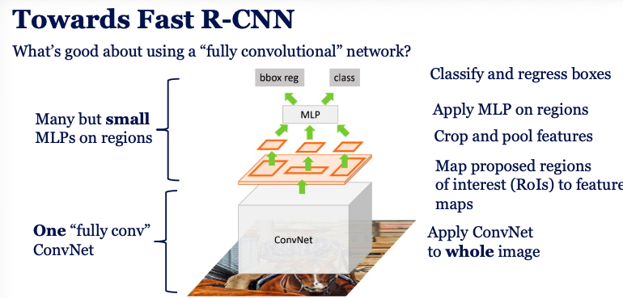
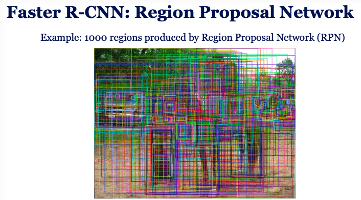
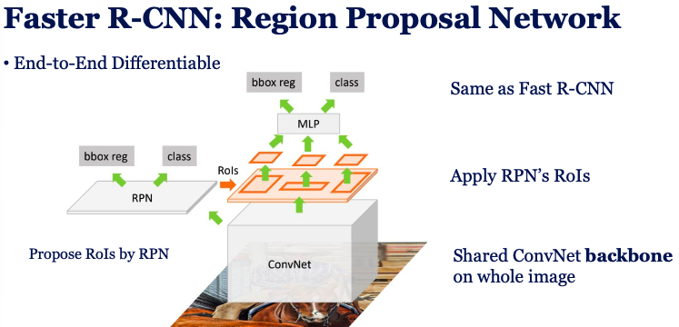

### Types of visual recognition tasks
- Image Classification
    - One label per image
- Semantic Segmentation
    - One label per pixel, make object boundaries selected
    - Evaluation metric: Avg of Intersection over Union (IoU) = $IoU = \frac{Intersection of Prediction and Ground Truth}{Union of Prediction and Ground Truth}$
    - FCN: Take classification CNN and replace final FC layers with conv layers to output spatial map
        - Issue: Output map is lower resolution than input image
        - Solution: Upsample (Combine **what** deep fratures with **where** spatial info)
        - Methods:
            - Interpolation
            - learned unsampling
            - skip connections
- Object Detection
    - Find objects and draw bounding boxes
    - Evaluation metric:
        - IoU for box overlap
        - Precision: how many detections are correct
        - Recall: how many true objects are detected
    - **Regress Boudning Boxes**: Predict 4 values (x, y, w, h) + class label for each object to make bounding box
        - Loss function: Cross entropy for class + Squared error for box coordinates
- Instance Segmentation (Semantic Segmentation + Object Detection)
    - separate object instances and label pixel by pixel
    - **Mask R-CNN**: Faster R-CNN + small FCN per object -> Fix misalignment with RoIAlign
        - detect objects (Faster R-CNN)
        - For each RoI, extract features and run small FCN to predict mask

### Fully Convolutional Networks (FCNs)
- All CNNs are fully convolutional but FCNs are FC convolutional with 1x1 conv kernels
- Can work on any image size
- Output is spatial map instead of single vector
- Perfect for segmentation and detection tasks

- **Encoder**: Extracts features and reduces spatial dimensions (Conv + Pooling)
- **Decoder**: Upsamples to original image size (Conv + Upsampling)
- **Idea**: compress -> understand -> decompress

#### U-Net
- Symmetric encoder-decoder architecture with skip connections
- Wit **Skip Connections**, image will be encoded and undrestood and after upsampling the skip connections will help to recover spatial details lost during downsampling

#### Histograms of oriented gradients (HOG)

Used for object detection, especially for pedestrians.
- Divide image into small connected regions (cells)
- For each cell, compute histogram of gradient directions or edge orientations for pixels within the cell
- Normalize histograms across larger regions (blocks) for illumination invariance
- Combine histograms to form feature vector for the image
- Use SVM or other classifiers on HOG features for object detection

#### Region-based CNN (R-CNN) and Selective Search

- R-CNN: Generate region proposals using Selective Search, merge similar regions and classify only those regions using CNN
- Fast R-CNN: Run CNN once on full image to get feature map, map regions to feature map, classify and regress boxes

This R-CNN goes forward and backward for each region proposal, which is slow.

#### Anchors

Instead of predicting boxes from scratch use refrence boxes (anchors) of different sizes and aspect ratios at each location in the feature map. The model predicts offsets to these anchors to get final bounding boxes.

#### Faster R-CNN

Uses a Region Proposal Network (RPN) to generate region proposals directly from the feature map, sharing computation with the detection network for speed.

They use **Feature Pyramid Networks (FPN)** to detect objects at different scales by building a pyramid of feature maps with different resolutions.
- Image pyramid: slow
- Feature pyramid: faster
- It use CNN feature hierarchy combine shallow (where) + deep (what)

Later **Feature pyramid networks (FPN)** use multi-scale feature maps to detect objects of different sizes faster.

#### Non-Maximum Suppression (NMS)

Keep highest scoring box and remove boxes with high IoU overlap with it. Repeat for remaining boxes as we have many overlapping boxes for same object.

- **Two-stage** detectors: Directly predict bounding boxes and class probabilities from full images in one pass, making them faster but sometimes less accurate
    - R-CNN, Fast R-CNN, Faster R-CNN
- **Single-stage** detectors: 
    - YOLO, SSD, RetinaNet