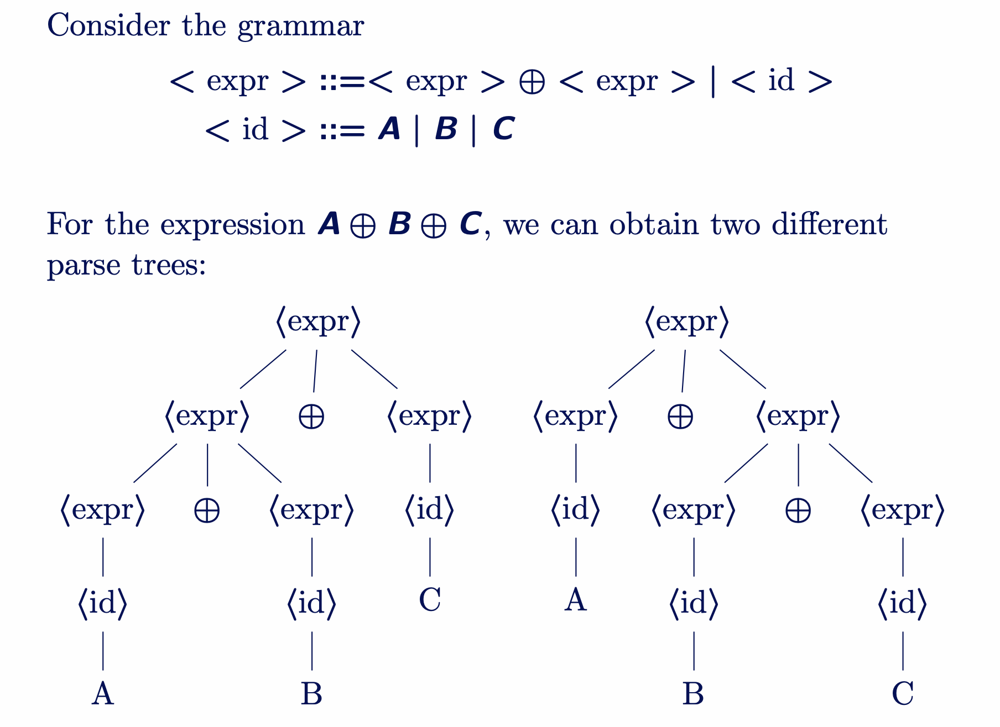
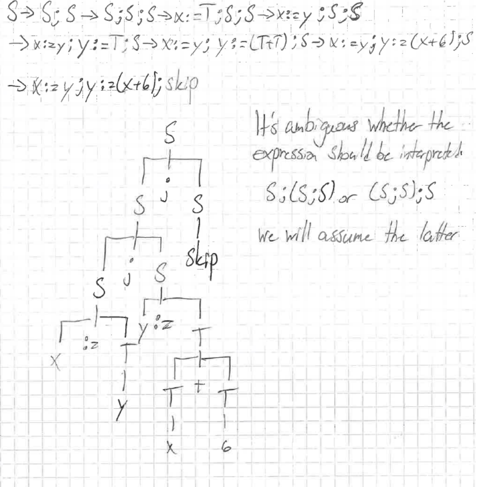

### Formal Grammar Components
- **1. Metalanguage**: Language used to describe another language (English for programming languages)
- **2. Object Language**: The language being described (Python, Java, etc.)
- **3. Terminal**: The smallest symbols of the object language (e.g., `2`, `+`, `3`)
- **4. Non-terminal**: Placeholder symbols (e.g., `<expression>`, `<number>`)
- **5. Rule (Production)**: A way to replace a non-terminal with other symbols (terminals or non-terminals). (e.g., `<expression> → <number> + <number>`, `<number> → 2 | 3`)
- **6. Derivation (Parse)**: The step-by-step process of applying rules until only terminals remain.
- **7. Start Symbol**: The main non-terminal we begin with.

- **Lexical ambiguity**, arising from multiple meanings of words like "I saw a bat" (the animal or the sporting equipment)
- **Syntactical ambiguity**, where the grammatical structure allows for different interpretations (or parse trees) like "I saw the man with the telescope."
### Chomsky Hierarchy

- **Type-0: Unrestricted (Free Grammar - Most Complex and General)**: Like Universal languages (can describe any computable language)
- **Type-1: Context-Sensitive Grammar (CSG)**: Rules depend on surrounding symbols (e.g., `A B C → A D C` if `B` is in a certain context, e.g.: Grammar for natural languages)
- **Type-2: Context-Free Grammar (CFG)**: Rules are applied regardless of context (e.g., `A → B C`, e.g.: Grammar for arithmetic expressions) $\to$ **Most programming languages**
- **Type-3: Regular Grammar**: Simplest form, rules are linear (e.g., `A → aB | b`, e.g.: Grammar for making postaddresses)

### **Ambiguity**
When there is a sentence which has more than one parse tree. $/$to$no algorithm can determine if a grammar is ambiguous or not.  ### **Associativity** * A binary operator ($\oplus$) can be: * **Left-associative**:$A \oplus B \oplus C = (A \oplus B) \oplus C$* **Right-associative**:$A \oplus B \oplus C = A \oplus (B \oplus C)$* **Associative**:$(A \oplus B) \oplus C = A \oplus (B \oplus C)$### **Precedence** * If there are two binary operators,$\oplus$and$\otimes$: -$\otimes$has **higher precedence** than$\oplus$if: -$A \oplus B \otimes C = A \oplus (B \otimes C)$- Meaning: do$\otimes$first before$\oplus$.
---

### Excercises

---

1- Write a grammar for the language consisting of strings that have n number of copies of the letter a followed by n + 1 copies of the letter b, where n > 0.

```
S → a S b | a b b # Many other solutions are possible
```
---

2 - Given the following grammar:

$S ::= \; skip \; \mid \; S;S \; \mid \; x := T$

$T ::= \; x \; \mid \; n \; \mid \; (T+T) \; \mid \; (T \times T)$

where $x$ stands for any variable name, and $n$ for any number draw the parse tree for the following expression: $x := y; y := (x + 6) ; skip$

