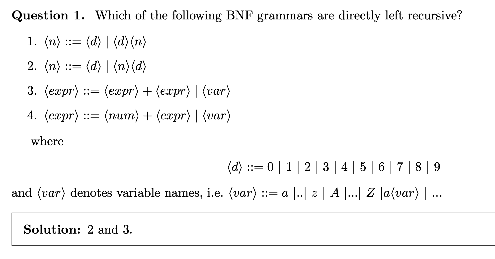
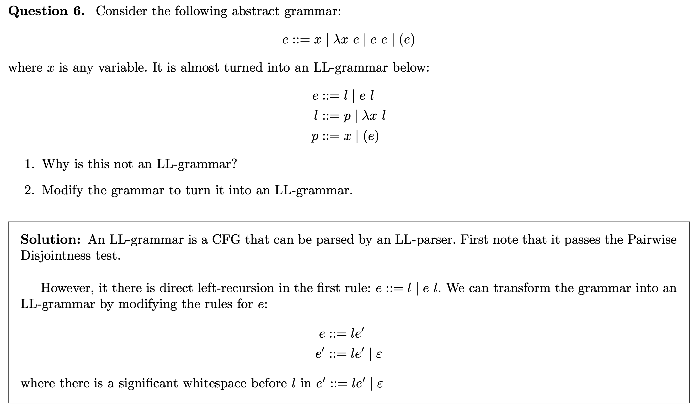
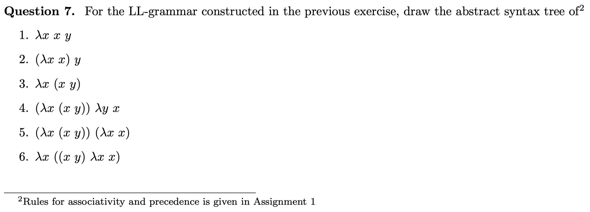
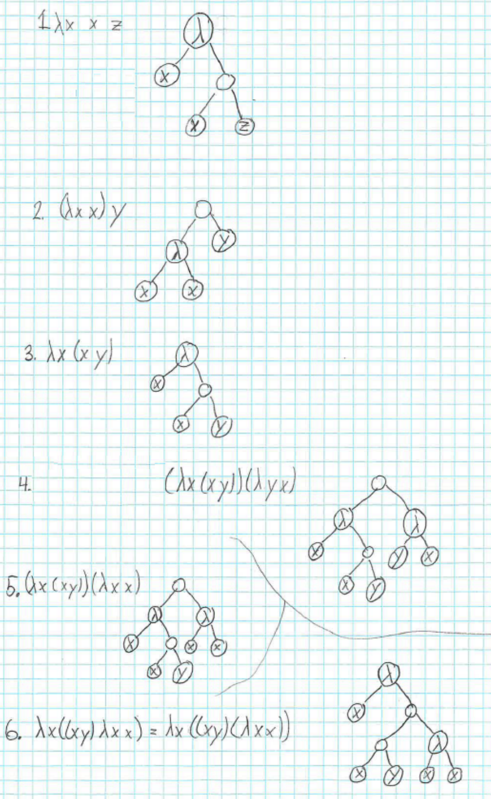

### **Lexical Analysis**
**First step of compilation** which converts source code into tokens.

### Important terms:

* **Lexeme**: The smallest meaningful unit in the source code. Example: `if`, `x`, `42`, `+` are all lexemes.
* **Token**: A **category** or **type** that groups lexemes. Example:
  * `if` → keyword token
  * `x` → identifier token
  * `42` → number token
  * `+` → operator token
* **Lexer** or **Scanner**: Program does lexical analysis, reads source code and produces tokens.
  * **Regular Expressions (Regex) Lexer**: Write rules like:
   * identifiers = `[a-zA-Z_][a-zA-Z0-9_]*`
   * numbers = `[0-9]+`
     Then, a program uses these rules to recognize tokens.
  * **Finite State Machine (FSM) Lexer**: Build a machine with states and transitions that recognize valid tokens step by step (like following a flowchart of character inputs).
  
### **Syntax Analysis**
After lexical analysis, the **parser** takes a sequence of tokens (from the lexer) and tries to build a structure (parse tree) using those grammar rules. e.g.:
```C
int x = 42;
```
Tokens: `int`, `x`, `=`, `42`, `;` then *parser* check if it fits grammar rule like `Statement → Type Identifier '=' Number ';'`, then builds a parse tree.

#### Parsing strategies:
* **Top-Down Parsing**: Start from the root of the parse tree and try to build it down to the leaves (tokens).
* **Bottom-Up Parsing**: Start from the tokens and try to build up to the root of the parse tree.

###  Parsing as Graph Search

1. **Parsing** = build structure (parse tree) from tokens using grammar.
2. **Naive BFS** → explores all possibilities → exponential growth.
3. **Prefix test** → cut branches if they don’t match target string’s prefix.
4. **Leftmost derivation** = always expand the leftmost non-terminal first.
   * Makes search systematic.
5. **BFS + Leftmost + Prefix test** → faster, fewer branches.
6. **Problem**: Some grammars still blow up (too many useless branches).

- **Recursive Descent Parsing**: A top-down parsing method with DFS instead of BFS using recursion. Each non-terminal in the grammar has a function. Each rule is handled by code inside that function.
    - **Problem**: Infinite recursion $\to$ Solution:  **Left recursion**.
- **Left Recursion**: A grammar is left recursive if a non-terminal A can eventually derive a form starting with itself $A ⇒^* Aγ$ where $⇒^*$ means in zero or more steps
    - Direct left recursion: $A ⇒ Aγ$
    - Indirect left recursion: $A ⇒^* Aγ$
    - **Problem**: Left recursion causes infinite recursion in recursive descent parsing.
    - **Solution**: Eliminate left recursion by rewriting rules. Remove Direct Left Recursion:

Suppose we have:

```
A ::= Aα1 | Aα2 | ... | Aαn | β1 | ... | βk
```

We rewrite as:

```
A ::= β1A' | β2A' | ... | βkA'
A' ::= α1A' | α2A' | ... | αnA' | ε
```

Where `Aα1,...` are Left Recursive productions and `β1,...` are Non-Left Recursive productions.

---

#### Predictive Parser

BFS, DFS are slow due to backtracking. A **lookahead parser** peeks at the next token to decide which rule to apply, reducing backtracking.

#### One-step lookahead
* We define FIRST(γ) which is the set of terminals (tokens) that can appear first if we derive γ.
* Rule for $LL(1)$ grammar :
    - First L, parse from left-to-right and second creates the leftmost derivation (**Left recursion test**)
    - If $A \rightarrow \alpha$, $A \rightarrow \beta$ then $FIRST(\alpha) \cap FIRST(\beta) = \emptyset$ (**pairwise disjointness test**)
* **LL(k) Parsers** use k tokens of lookahead to decide which rule to apply which is more powerful but more complex.
---

### Lambda Expressions

- **Variables**: x, y, z, ...
- **Abstraction**: λx.E (function with parameter x and body E)
- **Application**: (E1 E2) (apply function E1 to argument E2)
    - Left associative: E1 E2 E3 = ((E1 E2) E3)
    - Higher precedence than abstraction: λx.E1 E2 = λx.(E1 E2)

---

### Excercises

---



A grammar rule is left-recursive if a nonterminal can call itself at the very left of a production, like A → A α

**Indirect left recursion**:

$A ::= Bb | c$

$B ::= A | a$

---

**Question:**
Does the following grammar satisfy the *pairwise disjointness test*?

$$\begin{aligned}
A &::= aB \mid b \mid cBB \\
B &::= aB \mid bA \mid aBb \\
C &::= aaA \mid b \mid caB \end{aligned}$$

**Answer:**
No, it does not.
For the nonterminal **B**, two of its rules cause overlap: $
FIRST(aB) \cap FIRST(aBb) = { a } $ 
So the grammar fails the pairwise disjointness test.

#### Pairwise Disjointness Test
It’s a test used in LL(1) grammars (the kind used by top-down parsers) to check if the grammar is **predictive**: meaning the parser can always decide which rule to use just by looking at the next input symbol.

For a nonterminal like `A`, suppose it has many rules:

```
A → α₁ | α₂ | α₃ | ...
```

Then the grammar passes the **pairwise disjointness test** if the **FIRST sets** of all right-hand sides are **disjoint** — i.e., no overlap.

Formally:

```
For every pair (αᵢ, αⱼ),  FIRST(αᵢ) ∩ FIRST(αⱼ) = ∅
```

If two rules start with something that can begin with the same terminal, the parser won’t know which rule to pick →  fails the test.

---


---


<br>
