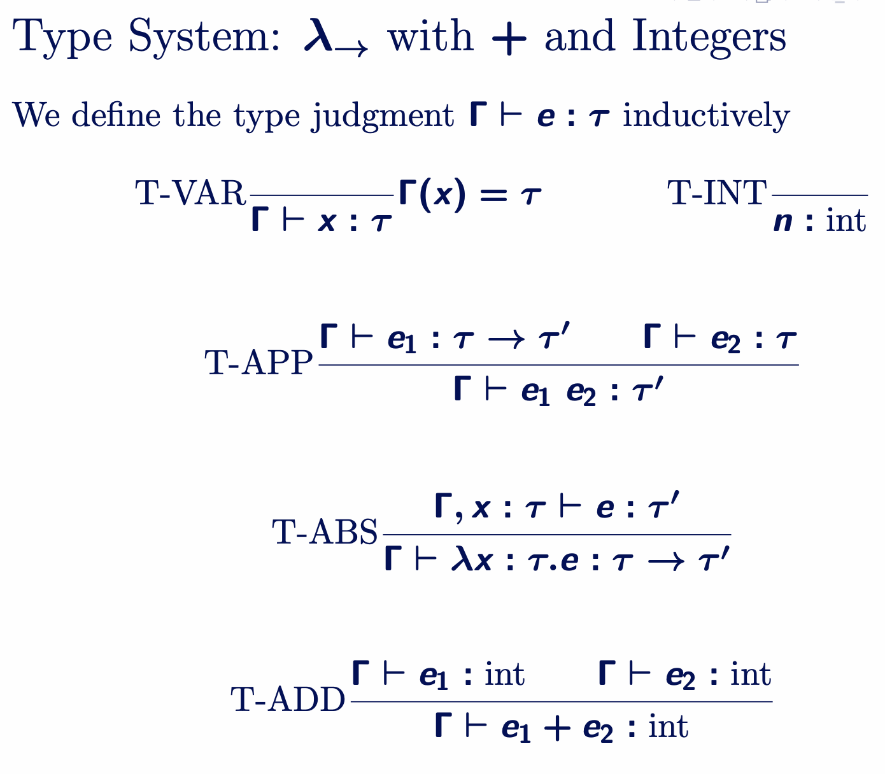

## **Tail Recursion**

### “Tail call”

A **tail call** is when the *last thing* a function does before it returns is **call another function** (including itself).

If a function is **tail recursive**, the compiler can optimize it using **Tail Call Optimization (TCO)**.
* It doesn’t need to keep old function calls in memory.
* It reuses the same stack frame.
* So it runs in **constant space** — even for large inputs.

---

## **Algebraic Data Types (ADTs)**

ADTs let us build **custom data types** by combining **sum types** and **product types**.

### **Sum Type**

A **sum type** means a *choice* between several possibilities.

```ocaml
type token = LAMBDA | APPLY | VAR of string
```

### **Product Type**

A **product type** means a *combination* of multiple values.

```ocaml
type point = {x : int; y : int}  (* record: x and y together *)
type name = string * string      (* tuple: (first, last) *)
```

---

## **Parametric Polymorphism**

Polymorphism = “many forms.”

You write one **generic** definition instead of many type-specific ones.

You write functions or data types that work for **any type** like handling both `int` and `string`.

---

## **The Y-Combinator**

A **combinator** is a λ-expression with **no free variables**.

The **Y-combinator** is for defining recursion in λ-calculus. It is defined as:

```
Y ≡ λf. (λx. f (x x)) (λx. f (x x))
```

It’s also called the **fixpoint combinator** allows **recursion** in λ-calculus.

When we apply it to some function M, we get:

```
Y M = (λf. (λx. f (x x)) (λx. f (x x))) M
```

Now we do β-reduction (substitute M for f):

```
→ (λx. M (x x)) (λx. M (x x))
```

---


## Simply Typed Lambda Calculus (λ→)

This is just λ-calculus but with **types added**.

---

### Grammar

| Symbol | Meaning    |
| ------ | ---------- |
| `e`    | expression |
| `v`    | value      |
| `τ`    | type       |

We define:

```
e ::= x | e1 e2 | n | e1 + e2 | λx : τ. e
v ::= λx : τ. e | n
τ ::= int | τ → τ
```

### Type context (Γ)
##### Table remembers types

$Γ = { x : int, y : bool }$

Notation:

$Γ ⊢ e : τ$

“Under context Γ, expression e has type τ.”

## Typing Rules

### T-VAR

If variable `x` has type `τ` in Γ, then `x` has type `τ`.

```
Γ(x) = τ (Type of x in context Γ)
------------  = τ (Type of x we found)
Γ ⊢ x : τ (Variable x has type τ)
```

### T-INT

Numbers have type `int`.

```
n : int
```

### T-APP (Function Application)

If `e1` is a function from `τ` → `τ'`
and `e2` has type `τ`,
then applying `e1` to `e2` gives a result of type `τ'`.

```
Γ ⊢ e1 : τ → τ'      Γ ⊢ e2 : τ
--------------------------------
Γ ⊢ e1 e2 : τ'
```

**Example:**

```
(λx : int. x + 1) 5  →  int
```

### T-ABS (Function Definition)

If assuming `x : τ` lets us show `e : τ'`,
then `λx : τ. e` is a function of type `τ → τ'`.

```
Γ, x : τ ⊢ e : τ'
----------------------
Γ ⊢ λx : τ. e : τ → τ'
```

**Example:**

```
λx : int. x + 1  :  int → int
```

Type of x is given as int, but 1 is function body in int, so the whole function type is int → int.

### T-ADD

If both sides of `+` are integers, the result is an integer.

```
Γ ⊢ e1 : int     Γ ⊢ e2 : int
------------------------------
Γ ⊢ e1 + e2 : int
```



---

### Type Soundness

Well-typed programs **don’t get stuck** — they keep evaluating until they reach a value.

$$\text{If } ⊢ e : τ \text{ and } e → e', \text{ then either } e' \text{ is a value or there exists } e'' \text{ such that } e' → e''.$$

### Meaning in words:

If an expression `e` has a type `τ`, and it reduces (takes one computation step) to another expression `e′`,
then:

* Either `e′` is already a final value (like `5` or `λx : int. x + 1`),
* Or you can keep reducing it (i.e. it still has valid next steps).

## Normalization

### Rule shown:

$$\text{If } ⊢ e : τ, \text{ then there exists a value } v \text{ such that } e →* v.$$

If an expression `e` has a type,
then you can always reduce it step by step (→*)
until you reach a final **value** `v`.

In simple words:

Every well-typed expression **finishes** — it does not loop forever.