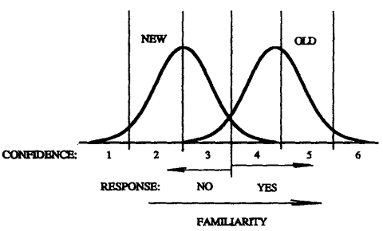
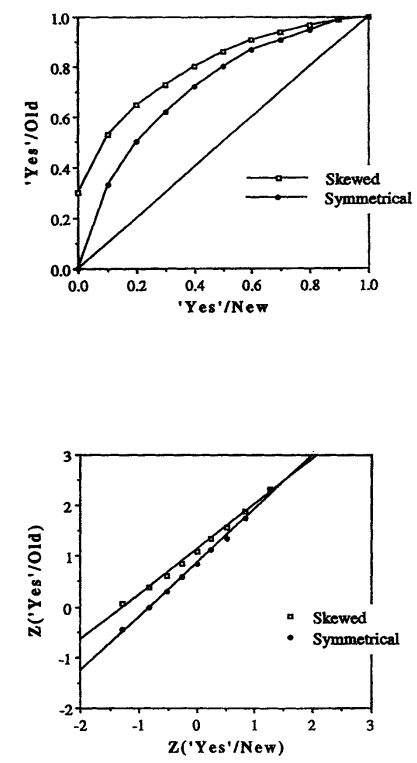
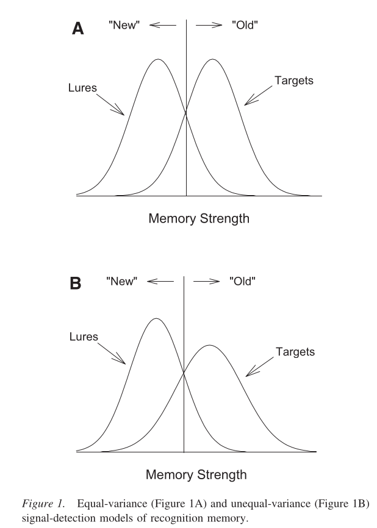
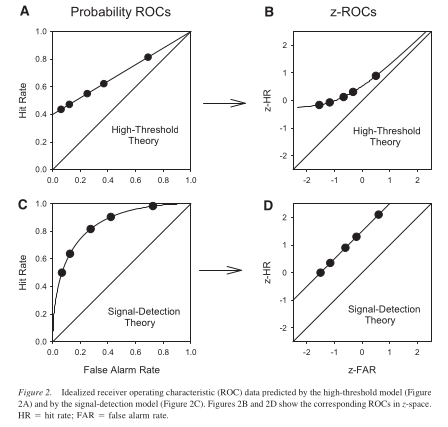

## **Dual-process model** of recognition memory
 - **Familiarity**
 - **Recollection**

| Feature        | Familiarity | Recollection |
|---------------|------------|-------------|
| Type of Process | Feeling of knowing | Clear memory retrieval |
| Strength | Gradual (weak → strong) | All-or-none (yes or no) |
| Example | "This word looks familiar..." | "I remember reading this in my psychology class!" |
| Influence on Recognition | Can lead to false positives (thinking you know something when you don’t) | More accurate but less frequent |

## **Signal Detection Theory (SDT)**:
   - Traditional models assume recognition is based solely on an assessment of **familiarity**.
   - Familiarity follows a **Gaussian distribution**: items studied earlier become more familiar, shifting their distribution to the right.
   - If recognition relied only on familiarity, receiver-operating characteristics (**ROC**) curves would be **symmetrical** with a slope of 1.

  
 - The y-axis represents the frequency of items (how often items have a certain level of familiarity).  - If an item has a low familiarity score (closer to the left), people classify it as new ("NO").  - If an item has a high familiarity score (closer to the right), people classify it as old ("YES").  - Some new items will mistakenly feel familiar (false alarms), and some old items won’t feel familiar enough to be recognized (misses). 
 
 

## **ROC Curves & Experimental Evidence**:
   - **ROC analysis** measures recognition memory by comparing **hit rates** (correct recognitions) with **false alarm rates** (incorrect recognitions).
   - ROCs are often **asymmetrical** (slopes < 1), which SDT alone cannot explain.
   - **Recollection process** explains why slopes decrease when performance improves.

  
 - Receiver Operating Characteristics (ROC) analyze recognition memory performance by comparing hit rates (correctly recognizing old items) and false alarm rates (incorrectly recognizing new items).  - If recognition were only familiarity-based, ROCs would be symmetrical, and in z-transformation, the slope would be 0.  - Real-world recognition involves both familiarity & recollection, leading to skewed ROCs with slopes <1, but in z-transformation, a slope closer to 0 shows its importance.  - The reason skewed ROCs have a slope <1 is that recollection is an all-or-none process, which reduces the slope of the curve compared to familiarity in conditions of low confidence. 
 
 

## **Dual-Process Model**:
   - Recognition involves **familiarity** (a graded strength signal) and **recollection** (all-or-none retrieval).
   - Familiarity **alone** results in symmetrical ROCs (slope = 1).
   - Recollection **skews** the ROC, reducing the slope to **less than 1**.
   - The probability of recognizing an item is:

$$P(yes | old) = P(R) + P(F > c) - [P(R) \times P(F > c)]$$

where **R** is recollection and **F** is familiarity and **c** is the Decision threshold.

---

### **Two prominent models of recognition memory**  
1. **Unequal-Variance Signal-Detection (UVSD) Model**  
2. **Dual-Process Signal-Detection (DPSD) Model**  

- **UVSD model is more robust** based on experimental evidence.

1. **UVSD Model:**
   - Recognition is based on a **continuous** memory strength variable.
   - Targets (previously seen items) have **greater variability** than lures (new items).
   - Supports a **graded** recollection process (not all-or-none).

   - Recognition is based on a **continuous** scale of memory strength, meaning items are judged based on how strongly they feel familiar.
   - **Targets** (old items) are more **strength** than **lures** (new items) because some older and more remembered memories are stronger than others.
   - This model suggests that recollection is not all-or-none, but rather a **gradual** process—some memories feel stronger and clearer than others.

2. **DPSD Model:**
   - Recollection occurs **all-or-none** (either a memory is retrieved or it is not).
   - Familiarity is modeled as a **continuous** process using signal detection.
   - Used in neuroscience studies to estimate separate contributions of recollection and familiarity.

- Figure A assumes all memories have similar variability, making recognition a simple familiarity-based decision.
- Figure B (UVSD model) better reflects real-world memory, where some old items are remembered strongly and others weakly, leading to greater variability in targets compared to lures.

 

- The **(ROC) curves** fit better with **curvilinear** predictions of UVSD than the **linear** predictions of DPSD.
- **Z-transformed ROCs (z-ROCs)** are mostly linear, as predicted by UVSD, contradicting the expected curvature from DPSD.
- Studies suggest that **recollection is not all-or-none** but instead occurs in degrees.
- Findings suggest that recognition memory is best understood as a **continuous** process rather than a mix of discrete processes.

| **Figure** | **Description** |
|-----------|---------------|
| **(A) Probability ROC – High-Threshold Theory** | - The **ROC curve** is less curved and closer to the diagonal, meaning recognition is modeled as a **yes/no** decision (all-or-none memory). - This suggests that only some items are remembered, while others are completely guessed. |
| **(B) z-ROC – High-Threshold Theory** | - When transformed into **z-space**, the curve is concave (bowed upwards), which indicates **inconsistencies** with a simple threshold model. - This suggests that memory does not work as a strict all-or-none process. |
| **(C) Probability ROC – Signal Detection Theory (SDT)** | - The curve is more **smoothly curved** rather than a straight line, indicating that memory strength is a **continuous** process rather than all-or-none. - Recognition is based on a graded sense of familiarity rather than a strict threshold. |
| **(D) z-ROC – Signal Detection Theory (SDT)** | - When transformed into **z-space**, the curve is nearly **a straight line**, supporting the SDT assumption that recognition follows a **Gaussian distribution** of memory strength. |

- **(A & B) High-Threshold Theory** assumes all-or-none memory, but its z-ROC shows inconsistencies.  
- **(C & D)Signal Detection Theory** explains recognition better because it assumes **graded memory strength**, producing a more linear z-ROC.  