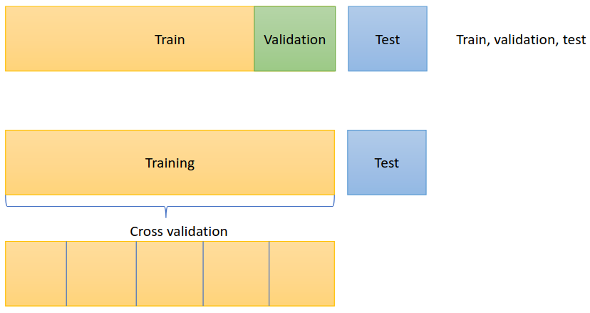
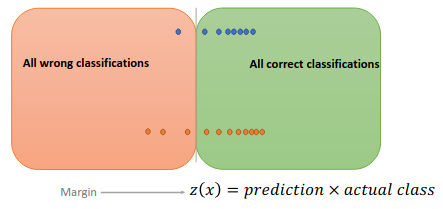

# Assessing Classification Performance

### Contingency Table (Confusion Matrix)

This table compares actual labels and predicted labels. For two classes (positive/negative), it looks like:

|                 | Predicted Positive  | Predicted Negative  | Total Actual |
| --------------- | ------------------- | ------------------- | ------------ |
| Actual Positive | True Positive (TP)  | False Negative (FN) | P            |
| Actual Negative | False Positive (FP) | True Negative (TN)  | N            |

* **True Positive (TP):** Correctly predicted positive
* **False Negative (FN):** Missed positive (predicted negative)
* **False Positive (FP):** Incorrectly predicted positive
* **True Negative (TN):** Correctly predicted negative

### Accuracy and Error Rate

* **Accuracy:** Fraction of correct predictions

$$\text{Accuracy} = \frac{TP + TN}{P + N}$$

* **Error rate:** Fraction of wrong predictions

$$\text{Error} = 1 - \text{Accuracy} = \frac{FP + FN}{P + N}$$

### True Positive Rate (Recall or Sensitivity)

* Measures how many actual positives are correctly predicted:

$$\text{Recall} = \frac{TP}{TP + FN}$$

### True Negative Rate (Specificity)

* Measures how many actual negatives are correctly predicted:

$$\text{Specificity} = \frac{TN}{TN + FP}$$

### Precision

* Out of all predicted positives, how many are actually positive?

$$\text{Precision} = \frac{TP}{TP + FP}$$

### F-measure (F1 Score)

is a performance metric that is not affected by negatives, as a weighted harmonic mean of precision and recall.

$$F_1 = 2 \times \frac{\text{Precision} \times \text{Recall}}{\text{Precision} + \text{Recall}}$$

* Useful when you care most about positive class performance.

---

# Evaluating Model Performance

### Train/Test Split

* Split data into training set (to learn model) and test set (to check how well it works on new data).
* Test set must be unseen during training to get a fair performance measure.

### Cross-Validation

* Split data into several parts ("folds"), train on some folds, test on others, then average the results.
* Gives a better estimate of performance and reduces bias.

---

# 2.2 Visualising Classification Performance

### Decision Threshold τ

* Classifier outputs a score (like probability).
* If score > τ, predict positive; else negative.
* Changing τ changes confusion matrix and performance metrics.

---

### ROC Curve (Receiver Operating Characteristic)

* Plot of **True Positive Rate (Sensitivity: y-axis)** vs **False Positive Rate (1 - Specificity: x-axis)**.
* Shows a summary of confusion matrices for different thresholds.
* Best threshold using ROC curve is where the curve is closest to the top left corner (0,1).
- A coverage plot and a Receiver Operation Curve (ROC) (normalized coverage plot) both help summarise all different confusion matrices.

### Area Under the Curve (AUC)

* AUC measures the performance of a classifier across all thresholds.
* If AUC for a model is higher than another, it means the first model is better at distinguishing between classes. 
---

# 3. Scoring and Ranking

### Scoring Classifier

* Outputs scores (not just labels) showing confidence for each class.
* For binary classes, usually one score (positive class score).

### Margin

* For an example x with true class c(x) (+1 or −1), margin is:

$$z(x) = c(x) \times \hat{s}(x)$$

* z(x) is the margin score, c(x) is the true class label (+1 for positive, -1 for negative), and $\hat{s}(x)$ is the score from the classifier.
* Positive margin means correct prediction; negative means incorrect.

---

### Loss Functions

Loss functions measure how bad predictions are and guide model training by minimizing loss.

| Loss Type        | Description                                         |
| ---------------- | --------------------------------------------------- |
| 0–1 Loss         | 1 if wrong prediction, 0 if correct                 |
| Hinge Loss       | Penalizes predictions that are not confident enough |
| Exponential Loss | Penalizes wrong predictions exponentially           |
| Logistic Loss    | Smooth loss function related to probability         |
| Squared Loss     | Penalizes squared error of margin                   |

---

# 3.1 Assessing Ranking Performance

### Ranking Error

* Measures how often a positive example is scored lower than a negative one.
* Lower ranking error means better ranking quality.

---

# 4. Class Probability Estimation

### What is it?

* Instead of just giving labels or scores, estimate probabilities for each class.
* Probabilities sum to 1. For two classes:

$$p(\text{positive}) + p(\text{negative}) = 1$$

### How?

* Some models like decision trees estimate class probabilities by the proportion of class examples in leaves.

---

# 4.1 Assessing Class Probability Estimates

### Mean Squared Error (MSE) for probabilities

Measures how close predicted probabilities are to true class labels:

$$SE(x) = \frac{1}{2} \sum_i (\hat{p}_i(x) - I[c(x)=C_i])^2$$

* Average squared error over all examples is the MSE.

---

# Summary of Concepts Covered:

* **Classification:** Predicting labels, evaluating with confusion matrix and metrics like accuracy, precision, recall, F1.
* **Performance evaluation:** Use train/test splits, cross-validation, watch out for over/underfitting.
* **Visualization:** ROC curve helps understand classifier trade-offs at different thresholds.
* **Scoring & ranking:** Models can output scores, which allows ranking instances by confidence.
* **Loss functions:** Guide model training by penalizing wrong or uncertain predictions.
* **Probability estimation:** Provides probabilities for classes and can be assessed with mean squared error.
