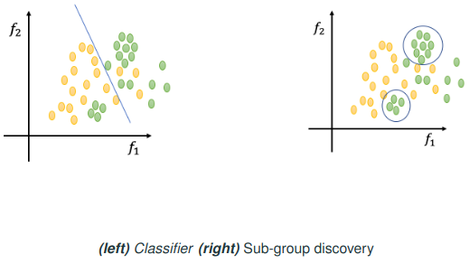

### Multi-class Classifiers

* **Inherently non-binary:** Algorithms that directly support multiple classes (e.g., decision trees).
* **Inherently binary:** Algorithms designed for two classes (e.g., Support Vector Machines, SVM). These need strategies to extend to multi-class.

### Strategies to Convert Binary Classifiers to Multi-class

1. **One versus Rest (One-vs-All):**
   Train $k$ classifiers, each distinguishing one class from all others.

2. **One versus One (All pairs):**
   Train classifiers for every pair of classes, so total $k(k-1)/2$ classifiers.

### Complexity Comparison

| Approach    | Training complexity   | Inference complexity |
| ----------- | --------------------- | -------------------- |
| One-vs-Rest | $O(k m^\alpha)$       | $O(k^\beta)$         |
| One-vs-One  | $O(k^2 (m/k)^\alpha)$ | $O(k^2 \beta)$       |

* $k$: number of classes
* $m$: number of instances
* $\alpha$, $\beta$: algorithm-specific complexities

So One-vs-Rest is generally more efficient for large $k$.

# Evaluating Multi-class Classifiers

### Confusion Matrix (Multi-class)

Example (3 classes):

| Actual \ Predicted | C1 | C2 | C3 | Total |
| ------------------ | -- | -- | -- | ----- |
| C1                 | 15 | 2  | 3  | 20    |
| C2                 | 7  | 15 | 8  | 30    |
| C3                 | 2  | 3  | 45 | 50    |
| Total              | 24 | 20 | 56 | 100   |

### Accuracy

$$\text{Accuracy} = \frac{15 + 15 + 45}{100} = 0.75$$

### Precision and Recall per Class

* For each class:

$$\text{Precision} = \frac{\text{True Positives}}{\text{Predicted Positives}} \text{Recall} = \frac{\text{True Positives}}{\text{Actual Positives}}$$

Example:

| Class | Precision      | Recall         |
| ----- | -------------- | -------------- |
| C1    | 15 / 24 = 0.63 | 15 / 20 = 0.75 |
| C2    | 15 / 20 = 0.75 | 15 / 30 = 0.50 |
| C3    | 45 / 56 = 0.80 | 45 / 50 = 0.90 |

### Overall Precision and Recall

* Weighted averages based on class proportions, e.g.,

$$\text{Precision} = 0.20 \times 0.63 + 0.30 \times 0.75 + 0.50 \times 0.80 = 0.75$$

### ROC Curve for Multi-class

* For multi-class, draw a separate ROC curve for each class using the **one-versus-rest** approach (treat each class as "positive" and the rest as "negative").
* To summarize performance, use:
   * **Macro-average:** Calculates ROC for each class separately, then averages the results equally across classes (ignores class imbalance).
   * **Micro-average:**  Calculates ROC for all classes together, treating each instance equally (considers class imbalance).
---

# Regression

### Residuals and Loss

* Residual = Actual value − Predicted value
* Loss functions measures how far predictions are from true values (Sum of residuals squared).
* Common loss functions:
  * **Mean Squared Error (MSE):** Average of squared residuals.
  * **Mean Absolute Error (MAE):** Average of absolute residuals.
  * **Huber Loss:** Combines MSE and MAE, less sensitive to outliers.

### Bias-Variance Tradeoff (dilemma)

* **Bias:** Error from wrong assumptions in model.
* **Variance:** Error from sensitivity to small fluctuations in training set.
* Low bias → complex model; low variance → simple model.
* Goal: balance both for best generalization.

---

# Unsupervised and Descriptive Learning

### Evaluating Clustering Performance

- With Ground Truth (We know the real groups): Use metrics like 
   - Rand index
   - Precision
   - Recall
   - F1 score.
- Without Ground Truth (No real labels): Use internal metrics like 
   - Davies-Bouldin index
   - Calinski-Harabasz Index
   - Silhouette coefficient
      - $s = \frac{b - a}{\max(a,b)}$
      * $a$: average distance to points in the same cluster
      * $b$: average distance to points in the nearest other cluster
      * Values close to +1 → good clustering; close to 0 → borderline; negative → wrong cluster.

# Sub-group Discovery

### What is Sub-group Discovery?

* Finds **interesting subgroups** in data that are statistically unusual, not just aiming for classification accuracy.
* Example: Finding groups with high risk of heart disease.

### Evaluating Subgroups

* Compare subgroup’s class distribution with overall distribution.
* Chi-squared to see if the subgroup differs significantly.

