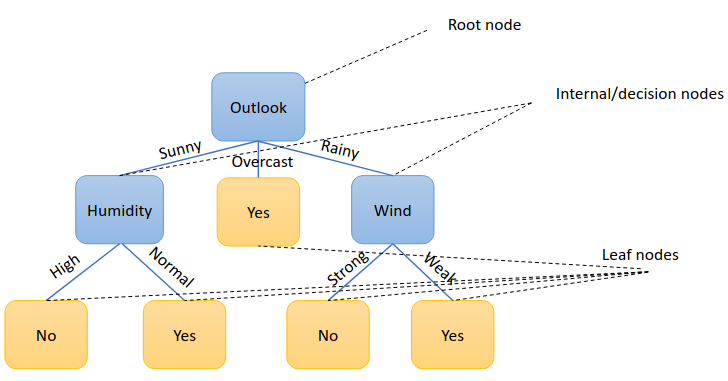

### What are Tree Models?

* Tree models = **supervised learning** = *non-linear relationships** (they split data based on rules, not lines) = logical = **easy to interpret**
* There are three main types:

  1. **Decision Trees** (single tree)
  2. **Random Forests** (many decision trees combined)
  3. **Gradient Boosting** (trees built sequentially to correct errors)

## Decision Trees

* It’s a **tree-like graph** where:

  * **Nodes**: Questions about features (e.g., “Is temperature > 20?”)
  * **Branches**: Answers to the question (e.g., Yes/No)
  * **Leaves**: Final prediction/class label

### Elements of a Decision Tree

### Max Depth and Number of Leaves in Decision Trees

* If there are **d binary features** (features with only 2 values like 0 or 1),

  * The max depth of the tree is **d + 1**
  * Max number of leaves is **2^d** (all combinations of feature values)

* We want to split data so each child group is as **pure** as possible (mostly one class).
* Two types of splits:

  * **Pure split**: each child has only one class (ideal)
  * **Impure split**: children have mixed classes (common in real life)

### Measuring Purity (Impurity)

* **Impurity** measures how mixed the classes are in a node.
* Lower impurity = better split.
* Common impurity measures:

  * **Misclassification error:** min(p, 1-p), where p is the fraction of one class
  * **Entropy:** measures uncertainty, calculated as:

$$-p \log_2 p - (1-p) \log_2 (1-p)$$

* **Gini index:** measures probability of misclassification, calculated as:

$$2 p (1 - p)$$

### Comparing Splits Using Impurity

* Calculate weighted impurity for children after the split.
* Choose the split that **reduces impurity the most** (called **purity gain** or **information gain**):

$$\text{Purity Gain} = \text{Impurity before split} - \text{Weighted impurity after split}$$

* The split with the **highest purity gain** is the best split.

### For Handling Continuous Features, we check impurity for each possible threshold and pick the best.

---

## Pruning Decision Trees

* Trees can become very big and memorize training data (overfit).
* **Pruning** reduces tree size by removing weak branches.
* **Reduced error pruning:**

  * Start from leaves, replace a node with majority class label.
  * Keep the change only if validation accuracy does not drop.
* Pruning helps the tree generalize better to new data.

## Sensitivity to Skewed Class Distributions

* When classes are imbalanced (one class much bigger), trees may be biased.
* For example, positive class errors may be more costly.
* Solutions:

  * Add more samples to minority class (oversampling)
  * Adjust impurity calculations or splitting criteria to be less sensitive to class imbalance
* Different impurity measures respond differently to class imbalance:
> **Note:** Entropy and Gini index are sensitive to fluctuations in the class distribution, pGini ($\sqrt{\text{Gini}}$) isn’t.

---

## Regression Trees

### What is a Regression Tree?

* Decision trees can also be used when the target is a **continuous numeric value** (not a class).

* Instead of class labels, leaf nodes hold **mean values** of the target variable in that subset.
* Splitting tries to minimize the **variance** of target values in child nodes.

### Measuring Impurity in Regression

* Use **variance** (average squared difference from mean) instead of class impurity:

$$\text{Var}(Y) = \frac{1}{|Y|} \sum_{y \in Y} (y - \bar{y})^2$$

* Find splits that **reduce variance** the most (variance reduction).

### Finding Splits in Regression Trees

* Try different thresholds on each feature.
* Calculate weighted variance after splitting.
* Choose the split with **lowest weighted variance**.

