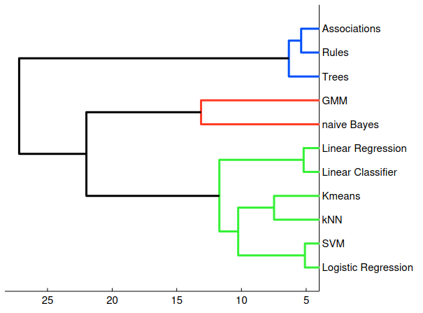
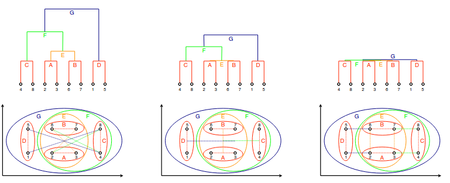
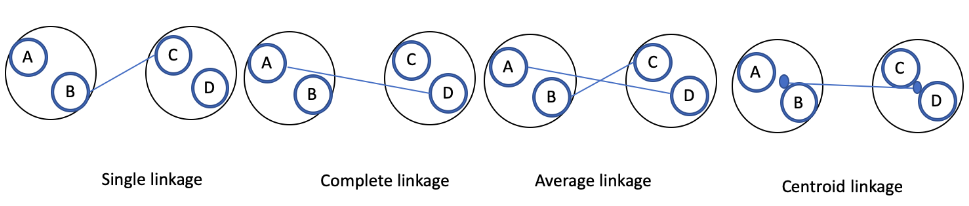

## 1. Distance-based Models

* **Examplars** are the centroid training data points used to make predictions (representative points of clusters)
* The closest exemplars have the biggest influence on deciding the class of the new instance.

### Measure distance

#### Minkowski Distance (p-norm)

For two points $x$ and $y$ with $d$ features:

$$Dis_p(x, y) = \left( \sum_{j=1}^d |x_j - y_j|^p \right)^{1/p}$$

* $p$ controls the type of distance.
* If $p=1$, this is **Manhattan distance**.
* If $p=2$, this is **Euclidean distance**.
* As $p \to \infty$, the distance becomes **Chebyshev distance** (For maximum difference along any coordinate).

Changing $p$ lets us adjust how we measure "closeness" between points. Different values of $p$ capture different notions of distance, which can be more suitable for certain data types or problems. By choosing the right $p$, we can help the algorithm perform better for the specific data or task at hand.

### What makes a **distance metric** valid?

A distance metric $Dis$ must satisfy:

1. **Zero distance to itself:** $Dis(x, x) = 0$
2. **Positive for different points:** $Dis(x, y) > 0$ if $x \neq y$
3. **Symmetry:** $Dis(x, y) = Dis(y, x)$
4. **Triangle inequality:** $Dis(x, z) \leq Dis(x, y) + Dis(y, z)$

If the 2nd condition allows zero even if points differ, it's called a **pseudo-metric**.

---

## Nearest-Neighbour Classification (KNN)

  * **Centroids**: average (mean) point of cluster (may not be an actual data point).
  * **Medoids**: the actual data point closest to all others in the cluster. (time consuming to calculate)

* Each training instance acts as an exemplar.
* To classify a new point, find the **k nearest training points**.
* The class with the majority vote wins.
* Can also do regression by averaging the target values of neighbours.

Hot to choose k?
* **Small k**: Low bias, High variance (sensitive to noise) ,overfitting
* **Large k**: High bias, Low variance (smoother decision boundary), underfitting
* **Optimal k**: usually between 3 and 10.
* Use cross-validation to find the best k for your data.
* **Odd k**: avoids ties in voting.
* **Weighted voting**: give more weight to closer neighbours.

### Curse of Dimensionality

In high-dimensional spaces, distances between points become less meaningful, making distance-based methods like KNN less effective.

---

## K-means Algorithm (Distance-based Predictive Clustering)

1. Randomly initialize K centroids.
2. Assign each point to the nearest centroid.
3. Update centroids to be the mean of assigned points.
4. Repeat steps 2–3 until centroids don’t change.

### Limitations of K-means

* Sensitive to initial centroids.
* Need to know K beforehand.
* Uses Euclidean distance.

---

## K-medoids Algorithm

* Works with any distance metric.
* More robust to noise/outliers but more expensive computationally (O(n²)).
1. Pick K random points as medoids.
2. Assign points to closest medoid.
3. Update medoids to minimize total distance within cluster.
4. Repeat until medoids stabilize.

## Evaluating Clustering

* **Inertia:** total within-cluster scatter distance from the centroid.
  Formula:

$$Inertia = \sum_{i=1}^K \sum_{x \in C_i} Dis(x, c_i)$$

where $C_i$ is the set of points in cluster $i$ and $c_i$ is the centroid of cluster $i$.

  * Lower inertia = tighter clusters.
* **Silhouette score:** measures how similar a point is to its own cluster vs the next closest cluster.

  * Range from -1 to 1.
  * High silhouette means good clustering.

---

## Descriptive Hierarchical Clustering

* Instead of flat clusters (like K-means), build a hierarchy/tree of clusters.
* Clusters merge step by step, forming a tree called a **dendrogram**.

* Leaves are data points; internal nodes represent merged clusters.
* Height of nodes shows the distance at which clusters merged.

---

### Linkage Functions (how to measure distance between clusters)

* **Single linkage:** minimum distance between points in two clusters.
* **Complete linkage:** maximum distance between points in two clusters.
* **Average linkage:** average distance between points in two clusters.
* **Centroid linkage:** distance between cluster centroids.

Different linkage methods produce different dendrogram shapes.

---

### Hierarchical Agglomerative Clustering (HAC) Algorithm

1. Start with each point as its own cluster.
2. Find the two closest clusters (according to linkage).
3. Merge them.
4. Repeat until one cluster remains.
5. Result: dendrogram representing cluster hierarchy.

---

### Problems with Hierarchical Clustering

* Choice of linkage affects results.
* Sometimes clusters suggested by dendrogram don’t match real data structure (spurious clusters).
* Silhouette scores can help check cluster quality.