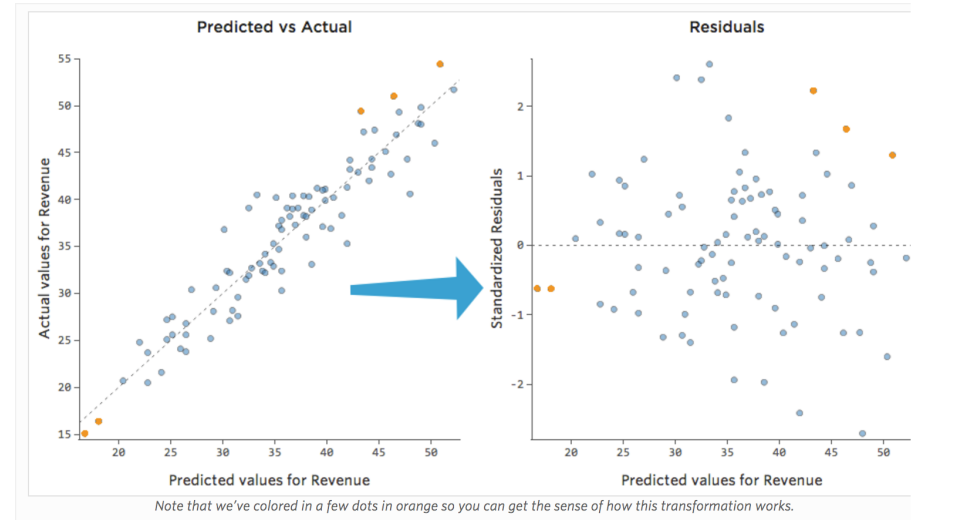
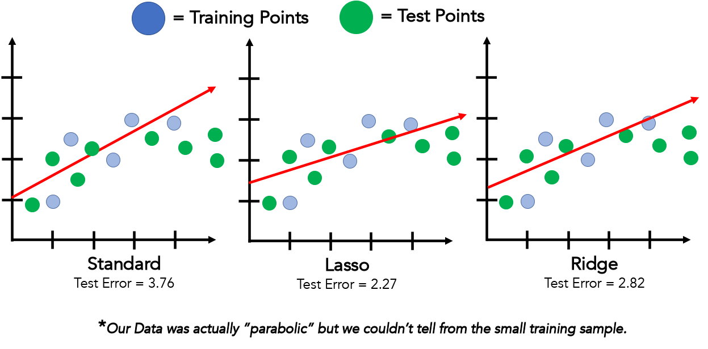
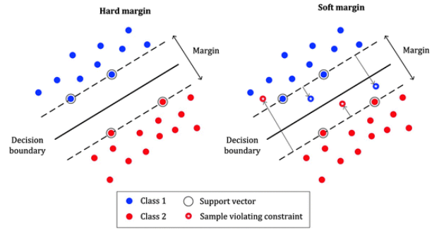

## The Least-Squares Method

- Uni-variate Linear Regression (Normal Linear Regression):
- Residual (error)  = $\hat{f}(x_i) - f(x_i)$.:

---

### Evaluating Regression Performance

#### Residual plots

A plot of the amount of error (residuals) against the predicted values. We can decide if the model is suitable or we should try a different (Non-linear) model.

* **Root Mean Squared Error (RMSE)**:

$$\mathrm{RMSE} = \sqrt{\frac{1}{n} \sum_{i=1}^n (f(x_i) - \hat{f}(x_i))^2}$$

RMSE is the square root of the average of the squared differences between the predicted and actual values. (standard deviation of the residuals)

* **Coefficient of determination $R^2$**:

$$R^2 = 1 - \frac{\mathrm{RSS}}{\mathrm{TSS}}$$

Where:

* Residual Sum of Squares (RSS):

$$\mathrm{RSS} = \sum_{i=1}^n (f(x_i) - \hat{f}(x_i))^2$$

* Total Sum of Squares (TSS):

$$\mathrm{TSS} = \sum_{i=1}^n (f(x_i) - \bar{f})^2$$

---

### Effect of Outliers

Outliers can strongly affect the regression line because least squares penalizes large residuals heavily.

**Possible solutions:**

* Train model → detect and remove outliers with residual plots → retrain.
* Use **Total Least Squares** that accounts for noise in both $x$ and $y$.

## Regularised Regression (Ridge Regression)

With few data points, the model can **overfit** the training data (low error on training, high error on test).

Regularisation adds a penalty on large weights to avoid overfitting.

$$\text"{ERROR} + \lambda \cdot \text{Penalty on Weights}"$$

Where $\lambda$ is a hyperparameter that controls the amount of regularization.
- Low $\lambda$ → model tries harder to fit the data exactly.
- High $\lambda$ → model keeps weights small and simpler, less sensitive to noise.

---

## 2.2 Using Least Squares for Classification

### Linear Models for Classification

We can encode two classes as real numbers:

* Positive class: $y^+ = +1$
* Negative class: $y^- = -1$

Train linear regression to predict these labels.

### Decision Rule

Predict class for an instance $x$ by:

$$\hat{y} = \mathrm{sign}(\mathbf{w} \cdot \mathbf{x} - t)$$

where

$$\mathrm{sign}(z) = \begin{cases}
+1 & z > 0 \\
0 & z = 0 \\
-1 & z < 0 \end{cases}$$

---

## Support Vector Machines (SVM)

