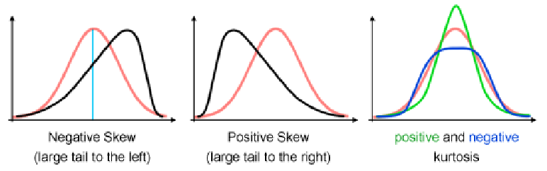

* **Statistics of central tendency:** Describe the center of data

  * **Mean**, **Median**, **Mode:** Average, middle value, most common value.

* **Statistics of dispersion:** Describe spread of data

  * **Variance**, **Standard deviation**
  * **Range:** Difference between max and min.
  * **Midrange:** Average of max and min.
  * **Quantiles:** Points dividing data into percentages (percentiles, quartiles, deciles).
  * **Interquartile range:** Difference between 3rd and 1st quartile.

* **Shape statistics:** Describe the shape of the data distribution

  * **Skewness:** Measures if data is lopsided. Positive means right-skewed (long tail on right), negative means left-skewed.
  * **Kurtosis:** Measures how sharp or flat the peak is compared to a normal distribution.

---

* Some models treat feature types differently:

  * Decision trees handle categorical and continuous differently.
  * Naïve Bayes works only with categorical features.
  * Distance-based models (like K-means) need quantitative or ordinal features.

- Dealing with Missing Values = **Imputation** with Mean, Regression, or Expectation Maximisation (statistical model).

---

### 2.3 Structured Features

* Structured features capture complex info, like word counts or phrase presence in texts.
* For example, in spam detection:

  * Features could be word frequencies.
  * Or whether a phrase like “machine learning” appears.
* Features can also represent relations, such as if one email quotes another.

## Feature Transformations

Transform features to make them easier to use or improve models.

| From \ To    | Quantitative               | Ordinal      | Categorical  | Boolean     |
| ------------ | -------------------------- | ------------ | ------------ | ----------- |
| Quantitative | Normalisation, Calibration | Calibration  | Calibration  | Calibration |
| Ordinal      | Discretisation             | Ordering     | Ordering     | Ordering    |
| Categorical  | Discretisation             | Unordering   | Grouping     | -           |
| Boolean      | Thresholding               | Thresholding | Binarisation | -           |

* **Calibration:** Assigns values to categorical data but can wrongly give more importance to some categories.
* **Thresholding:** Converts numeric/ordinal features into boolean by splitting at a threshold value.
* **Discretisation:** Converts quantitative features into ordinal by grouping continuous values into bins.

### Normalisation and Calibration

* **Normalisation:** Make sure all numeric features are on the same scale.

  * **Min-Max normalisation:** Scales data between 0 and 1.
  * **Z-score normalisation:** Centers data around mean 0 and standard deviation 1.

---

## Feature Construction and Selection

### 4.1 Principal Component Analysis (PCA)

* PCA creates new features (principal components) by combining original features.
* It finds directions (components) where data varies the most.
* First principal component (PC1) explains the most variation.
* Second component (PC2) is orthogonal (at right angles) to PC1 and explains the next most variation.
* PCA helps reduce redundancy when features are correlated.

Process:

1. Find the mean of data.
2. Center data by subtracting mean.
3. Find principal components as linear combinations of features.
4. Eigenvalues measure importance of each component (variance explained).
5. Eigenvectors give direction of components.

Methods to compute PCA:

* **Singular Value Decomposition (SVD)**
* **Eigenvalue decomposition**

