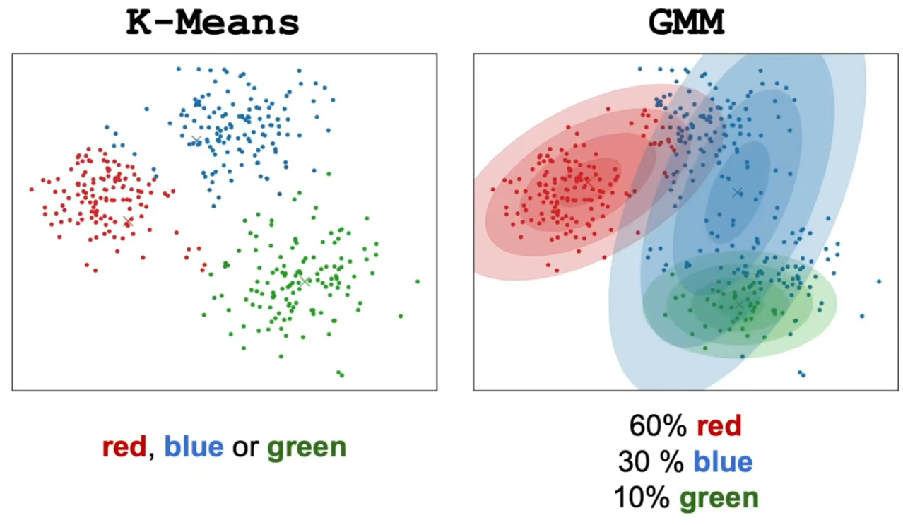

## Probability

* **Frequentist:** Uses hypothesis testing and p-values to check if there is a meaningful difference.
* **Bayesian:** Uses prior knowledge and calculates the probability one design is better than the other.

## Probabilistic Models

**Decision rules:**

**Maximum a posteriori (MAP) decision rule:**

Consider both likelihood and prior.

**Maximum likelihood Estimation (MLE) decision rule:**

Consider only likelihood, assume priors are equal.

---

## Probability Distributions for Continuous Variables

### Using Gaussians to classify

* Two groups (classes) each have their own Gaussian with different means and spreads.
* We find a **decision boundary** that separates the two groups.
* This boundary is where the chance of belonging to each group is equal.

### Mixture Model

* Data can come from a mix of two Gaussian groups.
* Each group has its own mean and spread.
* We use the likelihood of each group to decide which class a data point belongs to.

### Decision boundary cases

* If spreads (σ) are the same, the boundary is in the middle of the means.
* If spreads differ, the boundary can be more complex.

### Maximum Likelihood Estimation (MLE)

* A method to find the best mean and spread for the data.
* It chooses values that make the observed data most likely.

---

## Probability Distributions for Categorical Variables

**Categorical variables:** like words in a document.

* **Multivariate Bernoulli distribution:** models presence or absence of words (0 or 1).
* **Multinomial distribution:** models counts of word occurrences (how many times each word appears).

---

## Naïve Bayes Model

Assumes **features are independent given the class** — this is a simplification but works well in practice.

* Used in spam classification: assumes words occur independently in an email.

This assumption is usually false because words depend on each other (e.g., "scientific" and "experiment" often appear together), but the model still works well.`

### Zero frequency problem

If a word never appears with a class in training data, its probability estimate is zero, making the whole product zero.

**Solution:** Smoothing (Laplace correction):

$$\hat{\theta} = \frac{d + 1}{n + k}$$

where d = number of successes, n = trials, k = number of categories.

---

## Logistic Regression

* Used for **binary classification**.
* Estimates the probability p of belonging to a class.

---

## Gaussian Mixture Models (GMM)

* Data generated by several Gaussian distributions with unknown labels.
* Goal: estimate parameters (means μj, covariances Σj) of each Gaussian without knowing the class labels.

To classify points, need parameters. To estimate parameters, need class labels.

### Expectation-Maximization (EM) algorithm:

Iterative method to solve above problem.

1. **Initialize** parameters randomly.
2. **E-step:** Compute probabilities of each point belonging to each class given parameters.
3. **M-step:** Update parameters using these probabilities.
4. Repeat until convergence.

