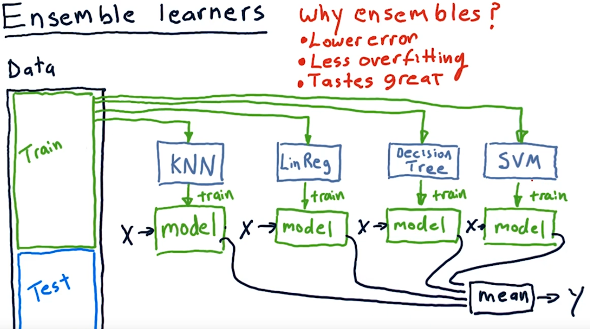

## Ensemble Learning

Concept: Wisdom of Crowds & Condorcet’s Jury Theorem

P is the probability that a single voter (or model) is correct.
- If p > 0.5, adding more voters/models improves accuracy.
- If p < 0.5, adding more voters/models makes accuracy worse.

* Combines multiple models to improve predictions where each model is trained on slightly different data (re-weighted or resampled).

---

### Bootstrapping

* Train and test many times on these random samples, and samples can repeat in each training set. This process helps reduce mistakes caused by just one fixed training set.

### Bagging (Bootstrap Aggregating)

* Steps:

  1. Create multiple bootstrap samples from the original data.
  2. Train separate models (learners) on each sample. (Bootstrap)
  3. Combine their predictions by voting or averaging. (Aggregate)
* This reduces variance (makes model more stable).

### Subspace Sampling

* Instead of using all features, you randomly pick only a small set of features for each model. Different models look at different parts of the data, so their errors won’t be the same. This helps the combined model (ensemble) perform better and avoid overfitting.

### Random Forests

* Bagging + random feature selection for trees.
* Train many decision trees on different bootstrap samples and random feature subsets.
* Predict by majority vote (classification) or average (regression).

---

### Bagging vs Boosting

* Bagging: models are independent, combine by voting, reduces variance.
* Boosting: models build sequentially, each model learns from errors of previous, reduces bias.

### Weight Assignment in Boosting

* Initially, all instances have equal weights summing to 1.
* After each round, misclassified points get higher weight, correctly classified get lower weight, so model focuses on hard cases.
* Example: if error rate is ϵ, weight for misclassified = 1/(2ϵ), for correctly classified = 1/(2(1−ϵ)).

### Boosting Models

- XGBoost (Extreme Gradient Boosting): Gradient Boosting with regularization.
- LightGBM: Gradient Boosting with histogram-based learning.
- AdaBoost: Boosting with adaptive weights.
- Gradient Boosting: Boosting with gradient descent optimization.
---

## Bias and Variance

### Definitions

* **Bias:** Error from wrong assumptions in the learning algorithm (systematic error).
* **Variance:** Error from sensitivity to small fluctuations in the training set (model changes a lot with different data).
* Total expected error = Bias² + Variance + Irreducible error.

### Examples

* High bias: model is too simple (e.g., linear model on non-linear data).
* High variance: model fits training data too closely and changes a lot with different samples (e.g., decision trees).

### Role of Bagging and Boosting

* Bagging mainly reduces variance (good for high-variance models like trees).
* Boosting mainly reduces bias (good for high-bias models like weak linear classifiers).

### Beyond Bagging and Boosting

* **Stacking:** Train multiple base models (e.g., decision trees, SVMs) and combine their predictions using a meta-model (e.g., logistic regression).
---

### Cross-validation

* Split data into k parts (folds).
* Train on k-1 folds, test on the 1 remaining fold. Repeat k times (each fold used once for testing).
* Gives average performance and variance estimate.

#### Leave-One-Out Cross-Validation (LOOCV)

LOOCV is a special case of k-fold cross-validation where each fold contains a single instance, so the model is trained on all data except one point and tested on that point, repeating for every data point—providing high accuracy but at significant computational cost for large datasets.

---

### P-Values:

- Null Hypothesis (H0): Says no difference or no relationship exists.
- Alternative Hypothesis (H1): Says there is a difference or relationship.
- P-value: Probability of observing the data if H0 is true. 
- If p-value < α (significance level, like 0.05), it means the results are unlikely to be just by chance. So, you usually say the result is statistically significant.

### **t-test**

* A t-test checks if the difference between two groups' averages (means) is real or just by chance.
* It helps you know if two things really behave differently.

There are two main types:

1. **Independent t-test:** Compare two separate groups (like comparing scores of men vs women).
2. **Paired t-test:** Compare the same group at two times (like before and after treatment).

### Comparing Algorithms on Multiple Datasets — Why t-test doesn’t work well

* Scores from different datasets can’t be compared directly because datasets can be very different.
* So, t-test is not good when you want to compare algorithm performance over many datasets.

### Wilcoxon Signed-Rank Test

* This is a better test for comparing two algorithms on many datasets.
* Steps:

  1. For each dataset, find the difference in performance between two algorithms.
  2. Take the absolute values of these differences and rank them from smallest to largest.
  3. Sum the ranks separately for positive and negative differences.
  4. Use the smaller sum as the test statistic.
* If the test statistic is below a certain critical value, you can say the algorithms perform differently (reject null hypothesis that they are equal).

### Friedman Test

* Used when you want to compare **more than two algorithms** over multiple datasets.
* Steps:

  1. Rank the algorithms on each dataset (1 for best, k for worst).
  2. Calculate the average rank for each algorithm across all datasets.
  3. Check if the differences in average ranks are big enough to say the algorithms perform differently (test the null hypothesis that they all perform equally).

### Post-hoc Tests (like Nemenyi Test)

* After Friedman test shows there is a difference, you want to know **which pairs** of algorithms are different.
* Calculate a **Critical Difference (CD)** value.
* If the difference between the average ranks of two algorithms is greater than CD, their performance difference is significant.

### Critical Difference Diagram

* A simple visual to show which algorithms differ significantly.
* Algorithms are placed on a line based on their average ranks.
* Groups of algorithms connected by a horizontal line mean their performances are **not significantly different**.

