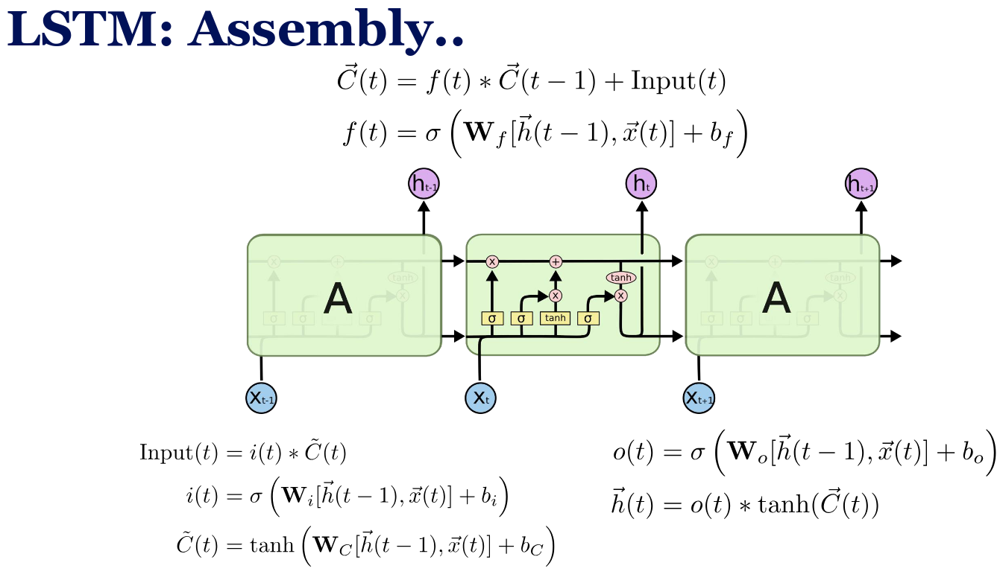

- **Vanilla Recurrent Neural Network** $O(t) = g(\vec{W}^T \vec{x} + w_2 O(t-1) + b)$
  - **Hidden state**: $h(t)$ that acts as short-term memory = previous hidden state $h(t-1)$ + current input $x(t)$.
  - **Output** $O(t)$ depends on input $x(t)$ and previous hidden state $h(t-1)$.
    - $O(t) = g(W_h h(t-1) + W_x x(t))$
    -

$$h(t) = sigmoid(\begin{bmatrix}x(t) \\h(t-1)\end{bmatrix})$$

- $O(t) = g(h(t))$
    - **Backpropagation Through Time (BPTT)**: Unfold the RNN over time steps, compute gradients, and update weights.
  - **Problems**: 
    - **Vanishing gradients**: Gradients become too small, causing the network to forget early inputs.
    - **Exploding gradients**: Gradients become too large, leading to unstable training.
  - **Solutions**:
    - **Constant Error Carousel**: A mechanism to help gradients flow through many time steps by having long memory $C_t$.
- **Gated Recurrent Units (GRUs)**: A simpler alternative to LSTMs with fewer gates.
- **Long Short-Term Memory (LSTM) Networks** (Gated RNNs)
  - **Gates** control information flow:
    - **Forget gate $f_t$**: Decides what to discard from the cell state.
    - **Input gate $i_t$**: Decides what new information to add.
    - **Output gate $o_t$**: Decides what part of the cell state to output.
  - **Notations**:
    - $C_t$: Cell state carrying long-term memory.
    - $h_t$: Hidden state at time $t$.
    - **$f(t), i(t), o(t)$**: Sigmoid gates controlling information flow.
    - **$\tilde{C}_t$**: Candidate cell state, computed using tanh to keep values in a suitable range.
  - **Flow**:
    - **Inputs**: $C_{t-1}, h_{t-1}, x_t$
    - $h_{t-1}$ and $x_t$ passes through sigmoid to produce  $f_t, i_t, o_t$.
      - $\vec{C}(t) = f(t) * \vec{C}(t - 1) + \text{Input}(t)$
      - $f(t) = \sigma \left( \mathbf{W}_f \left[ \vec{h}(t - 1), \vec{x}(t) \right] + b_f \right)$
    - $h_{t-1}$ and $x_t$ passes through sigmoid to produce $i_t$ and $tanh$ to produce $\tilde{C}_t$.
      - $\text{Input}(t) = i(t) * \tilde{C}(t)$
      - $i(t) = \sigma \left( \mathbf{W}_i \left[ \vec{h}(t - 1), \vec{x}(t) \right] + b_i \right)$
      - $\tilde{C}(t) = \tanh \left( \mathbf{W}_C \left[ \vec{h}(t - 1), \vec{x}(t) \right] + b_C \right)$
    - Now $C_t$ formed and $h_t$ can be computed. We pass $h_{t-1}$ and $x_t$ through sigmoid to produce $o_t$.
      - $o(t) = \sigma \left( \mathbf{W}_o \left[ \vec{h}(t - 1), \vec{x}(t) \right] + b_o \right)$
      - $\vec{h}(t) = o(t) * \tanh(\vec{C}(t))$
      

- The one with $f_t$ is **Forget Gate LSTM**.
- The one with $i_t$ and $\tilde{C}(t)$ is **Input Gate LSTM**.
- The one with $o_t$ is **Output Gate LSTM**.
- The one in top is **Cell State Update**

- **Sequence-to-Sequence (Seq2seq) Models**: For machine translation and multi-step forecasting. with two steps:

  1. **Encoder**: Encodes the input sequence into a fixed-size context vector. Encodes input sequence into a hidden representation uses word embeddings + RNN/LSTM layers and initial hidden state often random.
  2. **Decoder**: Uses the context vector to generate the output sequence. Generates output sequence from the encoder’s final hidden state, using previous outputs as inputs for next steps.
