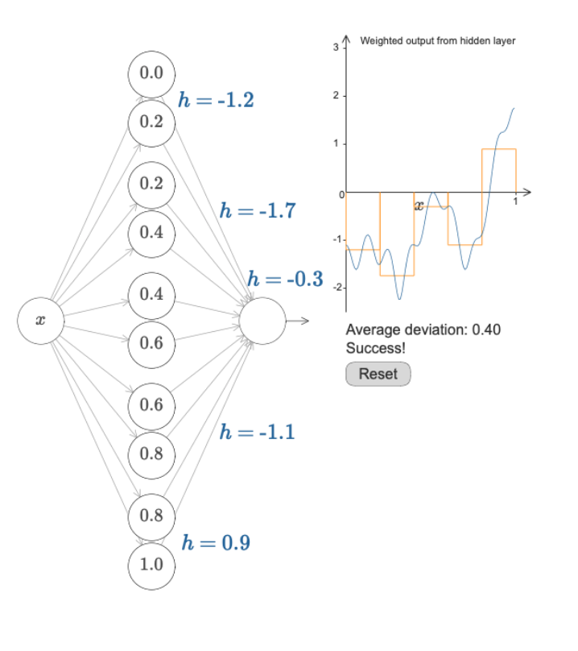
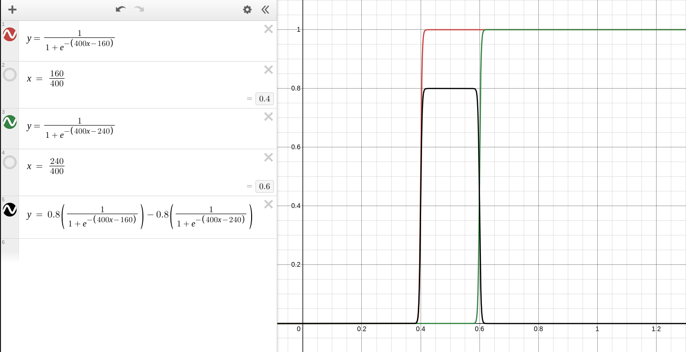

### Universal Approximation Theorem 
For any continuous function $f(x)$, there exists a neural network with a single hidden layer that can approximate $f(x)$ to any desired degree of accuracy.

### Proof

**Step 1:**
Make a **step function** using one neuron by setting a very large weight $w$ and bias $b$.
Step position: $s = -b/w$.

**Step 2:**
Use two neurons with step points $s_1$ and $s_2$, and weights $w_1$, $w_2$ on output.
Output = $w_1 a_1 + w_2 a_2$ (sum of weighted steps).

**Step 3:**
Create a **bin function** by setting $w_1 = -w_2 = h$, making one step go up and the other down between $s_1$ and $s_2$.
Control bin size, position, and height with $s_1, s_2, h$.

**Step 4:**
Add many bins (pairs of neurons) to divide the input into multiple parts.
Adjust heights and positions to build a histogram that approximates the target function.
More bins = better precision.

- The function for this example is: $B(x) = 0.8 \cdot \sigma(400(x - 0.16)) - 0.8 \cdot \sigma(400(x - 0.24))$

---

- **Generative Modeling** = Unsupervised task
    - **Autoencoders** = Encoder + Decoder $\to$ Sub-networks of Autoencoders.
        - **Encoder** = Compresses input to a lower-dimensional representation. $\to$ Make it latent
            - Can be any neural network architecture. Like Image(CNN), Time Series(LSTM), tabular(MLP).
        - **Decoder** = Reconstruct the data from the latent code.
            - Another neural network architecture.
        - **Deconvolutional Autoencoders**:
            - **Upsampling (interpolation)** Adding new pixels between the original ones by guessing their values.
            - **Transposed Convolution**: A convolutional layer using filter (kernel) the opposite way.
    - **Loss function** or **reconstruction error**. It measures how close the output image $x'$ is to the input image $x$.
        - $\mathcal{L}_{AE}(\phi, \theta) = \frac{1}{n} \sum_{i=1}^{n} \left[ \mathbf{x}^{(i)} - f_{\theta}\left(g_{\phi}(\mathbf{x}^{(i)})\right) \right]^2$
        - $id \approx f_\theta \circ g_\phi$
            - $g_\phi$ is the **encoder** that compresses the input to a smaller representation $z$,
            - $f_\theta$ is the **decoder** that reconstructs the input from $z$.
- **Generative Adversarial Network (GAN)** = Unsupervised task
    - **Generator**: Generates new data samples.
    - **Discriminator**: Classifies real vs. generated data.
    