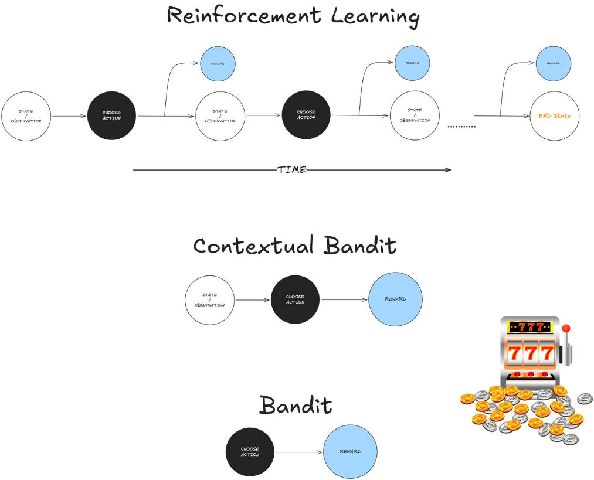

# **Reinforcement Learning (RL) - Lecture 1**

- **Reinforcement Learning is inspired by Instrumental Conditioning (Skinner Box)**

| Feature | Supervised Learning | Reinforcement Learning |
|---------|---------------------|------------------------|
| Dataset | Given | Actively collected |
| Feedback | Full (x with correct y) | Partial (state-action feedback) |
| Goal | Learn a function from labeled data | Learn an **optimal policy** through interaction |

---

#### **Summary**
This chapter introduces *Reinforcement Learning (RL)* as a computational approach to learning from interaction. Unlike supervised learning, RL involves an agent that learns through *trial-and-error* and *delayed rewards*, making decisions to maximize long-term rewards. The key difference from other learning methods is the trade-off between *exploration* (trying new actions) and *exploitation* (using known successful actions).

RL is framed as a *Markov Decision Process (MDP)*, emphasizing three core elements:
1. **Sensation (State)** – Perceiving the environment.
2. **Action** – Choosing actions to interact with the environment.
3. **Goal (Reward)** – A numerical signal guiding behavior.

Key elements in RL include:
- **Policy**: The strategy for selecting actions.
- **Reward Function**: Determines immediate desirability of states/actions.
- **Value Function**: Measures long-term expected rewards.
- **Model (optional)**: Predicts state transitions for planning.

The chapter presents examples like playing chess, controlling a refinery, and making breakfast to illustrate how RL applies to real-world decision-making. The *tic-tac-toe example* demonstrates RL principles using value function estimation and temporal-difference learning.

Historically, RL stems from both psychology (trial-and-error learning) and optimal control theory (dynamic programming). Modern RL integrates these fields, evolving into a key area bridging AI and engineering.

---

- **Reinforcement Learning (RL)**: Learning through interaction to maximize cumulative reward.
- **Trial-and-Error Learning**: Discovering the best actions by experimenting.
- **Delayed Reward**: Actions influence future rewards, requiring foresight.
- **Exploration vs. Exploitation**: Balancing trying new actions and leveraging past knowledge.
- **Markov Decision Process (MDP)**: The mathematical framework underlying RL.

#### **Main Elements of RL**
1. **Policy (π)** – Mapping states to actions (deterministic or stochastic).
2. **Reward Function (R)** – Immediate feedback for an action.
3. **Value Function (V)** – Expected future rewards from a state.
4. **Model (optional)** – Predicts environment transitions.

#### **Comparison with Other Learning Methods**
| Feature              | Reinforcement Learning | Supervised Learning | Evolutionary Methods |
|----------------------|----------------------|----------------------|----------------------|
| **Learning Style**   | Trial-and-error       | Given labeled data   | Direct policy search |
| **Feedback Type**    | Reward signals        | Correct labels       | Population fitness   |
| **Exploration Need** | Yes                   | No                   | Yes                  |

#### **Important Challenges**
- **Exploration-Exploitation Dilemma**: Agent must balance trying new actions vs. using known rewards.
- **Credit Assignment Problem**: Determining which past actions led to success.
- **Curse of Dimensionality**: Large state spaces make learning difficult.

#### **Tic-Tac-Toe Example**
- Uses **value function learning** to estimate probabilities of winning.
- Updates values based on **temporal-difference (TD) learning**.
- Learns optimal strategy through self-play.

#### **Historical Context**
- **Thorndike’s Law of Effect (1911)**: Reinforcement strengthens associations.
- **Bellman’s Dynamic Programming (1957)**: Key foundation for RL.
- **Minsky, Samuel (1950s-60s)**: Early AI applications of RL.
- **Watkins (1989)**: Introduced *Q-learning*, a major RL algorithm.
- **Tesauro’s TD-Gammon (1992)**: Demonstrated RL’s success in complex games.
---

### **Reinforcement Learning (RL) Basics**  
- **Agent** interacts with an **environment**, observes a **state**, takes an **action**, and gets a **reward**.  
- Loop continues until the environment **stops** (e.g., game ends).  
  - **Example**: A self-driving car (**agent**) sees a red light (**state**) and decides to stop (**action**) to avoid a fine (**reward**).  

### **Contextual Bandit (One-Step RL)**  
- **No time dimension** → One action, one reward, then stops.  
  - **Example**: Netflix recommends a movie (**action**) based on your watch history (**state**). You watch it (**reward = 1**) or skip it (**reward = 0**).  

### **Bandit (No Context)**  
- **No state information** → Just picks an action blindly.  
  - **Example**: A slot machine with **multiple arms**. The player (**agent**) pulls one (**action**) and gets a reward (money).  

### **Multi-Armed Bandit & Exploration vs. Exploitation**  
- **Multi-Armed Bandit**: Multiple actions, unknown rewards.  
- **Exploration** → Try all actions to learn.  
- **Exploitation** → Stick to the best-known action.  
  - **Example**: A business tests ads on **Google, Facebook, and YouTube**. After learning Google works best, they focus more on it.  

In Reinforcement Learning (RL), a **bandit** refers to the **multi-armed bandit (MAB) problem**, a simplified RL setting where an agent repeatedly chooses among multiple actions (or "arms") to maximize rewards. Each action has an unknown reward distribution, and the goal is to balance **exploration** (trying new actions) and **exploitation** (choosing the best-known action).

### Key Types of Bandit Problems:
1. **Multi-Armed Bandit (MAB)** – Standard setting with independent rewards per arm.
2. **Contextual Bandit** – The agent gets additional context (features) before choosing an action.
3. **Bayesian Bandit** – Uses Bayesian methods to update beliefs about arm rewards.

### Common Algorithms:
- **ε-Greedy** – Explores randomly with probability **ε**, otherwise exploits the best-known arm.
- **UCB (Upper Confidence Bound)** – Selects arms optimistically based on confidence intervals.
- **Thompson Sampling** – Uses Bayesian probability to sample from reward distributions.

Bandits are widely used in **A/B testing, recommendation systems, and online advertising**.