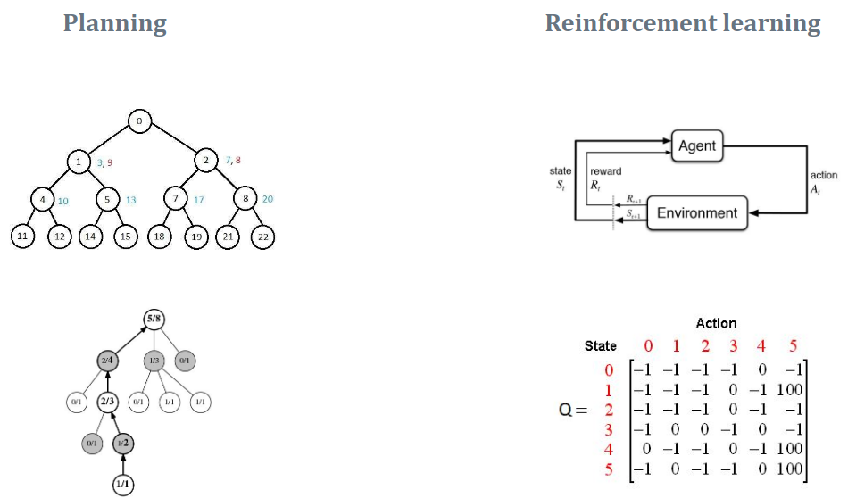
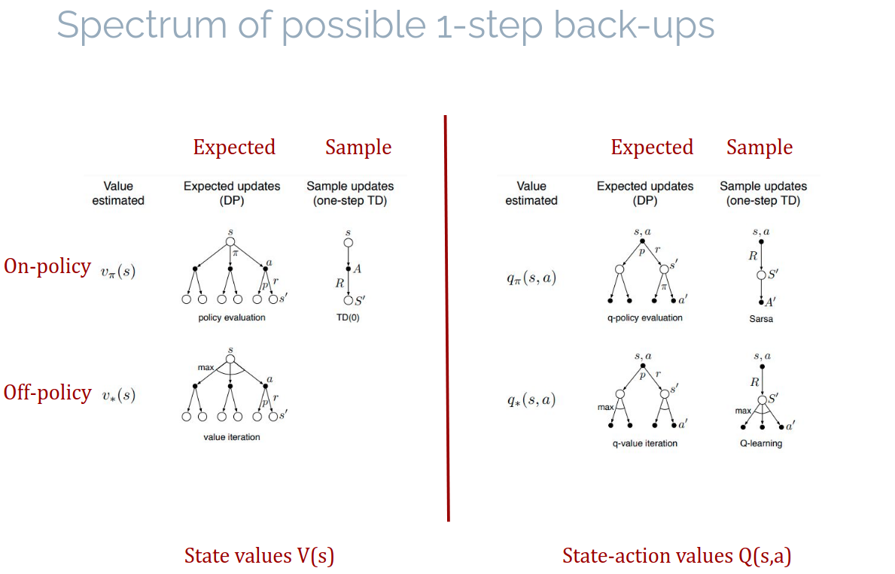
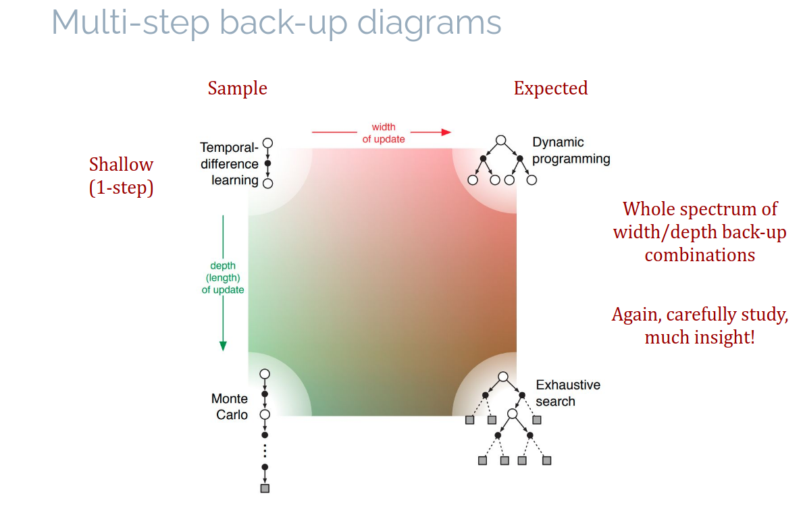

#### **Access to MDP Dynamics**
#### **Reversible vs. Irreversible Access:**

  * **Model (Reversible Access):** In a model, we can query the MDP dynamics at any time and get the probability distribution $p(s' | s, a)$.
  * **Environment (Irreversible Access):** In an environment, after taking an action $a$, we cannot undo it. We must move forward and observe the resulting state $s'$.
* **Distribution vs. Sample Models:**

  * **Distribution Models:** You get the full probability distribution over next states 
  * **Sample Models:**  You get only one sample of the next state
  
#### **Planning vs. Learning**

The distinction between **planning** and **learning** lies in two factors:



* **Access to MDP Dynamics:**

  * **Planning:** Uses a model with reversible access, allowing for queries on any state-action pair. Stores a **local solution**
  * **Reinforcement Learning (RL):** Uses an environment with irreversible access, where you must proceed through the environment step-by-step. Stores a **global solution**

|                            | Local solution               | Global solution              |
|----------------------------|------------------------------|------------------------------|
| **Reversible MDP access**   | Planning (e.g., MCTS)        | Borderline/Model-based RL (e.g., Dynamic Programming) |
| **Irreversible MDP access** | (impossible)                 | Model-free RL (e.g., Q-learning) |

---


### **Back-ups:**

In reinforcement learning, a **back-up** refers to how we update the value function or action-value function when estimating the value of a state or action.

* **Expected Back-ups:**
These are primarily used in **planning**. In planning, we have a model (reversible access to MDP dynamics), so we can fully calculate the expected value of the next state.

* **Sample Back-ups:**
These are mostly used in **reinforcement learning** (RL), where you often do not have a model of the environment. Instead, you experience one transition at a time and use that experience to update your estimates.

### **Back-up Diagrams:**

The back-up diagrams visually show how updates are made in the **state values** $V(s)$ and **state-action values** $Q(s,a)$. The diagrams correspond to different types of updates.

* **On-policy vs Off-policy:**

  * **On-policy**: The value or Q-values are updated using the same policy that is being followed (e.g., **Sarsa** where the policy is followed directly).
  * **Off-policy**: The value or Q-values are updated using a different policy than the one being followed (e.g., **Q-learning** where the greedy policy is used to update, but the agent may be exploring randomly).

### **1-Step vs. Multi-Step Back-ups:**

* **1-Step Back-ups (Shallow Updates):**

  * These updates involve only a single step (transition from one state to the next) and are **shallow** in terms of the depth of the update.
  * **TD(0)** and **Monte Carlo** methods are examples of shallow updates because they only consider the immediate next state or the final return (in the case of Monte Carlo).

* **Multi-Step Back-ups (Deep Updates):**

  * **Multi-step updates** involve looking further into the future, considering multiple steps in the environment (depth).
  * For example, **Monte Carlo** learning looks at complete episodes, while **TD(λ)** or **dynamic programming** methods may use longer sequences of states and actions to perform updates.
  * These updates are **deeper** and often lead to **more accurate estimates** of value functions but are computationally more expensive.



  

### **Relation to Algorithms:**

* **TD(0)** is a shallow update that uses **sample back-ups** (one-step sample updates).
* **Monte Carlo** can be a **multi-step** back-up method (it performs updates over entire episodes).
* **Dynamic Programming (DP)** involves **expected back-ups** over the entire state space and is typically used in planning where the model is fully known.

### **Notes:**
* **Expected back-ups** are used in **planning** where you have a model and can compute the full expected value over the next state.
* **Sample back-ups** are used in **RL** when you only have access to sampled experiences.
* **Shallow updates** look at immediate outcomes (1-step), while **deep updates** consider longer-term effects (multi-step).
---

#### **Tabular Model Learning**

In a tabular model, we learn both the **transition dynamics** and the **reward function** by collecting samples of transitions:

* **Transition counts:** $n(s, a, s')$ is the number of times we transition from state $s$ to $s'$ using action $a$.
* **Reward sums:** $R_{\text{sum}}(s, a, s')$ is the sum of rewards obtained when transitioning from $s$ to $s'$ using action $a$.

Using these counts, we can estimate:

* **Transition model:**

$$

\hat{p}(s'|s, a) = \frac{n(s, a, s')}{n(s, a)}

$$

* **Reward model:**

$$

\hat{r}(s, a, s') = \frac{R_{\text{sum}}(s, a, s')}{n(s, a, s')}

$$

### Algorithm 1: Tabular Model Update Pseudo-code

```text
Algorithm 1: Tabular model update pseudo-code. 
Input: Maximum number of timesteps T. 
Initialization: Initialize n(s, a, s0) = 0 and Rsum(s, a, s0) = 0 ∀s ∈ S, a ∈ A

repeat T times
    Observe hs, a, r, s0i  /* Observe new transition */
    n(s, a, s0) ← n(s, a, s0) + 1  /* Update transition counts */
    Rsum(s, a, s0) ← Rsum(s, a, s0) + r  /* Update reward sums */
    pˆ(s0|s, a) ← n(s,a,s0 / ∑s0 n(s,a,s0)) /* Estimate transition function */
    rˆ(s, a, s0) ← Rsum(s,a,s0) / n(s,a,s0) /* Estimate reward function */
    pˆ(s, a|s0) ← n(s,a,s0 / ∑s,a n(s,a,s0))  /* Reverse model (only for PS) */
end
```

---


## **Model-based RL Algorithms**

Model-based RL methods combine planning and learning by using a learned model to simulate the environment.

## Learning a model from data

Given a dataset of observed transitions, we can estimate:

* **Dynamics model:** The probability distribution $p(s'|s,a)$.
* **Reward function:** The expected reward $r(s,a,s')$.

To do this:

1. **Track counts** $n(s,a,s')$ and reward sums $R_{\text{sum}}(s,a,s')$.
2. Estimate the transition model as:

$$

\hat{p}(s'|s,a) = \frac{n(s,a,s')}{n(s,a)}

$$

3. Estimate the reward model as:

$$

\hat{r}(s,a,s') = \frac{R_{\text{sum}}(s,a,s')}{n(s,a,s')}

$$

### 1- **Real-time Dynamic Programming (RTDP):**

Real-time Dynamic Programming (RTDP) is a variant of Dynamic Programming that efficiently combines planning and learning. Here's a quick breakdown:

* **Classic Bridging Algorithm**: RTDP updates values using the Bellman optimality equation, similar to Dynamic Programming, but focuses on reachable states instead of all states in the space.

* **Curse of Dimensionality**: Traditional DP is inefficient in large state spaces because it updates all states, even unreachable ones. RTDP solves this by focusing only on states that are actually visited.

* **Efficient Updates**: RTDP applies updates only to states that are part of the trajectory from the start, making it more efficient and scalable.

* **Uniform Updates**: While traditional DP updates all states uniformly, RTDP targets only reachable states, improving performance in large problems.

In short, **RTDP** reduces unnecessary calculations by focusing on reachable states, making it more efficient for large state spaces.

### 2- **Dyna:**

Dyna is a model-based RL algorithm that combines learning and planning. First, we **learn a model** of the environment, then we use the model to simulate **one-step planning updates** to our value function.

The algorithm updates the Q-values using both actual environment samples and simulated samples from the learned model. This helps improve **data efficiency** by leveraging the model.

Algorithm details for Dyna Q-learning:

1. Initialize Q-values, transition counts, and reward sums.
2. For each timestep:

   * Take an action using an $\epsilon$-greedy policy.
   * Observe the transition and update the model.
   * Perform Q-learning updates using real experiences.
   * Perform planning updates using simulated transitions from the model.

### Algorithm 2: Dyna Q-learning with Epsilon-Greedy Exploration
```text
Input: Number of planning updates K, exploration parameter epsilon ∈ (0, 1], learning rate alpha ∈ (0, 1], discount parameter gamma ∈ [0, 1], maximum number of timesteps T.
Initialization: Initialize Q(s, a) = 0, n(s, a, s0) = 0, Rsum(s, a, s0) = 0 ∀s ∈ S, a ∈ A.

for t = 1...T do
    s ← current state  /* Reset when environment terminates */
    a ∼ πε-greedy(a|s)  /* Sample action */
    r, s0 ∼ p(r, s0|s, a)  /* Simulate environment */
    pˆ(s0, r|s, a) ← Update(s, a, r, s0)  /* Update model (Alg.1) */
    Q(s, a) ← Q(s, a) + alpha · [r + gamma · maxa0 Q(s0, a0) − Q(s, a)]  /* Update Q-table */
    
    repeat K times
        s ← random previously observed state  /* State to plan on */
        a ← previously taken action in state s  /* Planning action */
        s0, r ∼ pˆ(s0, r|s, a)  /* Simulate model */
        Q(s, a) ← Q(s, a) + alpha · [r + gamma · maxa0 Q(s0, a0) − Q(s, a)]  /* Update Q-table */
    end
end
```

### 3- **Prioritized Sweeping:**

Uses both forward and backward models to prioritize states for updating, spreading information faster.

Prioritized sweeping focuses on efficiently updating the value function by identifying **states with high-priority updates**:

* When the Q-value estimate for a state-action pair changes significantly, the predecessor states that lead to this state should also be updated.
* This prioritization helps focus updates on the most promising state-action pairs.

The algorithm maintains a **priority queue** where states with larger TD errors (difference between predicted and actual rewards) are prioritized for updates. It also performs **backward search** to identify which states to update based on the value changes.

### Prioritized Sweeping (Q-learning with epsilon-greedy exploration)

```text
Input: Number of planning updates K, exploration parameter epsilon ∈ (0, 1], learning rate alpha ∈ (0, 1], discount parameter gamma ∈ [0, 1], maximum number of timesteps T, priority threshold theta.
Initialization: Initialize Q(s, a) = 0, n(s, a, s0) = 0, Rsum(s, a, s0) = 0 ∀s ∈ S, a ∈ A, and prioritized queue PQ.

for t = 1...T do
    s ← current state  /* Reset when environment terminates */
    a ∼ πε-greedy(a|s)  /* Sample action */
    r, s0 ∼ p(r, s0|s, a)  /* Simulate environment */
    pˆ(s0, r|s, a) ← Update(s, a, r, s0)  /* Update model (Alg.1) */
    p ← |r + gamma · maxa0 Q(s0, a0) − Q(s, a)|  /* Compute priority p */
    if p > theta then
        Insert (s, a) into PQ with priority p  /* State-action needs update */
    end
    
    repeat K times
        s, a ← pop highest priority from PQ  /* Sample PQ, break when empty */
        s0, r ∼ pˆ(s0, r|s, a)  /* Simulate model */
        Q(s, a) ← Q(s, a) + alpha · [r + gamma · maxa0 Q(s0, a0) − Q(s, a)]  /* Update Q-table */
        
        for all (s, a) with pˆ(s0, a0|s) > 0 do
            r¯ = ˆr(s0, a, s)  /* Get reward from model */
            p ← |r¯ + gamma · maxa Q(s, a) − Q(s0, a0)|  /* Compute priority p */
            if p > theta then
                Insert (s, a) into PQ with priority p  /* State-action needs update */
            end
        end
    end
end
```
