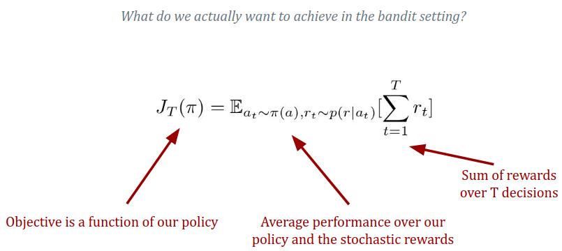
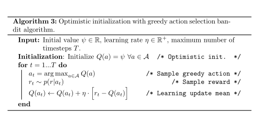
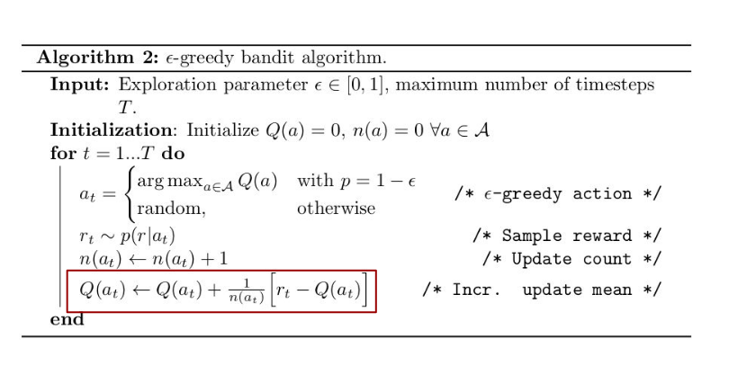
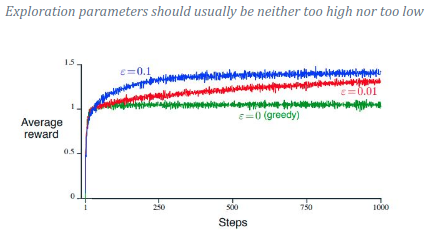
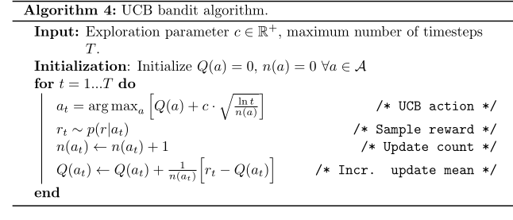

|                   | Dataset Given          | Actively Collect Data             |
|-------------------|------------------------|-----------------------------------|
| **Full feedback**    | Supervised learning   | (Active supervised learning)       |
| **Partial feedback** | (Offline RL)          | Bandits / Reinforcement learning   |
| **No feedback**      | Unsupervised learning | (Active unsupervised learning)     |
## Bandits

In **Bandits**, each action (arm pull) leads to a single reward, and the environment doesn't evolve into a new state. 

Unlike standard RL, where actions change the state and influence future rewards, bandit environments treat every pull as an independent one-step problem. 

By balancing exploration (trying different arms) and exploitation (pulling the best-known arm), RL approaches maximize long-term reward despite uncertainty.

### 1. **Bandit Definition**
A *bandit* is defined by the tuple $\langle A, p(r|a) \rangle$:
- $A$: A set of discrete actions (also called arms).
- $p(r|a)$: A conditional probability distribution that maps each action $a$ to a distribution over possible rewards $r$.

### 2. **Action Value Q(a)** or **Expected reward of an action $a$**

$$

Q(a) = \mathbb{E}_{r \sim p(r|a)}[r]

$$

Where denotes the expected value of R based on probability of reward $r$ if we take action $a$.

#### Initialization of $Q(a)$

- **Realistic Initialization**:

    $Q(a)=0 , ∀ a∈A$ :    Start with initial guess that the reward for each action is 0.
- **Optimistic Initialization**:

    $Q(a)=ψ , ∀a∈A$ : $ψ$ is a positive hyperparameter. This initialization encourages exploration by starting with a high value for each action. This makes the algorithm more likely to explore less tried actions, since they appear to have high expected rewards initially.

### 3. **Policy ($π$)** or **Action selection**
Gives probability of Choosing an Action based on the policy which consider Q(a).

### 4. **Objective (Maximizing Cumulative Reward)**

The goal of the bandit problem is to maximize the total reward over a given number of time steps $T$. At each time step $t$, an action $a_t$ is chosen according to the policy $\pi$, and a reward $r_t$ is observed from the distribution $p(r | a_t)$. The objective function $J_T(\pi)$ represents the expected total reward over the time horizon $T$, and is given by:



The goal is to find the optimal policy $\pi^*$ that maximizes this expected cumulative reward:

$$

\pi^* = \arg\max_{\pi} J_T(\pi)

$$

This means we are trying to find the policy that leads to the highest expected total reward after $ T $ timesteps.

### **Bandit Algorithm Pseudocode**

```markdown
Input: Maximum number of timesteps T
Initialize policy π(a)

for t = 1...T:
    at ∼ π(a)     # Sample an action from the policy -> Exploration/exploitation!
    rt ∼ p(r|at)  # Observe the reward for that action
    Update π based on (at, rt)   # Update the policy with the new information

End
```

In summary:
- **Bandit Problem**: Involves selecting actions (arms) and receiving rewards.
- **Action Value (Q(a))**: The expected reward for each action.
- **Policy (π)**: A strategy that dictates which actions to take.
- **Objective**: Maximize the cumulative reward over time.

The challenge is to estimate the action values efficiently and adjust the policy to maximize long-term rewards.

---

## Estimate a mean

Many algorithms rely on our ability to estimate the mean reward of an action:

However, now next $r_{n+1}$ comes in, and how do we update the current mean $Q_n$ ?
- **Incremental update**
- **Learning update**

$Q(n) = 1/n \sum_{i=1}^{n} r_i$ is the mean of the first n rewards but now we want to make formula how to update the mean when we get new reward $r_{n+1}$
- **Incremental update**:

$$

Q_{n} = Q_{n-1} + \frac{1}{n} [r_{n} - Q_{n-1}]

$$

- **Learning update**:

Simply move the new mean a bit in the direction of the last observed reward

$$

Q_n \leftarrow Q_{n-1} + \alpha \left[ r_n - Q_{n-1} \right]

$$

Where $ \alpha $ is the learning rate, which controls how much the new reward influences the current estimate.

---

## **Bandit algorithms**

## Policies

### **Greedy Policy (with Optimistic Initialization)**:
  - The greedy policy selects the action with the highest $Q(a)$ value.
  - **Mathematically**:

$$

\pi_{\text{greedy}}(a) = \begin{cases}
1, & \text{if } a = \arg\max_{b \in A} Q(b) \\
0, & \text{otherwise} \end{cases}

$$

This selects the best-known action with certainty. Optimistic initialization ensures that initially all actions are explored equally by setting high initial estimates for $Q(a)$.



### **$\epsilon$-Greedy Policy**:
  - Balances exploration and exploitation by choosing the best action with probability $1 - \epsilon$ and exploring other actions randomly with probability $\epsilon$.
  - **Mathematically**:

$$

\pi_{\epsilon\text{-greedy}}(a) = \begin{cases}
1 - \epsilon, & \text{if } a = \arg\max_{b \in A} Q(b) \\
\frac{\epsilon}{|A| - 1}, & \text{otherwise} \end{cases}

$$

**Note**: $ε$ = exploration parameter which scale the amount of exploration




  
### **Softmax (Boltzmann) Policy**:
  - Uses a probabilistic approach where actions with higher $Q(a)$ values are more likely to be chosen.
  - **Mathematically**:

$$

\pi_{\text{softmax}}(a) = \frac{\exp(Q(a)/\tau)}{\sum_{b \in A} \exp(Q(b)/\tau)}

$$

Where $\tau$ (temperature parameter) controls the level of exploration. A high $\tau$ encourages exploration (more randomness), while a low $\tau$ encourages exploitation of the best-known actions.

### **Upper Confidence Bound (UCB) Policy** (Exploration approach):
  - **Mathematically**:

$$

\pi_{\text{UCB}}(a) = \begin{cases}
1, & \text{if } a = \arg\max_{b} \left[ Q(b) + c \cdot \sqrt{\frac{\ln t}{n(b)}} \right] \\
0, & \text{otherwise} \end{cases}

$$

Here, $ n(a) $ is the number of times action $ a $ has been taken, $ t $ is the current timestep, and $ c $ is a constant controlling exploration.
    
     The UCB formula **ensures untried actions are explored more**.



---
### Hyperparameters

- **$ \epsilon $-Greedy**: $ \epsilon $ controls exploration; higher $ \epsilon $ increases exploration.
- **Optimistic Initialization**: The **initial value** encourages exploration by setting high initial rewards.
- **UCB**: The **$ c $** parameter scales exploration; higher $ c $ increases exploration.

---

#### **3. Contextual Bandit**

- Often the reward distribution of the bandit you face depends on context

- When the state also changes based on our action we call it a
Markov Decision Process (MDP)

- MDPs are the foundation of reinforcement learning, where the goal is to balance exploration and exploitation in dynamic environments.