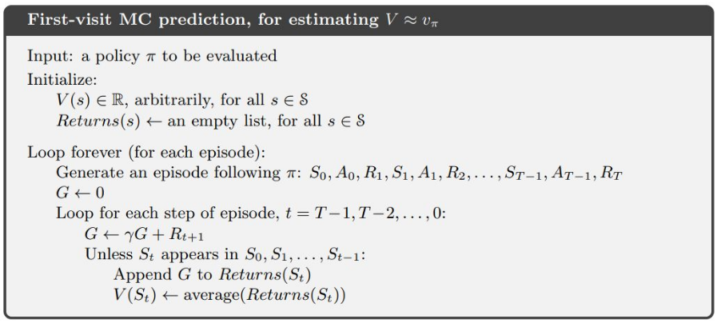
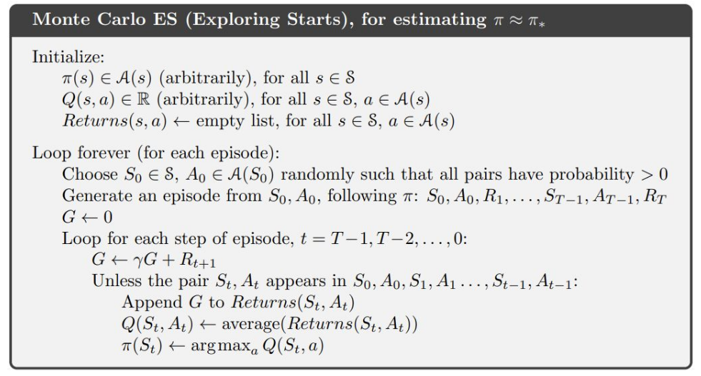
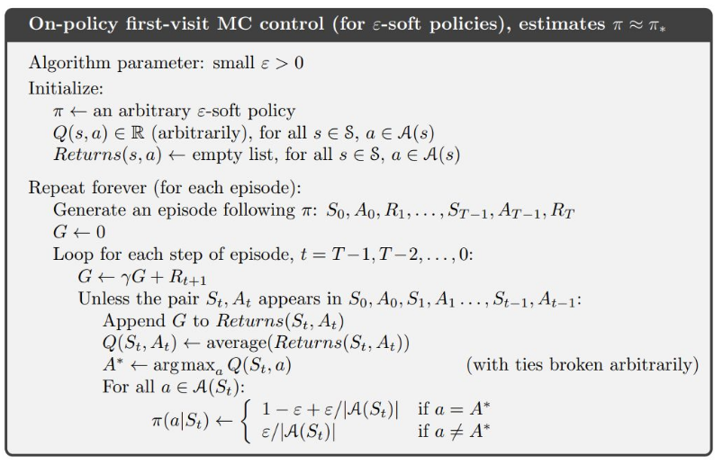

- Traditional MDPs assume we know everything about the environment. But we want to learn good policies without knowing everything in advance.
- In **Model-based RL**, we aim to estimate transition and reward functions from experience.

---

### **Monte Carlo (MC) Methods**  
- **Goal**: Estimate the value of states under a policy $\pi$.
- **First-Visit MC Method**:
  - **Initialize state values** $v^\pi(s)$ by our desire.
  - **Generate episodes**: You start at an initial state and take actions according to the **policy** which forms an **episode** (a sequence of states, actions, and rewards).
  - **For each state visited in the episode**, update its value using the **cumulative discounted rewards** from that state onwards.

- The **update rule**: For each state visited, calculate the **average reward** after its first occurrence.
  - **Formula**:

$$

v^\pi(s) = \frac{(v^\pi(s) \text{ from previous episodes} + \text{new reward})}{\text{number of episodes}}

$$

- **Goal**: Refine state value estimates after multiple episodes.

- **Monte Carlo for Action Values**:
  - Use similar MC methods but calculate averages for **state-action pairs**.
- **Exploration Issue**: Some state-action pairs may not be visited. **Exploring starts** (starting from a random state-action pair) can address this.

#### **First-Visit vs Every-Visit MC**
- **First-Visit MC**: Updates the value of a state only after its first occurrence in an episode.
- **Every-Visit MC**: Updates the value of a state every time it is visited in an episode.
- **Example**: 
  - **First-Visit**: If a state is visited multiple times in an episode, only the first visit's reward is used for the update.
  - **Every-Visit**: All visits to the state in the episode contribute to the update.

#### **Generalized Policy Iteration (GPI)**
- **Goal**: Balance exploration and exploitation.
- **Policy Evaluation**: Estimate the value of a policy.
- **Policy Improvement**: Update the policy based on the estimated values.
- **GPI Process**:
  1. **Policy Evaluation**: Use MC methods to estimate the value of the current policy.
  2. **Policy Improvement**: Update the policy to be greedy with respect to the estimated values.
  3. Repeat until convergence.

### **On-Policy vs. Off-Policy Methods**
- **On-policy**: The policy used to generate episodes is the same as the one being optimized.
  - **Advantages**: Simple and easy to implement.
  - **Disadvantages**: Can be suboptimal due to constant exploration.
  
- **Off-policy**: The policy used to generate episodes differs from the one being optimized.
  - **Advantages**: More powerful and flexible.
  - **Disadvantages**: More complicated and slower to converge.
    - In off-policy learning, the behavior policy $b$ (the policy used to generate episodes) differs from the target policy $\pi$ (the policy being optimized).
    - **Problem**: If an action is not taken in the behavior policy, the value for that state-action pair is unknown.
    - **Solution**: **Importance sampling** adjusts the returns to account for differences in probabilities between $b$ and $\pi$.

---

### **Temporal Difference (TD) Learning**
- **Goal**: Avoid waiting until the end of an episode to update values. TD learning allows for updating values incrementally during the episode.
- **TD(0)**: A one-step update method where the value of a state is updated based on the next step:

$$

v^\pi(s_t) \leftarrow v^\pi(s_t) + \alpha \left[ R_{t+1} + \gamma v^\pi(s_{t+1}) - v^\pi(s_t) \right]

$$

- **Advantages**: Updates are made during the episode, enabling faster learning.

#### **Q-Learning**
- **Off-policy TD Control**: Q-learning is an off-policy method where the agent learns the optimal policy using a greedy target:

$$

Q(s_t, a_t) \leftarrow Q(s_t, a_t) + \alpha \left[ R_{t+1} + \gamma \max_a Q(s_{t+1}, a) - Q(s_t, a_t) \right]

$$

- **Key Point**: The **maximization bias** occurs when the agent overestimates action values.

- **Solution**: **Double Q-learning** uses two independent Q-tables to reduce maximization bias.

### **Sarsa**
- **On-policy TD Control**: Sarsa is an on-policy method where the agent learns the value of the current policy:

$$

Q(s_t, a_t) \leftarrow Q(s_t, a_t) + \alpha \left[ R_{t+1} + \gamma Q(s_{t+1}, a_{t+1}) - Q(s_t, a_t) \right]

$$

- **Key Point**: Sarsa updates the Q-value based on the action taken in the next state, making it more conservative than Q-learning.

**Sarsa vs Q-learning**: **Sarsa** uses the current policy to update the Q-values, while **Q-learning** uses the maximum future Q-value, independent of the current policy.

### **Maximization Bias and Double Q-learning**
- **Maximization Bias**: Q-learning can overestimate action values due to always selecting the maximum Q-value in future states.
- **Double Q-learning**: Addresses this bias by maintaining two separate Q-tables and using one to select actions and the other to evaluate them, reducing overestimation.

### **N-step TD and N-step SARSA**
- **N-step TD**: An extension of TD learning that uses multiple steps of temporal difference learning to update values instead of just one step, thus incorporating more information for better value estimation.
- **N-step SARSA**: Similar to N-step TD but applies to the SARSA algorithm, allowing for more accurate value updates by considering multiple steps of rewards.
### **Expected SARSA**
- **Expected SARSA**: An extension of SARSA where the agent uses the expected value of the next state-action pair, weighted by the policy's probabilities. This can be used both on-policy and off-policy.
- **Key Point**: Expected SARSA can provide a more stable learning process by averaging over possible actions rather than selecting the maximum.
### **Summary**
- **Monte Carlo (MC) Methods**: Learn state values by averaging returns over episodes.
- **Temporal-Difference (TD) Methods**: Learn values incrementally during episodes without waiting for the end.
- **On-Policy vs. Off-Policy**: On-policy uses the same policy for generating episodes and improving it, while off-policy uses different behavior and target policies.
- **Q-learning**: An off-policy TD method that uses the **greedy approach** to maximize rewards, but has **maximization bias**, which can be solved with Double Q-learning.
- **Sarsa**: An on-policy TD method that updates values based on the current policy, making it more conservative.
- **N-step TD and N-step SARSA**: Extensions of TD and SARSA that consider multiple steps for better value estimation.
- **Expected SARSA**: An extension of SARSA that uses expected values for more stable learning.
- **Generalized Policy Iteration (GPI)**: A framework that combines policy evaluation and improvement to iteratively refine policies.