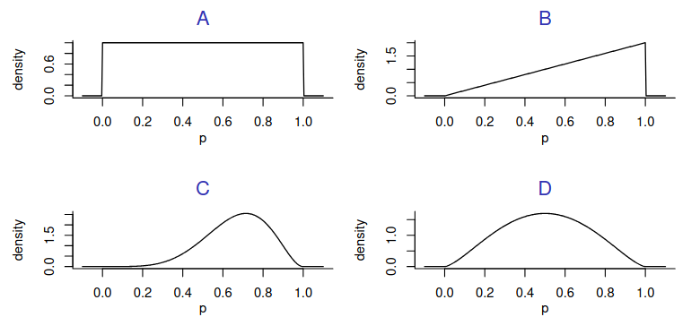

#### 1- In statistics, what is a type I (type 1) error?
- A. $H_0$ is rejected, while $H_0$ is true.
- B. $H_a$ is rejected, while $H_a$ is true.
- C. $H_0$ is retained, while $H_0$ is true.
- D. $H_a$ is retained, while $H_a$ is true.

#### 2- Practically (perhaps unjustly), the most important numbers in statistics are p-values. Which of the following statements about the p-value is most correct?
##### The p-value is a probability statement about...
- A. the null hypothesis.
- B. the alternative hypothesis.
- C. the data.
- D. making type I errors.

#### 3- If the null-hypothesis is true (so “no pattern in the data”), what should the distribution of the p-value look like?

#### 4. Why is sequential testing with optional stopping considered a questionable research practice?
- A. Because it increases the sample size of a study by a considerable amount
- B. Because it increases the Type II error rate of a study by a considerable amount
- C. Because it increases the risk of incorrectly rejecting the null hypothesis by a considerable amount
- D. Because it increases the length of the empirical cycle by a considerable amount

#### 5. Why does HARKing mess up the empirical cycle?
- A. Because one generates a hypothesis and tests that hypothesis on the same dataset
- B. Because one does not collect any new data at any point of the empirical cycle
- C. Because one essentially switches the order of the deduction and the induction phase
- D. Because one creates an unwanted feedback loop between the evaluation and the testing phase

#### 6. Which statement about pre-registration is correct?
- A. Pre-registration is an example of a Registered Report
- B. Pre-registration mainly aims to reduce the Type 2 error rate
- C. Pre-registration is a requirement when proposing an AI application
- D. Pre-registration can protect researchers against cognitive biases

#### 7. Silberzahn, Nosek and colleagues, examined whether soccer referees were more likely to hand out red cards to dark-skinned players. They asked 29 teams to investigate this question, and the results differed considerably. Why was that the case?
- A. Because some teams committed fraud to reach a desirable conclusion
- B. Because the teams analyzed different datasets
- C. Because the teams performed different analyses
- D. Because the teams performed the same analyses, but some teams made mistakes

#### 8. What is an advantage of articles published in high-impact journals compared to pre-prints?
- A. The reproducibility of the results are checked
- B. Quick dissemination of findings
- C. Paper is freely available for everyone to read
- D. None of the above

#### 9. What is the relationship between reproducibility and replicability?
- A. Reproducibility is a special case of replicability
- B. Replicability is a special case of reproducibility
- C. They are complementary aspects
- D. They are mutually exclusive, i.e. only one aspect can be satisfied

#### 10. What is reason for using seed-averaging when training a neural network model?
- A. To ensure label balance
- B. To ensure the highest performance
- C. To ensure a fair reporting of performance
- D. To ensure fair data shuffling

##### Answers

1- A, 2- C, 3- A, 4- C, 5- A, 6- D, 7- C, 8- D, 9- C, 10- C