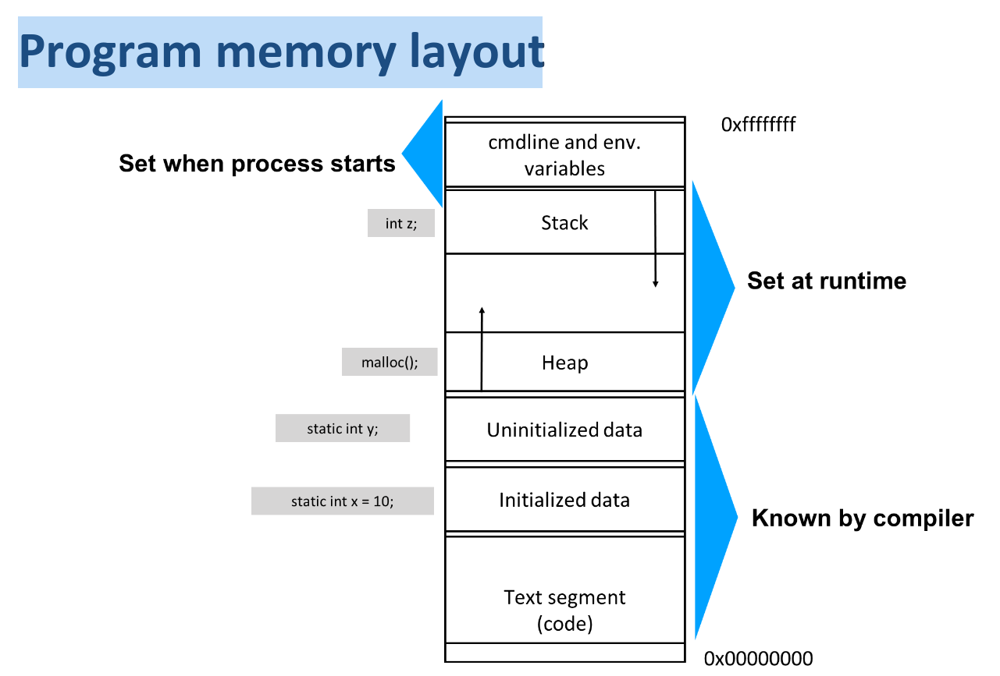
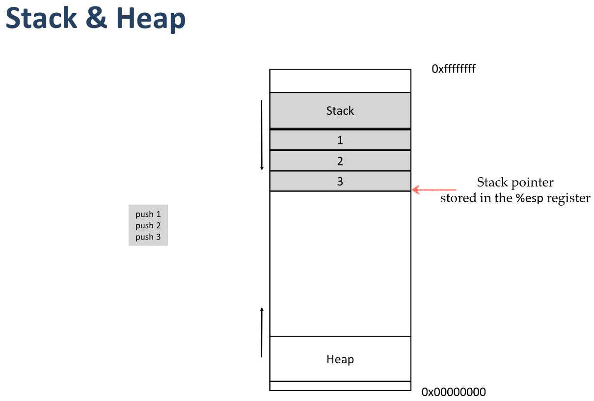
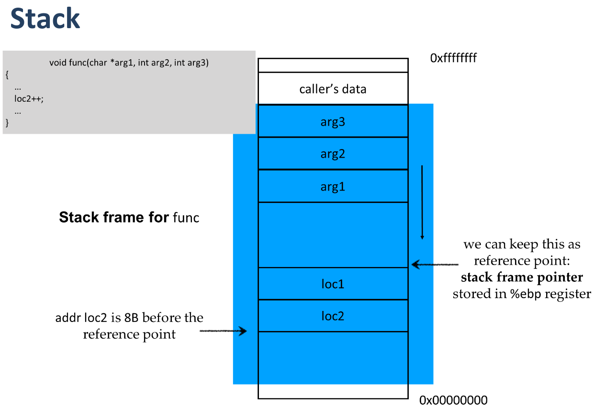
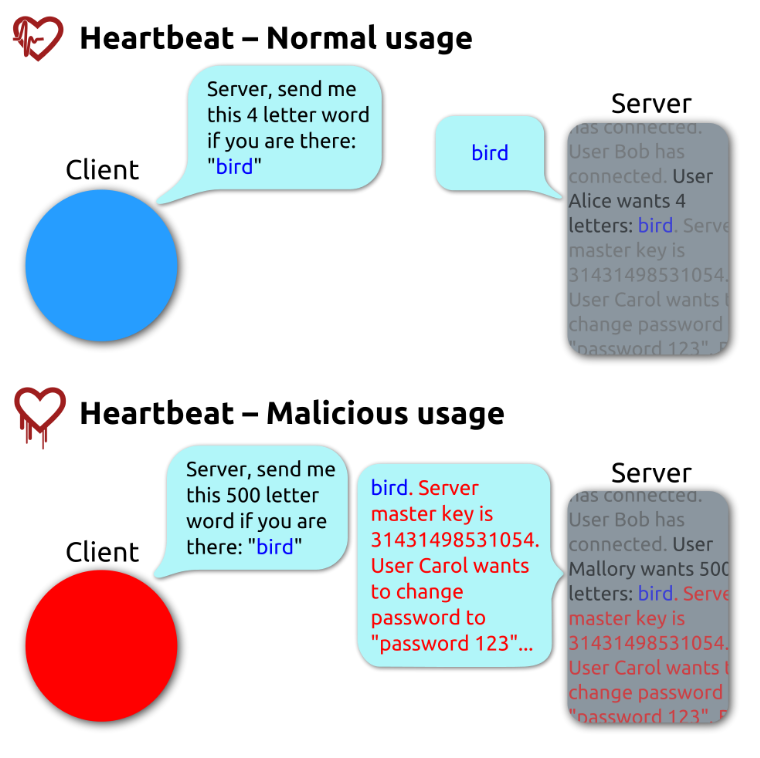

## Memory Layout: Stack & Heap

- **Stack:** Stores function calls, local variables, return addresses in order. (LIFO - Last In, First Out).
- **Heap:** Used for dynamic memory allocation (malloc/new). (Follows a more complex structure, not LIFO).
- Functions push data onto the stack in a specific way (arguments, return address, frame pointer, local variables).
- When a function is called:
    - Arguments pushed in reverse order.
    - Return address saved.
    - Stack frame set up with local variables.
- **Buffer** fixed-size block of memory that holds data, like an array.




`%esp` is the stack pointer register stores the address of the top of the stack

Heap is managed by `malloc`

Function atguments are pushed onto the stack in reverse order like 1 is arg 3...3 is arg1.



| Stack Position                       | Content                                                           |
| ------------------------------------ | ----------------------------------------------------------------- |
| Top (higher addr)                    | main's data                                                       |
| Arguments                            | arg3, arg2, arg1                                                  |
| Saved `%ebp`                         | The old base pointer                                              |
| Return Address (for `%eip`)          | Address where func should return to (next instruction after call) |
| Local Variables                      | Below saved `%ebp`                                                |
| `%esp` points here (bottom of frame) |                                                                   |

`%ebp` or **Extended Base Pointer** mark the base of the current stack frame and in functino call %ebp is then set to the current stack pointer %esp helping the program keep track of where the function's local variables and arguments are stored on the stack.

`%eip` is the instruction pointer register which holds the address of the next instruction to run. In function call, return address (where to go after) is saved on the stack for %eip to use later.

- **Buffer Overflow:**
    - First, **overflow the local buffer** with your attack code.
    - Then overwrite the **saved %ebp** (optional, but often done).
    - Finally, **overwrite the return address** with an address pointing back to your shellcode in the buffer.
    - When the function returns, CPU uses the overwritten return address (`%eip`) and jumps to your malicious code.
- **Stack Overflow** (Stack Smashing): is a type of buffer overflow that attacker overwrite the **return address** on the stack and inject **malicious code (shellcode)** that runs a command.
- **Nop Sled:** A technique where many "no operation" commands (NOPs) are placed before shellcode to help find the right jump address.
- **Heap Overflow**: Similar to stack smashing but happens in memory allocated dynamically on the heap.
- **Integer Overflow**: Happens when an arithmetic operation results in a value bigger than the variable can hold. Attackers can use this to corrupt data, bypass checks (e.g., authentication), or alter program behavior.
- **Read Overflow** - **Heartbleed Bug**:


- **Format String Vulnerability**:
    - Problems arise when user input is used directly as a format string (e.g., in printf).
    - Attackers can manipulate format specifiers to read/write memory unexpectedly.

```c
void vulnerable() {
    char buf[80];
    fgets(buf, sizeof(buf), stdin);
    printf(buf);  // Using user input as format string - dangerous!
    // Correct way: printf("%s", buf); // Always use a format specifier
}
```
User input controls format string, can include %x, %s to read some values from stack (in hex) and leaks sensitive memory data like return addresses

- **Race Conditions (TOCTOU - Time Of Check to Time Of Use)**
    - Happens when a program checks a condition but the situation changes before the action is done.
    - Attackers exploit this to cause unexpected behavior or security holes.
    - Like a program checks permission of code changing sth on file first, but an attacker can change the file between that check and actual writing time gap, causing the program to write to a wrong or protected file.
