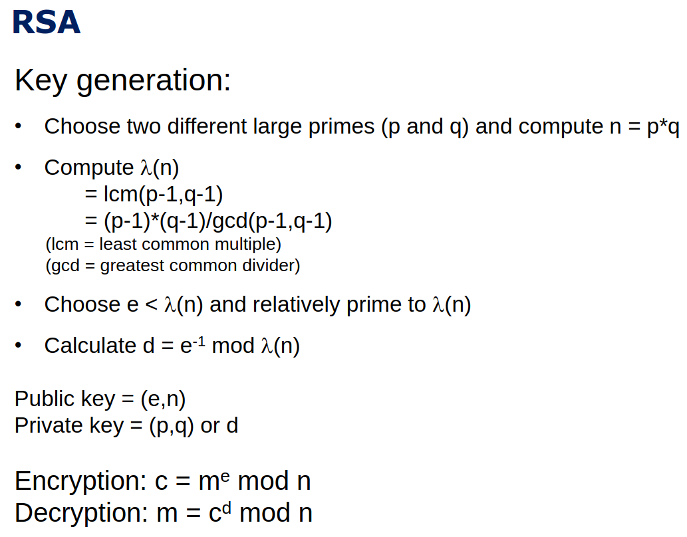
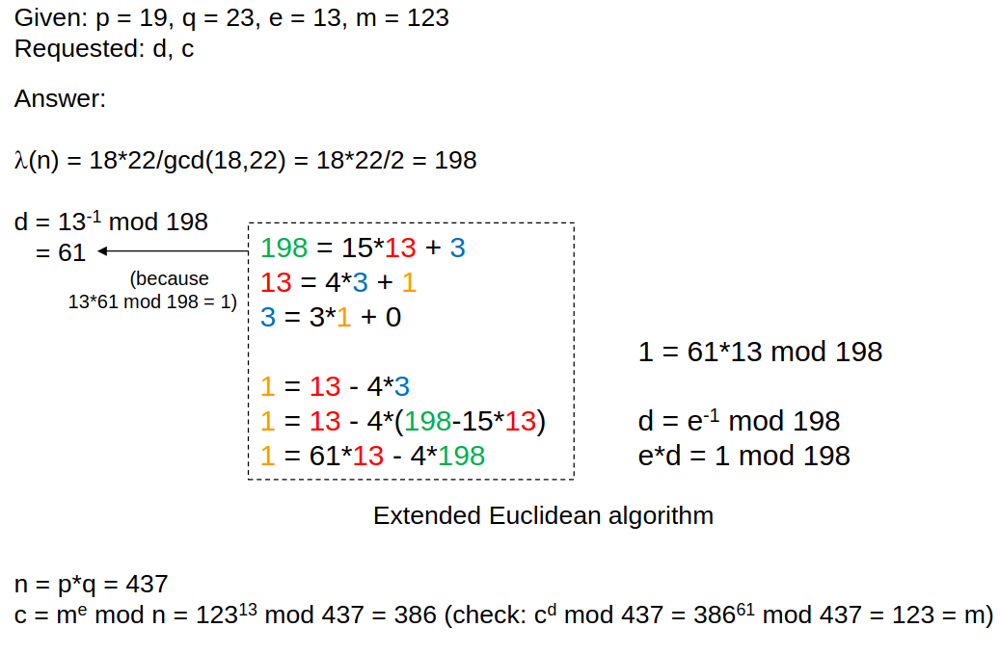

- **Diffie-Hellman Key Exchange (DH)**: A way for two parties (Alice & Bob) to agree on a secret symmetric key over a public channel by modular math. Two random secret numbers are chosen, and public values are exchanged after combination on public network and later swich and compute the shared key using modular exponentiation.
  - **Man-in-the-middle attack (MITM)** can happen if attacker pretends to be Alice or Bob.
    - **Solution**: Use **digital signatures** for mutual authentication to prevent MITM.
- **Digital Signatures**: A way to verify the authenticity and integrity of a message. It uses a private key to sign a hash of the message, which can be verified with the sender's public key.
- Elliptic Curve Cryptography (ECC): A type of public-key cryptography that uses the mathematics of elliptic curves to provide security with smaller key sizes compared to traditional methods like RSA.
- **ElGamal Encryption**: A public-key encryption scheme based on the Diffie-Hellman problem, which allows secure message encryption and decryption using a private key.
- **Public-Key Infrastructure (PKI)**: A system that uses digital certificates by trusted thurd-party (Certificate Authority or CA) to establish a chain of trust for public keys, ensuring secure communication over networks.
- **TLS (Transport Layer Security)**: A protocol for HTTPS uses PKI and digital certificates that provides secure communication over a computer network, ensuring privacy, integrity, and authentication through the use of public-key cryptography and symmetric encryption.
  - **TLS session key establishment**: Client and server exchange random numbers (nonces) and keys securely, generate shared secret keys, verify the connection, and then communicate safely.
    - K0: Pre-master key (temporary secret)
    - K1: Master secret key (created from K0 and nonces)
    - key: Session key (used to encrypt messages)
    - MAC: A code to check message integrity and authenticity
  - **Double Hashing**: A technique used in TLS to ensure the integrity of the handshake process by hashing the handshake messages twice to prevent tampering.
  - **Why both A/Symmetric**: TLS uses asymmetric encryption to safely share a secret key between client and server. Then, it uses symmetric encryption with that key to quickly and securely encrypt the actual data. This way, TLS is both safe and fast.

- **RSA Algorithm**: A widely used public-key cryptosystem that relies on the difficulty of factoring large integers. It is used for secure data transmission and digital signatures.
  - **RSA Padding**: Padding adds randomness to the message before encryption, preventing the same plaintext from producing the same ciphertext when encrypted multiple times.
  - **Homomorphism in RSA** RSA encryption allows **multiplication on ciphertexts**, resulting in multiplication of plaintexts after decryption. This “malleability” can be a risk for attacks but also useful in secure computation.

### Advantages and Disadvantages of Public-Key Cryptography

| Advantages                       | Disadvantages                      |
| -------------------------------- | ---------------------------------- |
| No need to share keys in advance | Slower than symmetric cryptography |
| Supports digital signatures      | Larger ciphertext size             |
| Provides non-repudiation         | Requires more computation          |

---

### Digital Signature vs Public-Key Encryption

| Digital Signature                         | Public-Key Encryption      |
| ----------------------------------------- | -------------------------- |
| Use private key to sign                   | Use public key to encrypt  |
| Use public key to verify signature        | Use private key to decrypt |
| Proves sender identity and data integrity | Ensures confidentiality    |

---

| Concept                     | Purpose                                  |
| --------------------------- | ---------------------------------------- |
| Symmetric Cryptography      | Fast encryption using one key            |
| Asymmetric Cryptography     | Secure key exchange & digital signatures |
| Diffie-Hellman Key Exchange | Share symmetric keys securely            |
| Digital Signature           | Authenticate sender & data               |
| PKI                         | Trust in public keys                     |
| TLS                         | Secure internet communication            |
| RSA                         | Popular public-key encryption            |
### RSA Exercise

