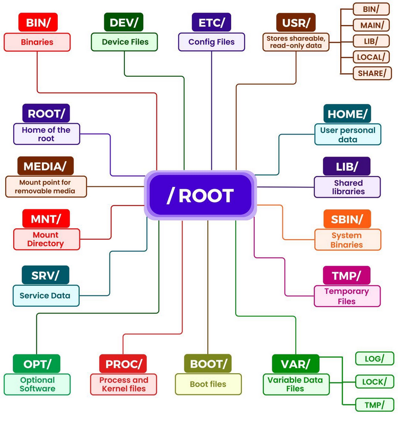

- `less <file>` : View file contents one page at a time 
- `man <command>` : Show manual pages for a command 

## **Executing Multiple Commands**
| Operator | Function |
|----------|------------|
| `;` | Execute multiple commands sequentially |
| `&&` | Execute next command only if the first succeeds |
| $`\|\|`$ | Execute next command only if the first fails |
| `&` | Run this command in the background so I can keep using the terminal|
| `>` | Redirect output to a file (overwrite) |
| `>>` | Append output to a file |
| `<` | Read input from a file (sort < names.txt  # Sort contents of names.txt)|
| $\|$  | Pipe output of one command to another (ls $\|$ grep "txt"  # Show only .txt files) |

## **File and Directory Permissions**
- Permissions for three groups: **Owner** (u), **Group** (g), and **Others** (o).
- Add permissions using `+`, remove with `-`, and set with `=`.
- Give permissions to a file `chmod +x script.sh` for execution and to onlu users in the group `chmod g+x script.sh`.
- To set permissions generally, `chmod -rwxr-x--x script.sh` or `chmod 751 script.sh`.

## **File Structure**



## **Environment Variables**
- View all environment variables: `printenv` or `env`
- Set a temporary variable `VARIABLE=value command` like:
  ```sh
  MEMORY_LIMIT=1024 python3 script.py
  ```

- Set a persistent variable:
  ```sh
  export VARIABLE=value
  ```

### **Variables in Scripts:**
```sh
#!/bin/bash
NAME=Francesco
echo "${NAME} is learning Bash!" ``` ### **Conditional Statements:** ```sh if [[${USER} == "root" ]]; then
    echo "You are root!"
else
    echo "You are not root!"
fi
```

### **Loops in Bash:**
```sh
for i in {1..5}; do
  echo "Iteration $i"
done
```