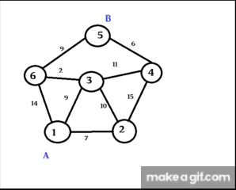
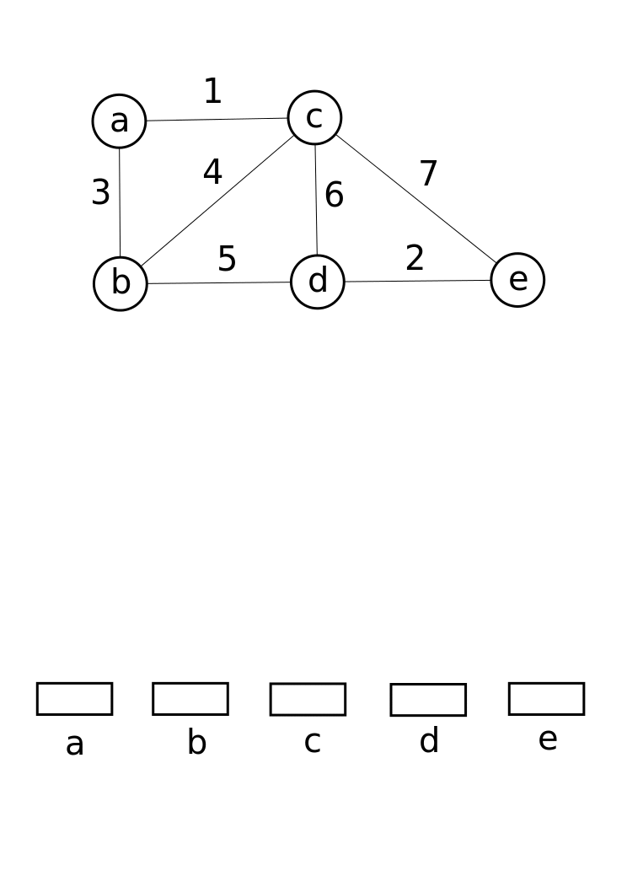

## Greedy algorithm
Simple way to solve problems by taking the best option available at each step.
This approach takes the best option at each step without looking at the whole problem, hoping it leads to the best solution.
## Priority Queue

A Priority Queue is a data structure where each element has a priority. Elements are served based on their priority rather than their order in the queue. 

**Operations (Priority Queue):**
- Insert: heap: $O(\log n)$
- Findmax (findmin): heap: $O(1)$
- Deletemax (deletemin): heap: $O(\log n)$
- (Optional) Change priority: heap: $O(\log n)$
### Heap of Priority Queue
Enqueue (Insertion)

- Add the new element at the end of the heap (the bottom level).
- Heapify Up: Compare the added element with its parent; if the added element is larger (for max-heap) or smaller (for min-heap), swap them.
- Repeat the process until the heap property is restored.

Dequeue (Removal)

- Remove the root element (the highest priority element).
- Replace the root with the last element in the heap.
- Heapify Down: Compare the new root with its children; if necessary, swap it with the larger (max-heap) or smaller (min-heap) child.
- Repeat the process until the heap property is restored.
### Dijkstra's Algorithm 
Greedy algorithm used to find the shortest path from a single source vertex to all other vertices in a weighted graph
Time complexity: $ O (|E| + |V| \log{|V|}) $

```py
import heapq

def dijkstra(graph, start):
    # Initialize distances with infinity and set the start node distance to 0
    distances = {node: float('infinity') for node in graph}
    distances[start] = 0
    
    # Priority queue to store (distance, node)
    priority_queue = [(0, start)]
    
    while priority_queue:
        current_distance, current_node = heapq.heappop(priority_queue)
        
        # Skip processing if a shorter path to current_node is already found
        if current_distance > distances[current_node]:
            continue
        
        # Check and update distances to neighboring nodes
        for neighbor, weight in graph[current_node].items():
            distance = current_distance + weight
            
            # Only consider this new path if it's better
            if distance < distances[neighbor]:
                distances[neighbor] = distance
                heapq.heappush(priority_queue, (distance, neighbor))
    
    return distances

# Example graph represented as a dictionary
graph = {
    'A': {'B': 1, 'C': 4},
    'B': {'A': 1, 'C': 2, 'D': 5},
    'C': {'A': 4, 'B': 2, 'D': 1},
    'D': {'B': 5, 'C': 1}
}

# Running Dijkstra's algorithm
start_node = 'A'
distances = dijkstra(graph, start_node)

print(f"Shortest distances from {start_node}: {distances}")

```

## Minimal spanning tree
### Prim's Algorithm

Prim's Algorithm is a greedy algorithm that finds a minimum spanning tree for a weighted undirected graph. This means it finds a subset of the edges that forms a tree that includes every vertex, where the total weight of all the edges in the tree is minimized.
- $O(E \log{V})$ using binary Heap
- $O(E + V \log{V})$ using Fibo Heap

### Kruskal’s Algorithm

Sorting edges takes $ O(m \log m) $. Checking for cycles using the Union-Find structure takes $ O(m \log n) $.



#### Complexity of Quick Union:

- `makeset(x)`: $ O(1) $
- `find(x)`: $ O(\log n) $
- `union(x, y)`: $ O(1) $