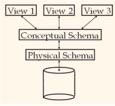
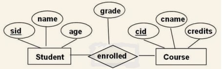

# Entity Relationship Diagram
## Database Schemas
### Components of the architecture
#### Three Layers

- Views (How users see the data)
    - CourseInfo(cid:string, numberOfStudents:integer,bestGrade:integer)

- Conceptual (Defines logical structure)
    - Students(sid: string, name: string, login: string, age: integer)
    - Courses(cid: string, cname:string, credits:integer)
    - Enrolled(sid:string, cid:string, grade:string)

- Physical (Files and data-structures for fast data-access)
    - Relations stored as unordered files.
    - B+ tree index on first column of Students



<hr>

#### DDL (Data Definition Language)

 provides the ability to define, create and modify database objects such as tables, views, indexes, and users. 

#### DML (Data Manipulation Language)
 
  allows for manipulating data in a database, such as inserting, updating, and deleting records.

## Components of ER Diagram

1. **Entities**:
   - Represented by rectangles.
   - Have attributes that describe them.
   - Identified by unique keys.

2. **Attributes**:
   - Descriptive properties of entities.
   - Represented by ovals connected to entities.

3. **Relationships**:
   - Represented by diamond shapes.
   - Describe associations between entities.
   - Can have cardinality and participation constraints.

4. **Primary Key**:
   - Attribute or combination of attributes that uniquely identify an entity.
   - Denoted by underlining the attribute(s).

5. **Foreign Key**:
   - Attribute(s) in one entity that refers to the primary key of another entity.
   - Establishes relationships between entities.


### Weak entities
A weak entity is an entity that depends on another entity. It cannot exist without the presence of another entity.
```
  ===                         ____
||   || =======   //\\ ______|    |
  ===             \\//        ----
```

### IS-A Hierachies
Inheritence attributes
```
        _______
       |_Human_|
           |
          / \
 _____|--/___\ --|____
|_PHD_|         |_STU_|

```

### Aggregation
As relation cannot connect to each other, we need to use aggregation to connect them.


### Ternary relationship
A ternary relationship is a relationship between three entities unlike binary relationship which is between two entities.

# Cardinalities
| Shape | Cardinality | Constraint |
|-------|-------------|------------|
| ---------- | 0 or more | Normal |
| --------> | 0 or 1 | At most one (Key Constraint) |