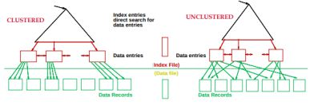
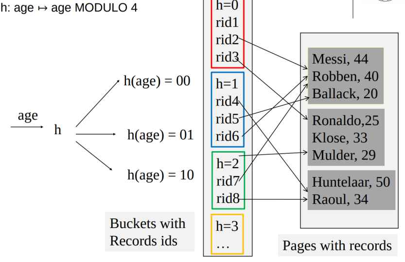
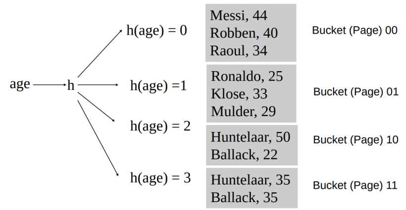

# Storage and Indexing
### File Organizations:

- Heap (random order) files: Suitable when typical access is a file scan retrieving all records.
- Sorted Files: Best if records must be retrieved in some order, or only a `range' of records is needed.
- Indexes: Data structures to organize records via trees or hashing.
    - B+ trees
    - Hash index
    

### Search Key and K*:

**Search Key** can be specific key for quering your users like username in users database but totally can be different from primery **key** like Indexes

 <b> k* </b> denotes the set of data entries associated with the key value "k"
### Alternatives for organizing and accessing data:
- Alternative 1: Here, each data record (like a row in a table) is directly used as an index. It's good when data records are large, but only one index can use this method for each collection of records to avoid duplication and potential inconsistency.
    - For example, if you're looking for a specific recipe in a cookbook, you'd flip through the pages until you find it.

- Alternative 2: Data entries are smaller than records. This is better than Alternative 1 when records are large, especially if search keys are small. The portion of the index used for searching is smaller compared to Alternative 1.
    - For instance, if you're looking for all the recipes that use chicken, you'd just check the index rather than searching through every page.

- Alternative 3: Similar to Alternative 2 but even more compact. However, it leads to variable-sized data entries, even if search keys are fixed length.
    - If you're looking for a quick and easy chicken recipe, you'd still check the index, but you might find that each entry varies in length depending on the extra details provided.
## Index Classification (Clustered vs. unclustered)

Clustered index means the index is organized in a way that closely matches the order of the actual data in the database. This can speed up data retrieval because it aligns with how the data is physically stored. (Alternative 1 implies clustered)

Suppose that Alternative (2) is used for data entries,
and that the data records are stored in a Heap file.
To build clustered index, first sort the Heap file


```sql
CREATE INDEX index_name
ON table_name (column1, column2, ...);
```
also you can mentino to be clustered or not and also typeby:
```sql
CREATE CLUSTERED INDEX index_name
ON table_name WITH STRUCTURE = BTREE KEY = (column1, column2)
```


### B+ Tree Indexes:

Balanced search tree where leafes are the last level in tree were is actual data and non-leaf pages make it easy to reach records. Also each record is connected to the other for increasing speed because of double linked list structure.


#### B+ trees vs. B trees

B-tree is a tree with similar structure to B+ tree,
- but the pages might be filled
- the doubly-linked list is not present
- The elements of the leaves can be the full data entry

used in Sqlite3
## Hash-Based Indexes

**Index is a collection of buckets**
- Bucket: Container holding related data share similar or same values
- Page : Unit of data storage in a database like a block of memory where records or data are stored

Unclustered Hash Index



Clustered Hash index, alternative 1


## Compare models

Hash Indexes: are highly efficient for matching exact values, but not ranges or partial matches.

B+ Tree Index: Can also handle equality searches, but it's better suited for range queries.  Ideal for handling composite search keys like (key1, key2).

## Cost Model for Our Analysis

In our analysis, we consider the following variables:

- B: The number of data pages
- R: Number of records per page
- D: (Average) time to read or write a disk page
- H: Time to evaluate the hash function
- rid size/record size: 0.1 (ratio of the size of the record identifier to the size of the record)
- Page fill for tree leaves: 2/3 = 0.67 (percentage of page filled with data in tree leaves)
- Page fill for hash buckets: 0.8 (percentage of page filled with data in hash buckets)

These variables are important for evaluating the performance and cost of different storage and indexing techniques.

## Comparing File Organizations

There are several file organizations that can be used in databases. Let's compare some of them:

- Heap files (random order; insert at the end of the file)
- Sorted files, sorted on <age, sal>
- Clustered B+ tree file, search key <age, sal>
- Heap file with unclustered B+ tree index on search key <age, sal>
- Heap file with unclustered hash index on search key <age, sal>

### Operations to Compare

To evaluate the performance of these file organizations, we can consider the following operations:

1. Scan: Fetch all records from disk
2. Equality search
3. Range selection
4. Insert a record
5. Delete a record

Cost of Operations

The cost of these operations can vary depending on the file organization used. Here's an illustration of the cost comparison:


*BD: A unit of measure overall size (Pages x Avg time R/W)
### Summary Cost Analysis

**Heap Files:**
- Fast insert
- Low extra storage
- Slow search and scan
- Slow delete

**Sorted Files:**
- Fast search
- Low extra storage
- Expensive insert and delete

**B+ Tree:**
- Very fast equality search and range selection
- Fast insert and delete
- Memory overhead (approximately 1.5)
- Supports composite keys

**Hash Index:**
- Very fast equality search, insert, and delete
- Slow range selection
- Memory overhead and potential scalability issues (if the database unexpectedly grows)
