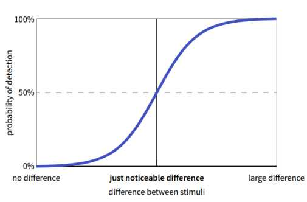

- **Cognitive Science:** Emerged in the late 1970s as an interdisciplinary field combining ideas from psychology, linguistics, mathematical logic, and information-processing models.
- **Interdisciplinary Research:** Innovations arise from combining existing concepts from different fields.

**Classical Conditioning:**
- **Behaviorism:**
      All learning results from conditioning and reinforcement.
  - **Classical Conditioning:** Reflexive, automatic responses (e.g., Pavlov’s dogs).
  - **Extinction and Spontaneous Recovery:** Reflexes can weaken without the unconditioned stimulus but can reappear spontaneously.
  - **Stimulus Connection Approaches:**
    - **Behaviorism:** Simple stimulus-response connection.
    - **Cognitivism:** Stimulus-stimulus connection with mental representation.

**S-R Theory of Classical Conditioning:**
- **Unconditioned Stimulus (Food) → Conditioned Stimulus (Bell) → Response**
- **S-S Theory of Classical Conditioning:**
  - **Conditioned Stimulus → Mental representation of Unconditioned Stimulus → Response**

**Reinforcement Learning (Operant Conditioning):**
- **Classical Conditioning:** Reflexive behavior.
- **Operant Conditioning:** Self-initiated behavior to reach a reward or avoid punishment.
- **Shaping and Discrimination Training:** Rewarding successive steps or concept learning (e.g., pecking on specific paintings).

**Reinforcement Schedules:**
- **Continuous Reinforcement:** Desired response always followed by a reinforcer.
- **Partial Reinforcement:** Relationship not 1-to-1, leading to variable resistance to extinction.

**Cognition and Computation:**
- **Turing-Complete Human Brain:** Efficient in processing information channels (~3 bits, or ≈ 7 items).
- **Threshold Values:** Just Noticeable Difference (JND), Weber’s law on stimulus intensity changes.

**Reducing Information Load: Attention:**
- **Dichotic Listening Task:** Shadowing one story, ignoring another.
- **Selective Attention:** Only attending to selected information, noticing changes like voice pitch or recognizing familiar names (Breakthrough phenomenon).

In response learning, location information is encoded based on the movements an organism makes to reach that location. In place learning, location information is encoded based on the location's relationship to other locations in the environment.
## Cognition and computation

Human brain is Turing-complete but not very efficiently.

The Human mind contains information channels with mean channel capacity ~3 bits, or $2^3$ ≈ 7 items (magical number 7 (± 2)).

### Threshold values 
#### Just Noticeable Difference (JND)

Like: Is 95 vs. 100 kg detected as easily as 10 vs. 15 kg?
### **Key Historical Developments:**
1. **Reaction Against Behaviorism in Psychology:**
   - **Behaviorism:** Focuses on observable behavior and conditioning, avoiding unobservable mental states.
   - **Latent Learning (Tolman & Honzik, 1930):** Rats learn maze layouts without reinforcement, Disproving behaviorist assumptions. Shows representation of information
   - **Cognitive Maps (Tolman, Ritchie, and Kalish, 1946):** Rats form mental representations of spatial layouts, indicating place learning over response learning.
   - **Complex Behaviors (Lashley, 1951):** Behaviors are hierarchically organized and controlled by subconscious planning and information-processing mechanisms.
2. **Theoretical Models of Computation:**
   - **Turing Machines (Turing, 1936-7):** Abstract machines that perform algorithmic computations, laying the foundation for understanding minds as information processors.
   - **Church-Turing Thesis:** Anything computable can be computed by a Turing machine, implying minds operate like complex Turing machines.

3. **Systematic Analysis of Language (Chomsky, 1957):**
   - **Transformational Grammar:** Analyzes deep and surface structures of sentences, showing how linguistic information is stored and manipulated algorithmically.
   - **Phrase Structure Trees:** Represent the hierarchical organization of sentences.
4. **Development of Information-Processing Models in Psychology:**
   - **Information Theory (Shannon, 1948):** Concept of information channels and measurement of information (bits).
   - **Miller (1956):** Human information processing is limited to about seven items (channel capacity), improved by chunking.
   - **Broadbent (1958):** Selective attention models showing how information flows through sensory channels, emphasizing selective filters and limited capacity channels.

**Central Themes of the Chapter:**

**1. Even very basic types of behavior (such as the behavior of rats in mazes) seem to involve storing and processing information about the environment:**
- Experiments by Tolman and Honzik (1930) and Tolman, Ritchie, and Kalish (1946) demonstrated that rats form cognitive maps and engage in latent learning, indicating that even simple organisms process and store environmental information.

**2. Information relevant to cognition can take many forms – from information about the environment to information about how sentences can be constructed and transformed:**
- Cognitive science studies diverse types of information, such as spatial layouts in Tolman's experiments and linguistic structures in Chomsky's transformational grammar. These forms of information are crucial for understanding different cognitive abilities.

**3. Perceptual systems can be viewed as information channels and we can study both: (a) the very general properties of those channels (e.g., their channel capacity) (b) the way in which information flows through those channels:**
- **George Miller (1956):** Proposed limits on human information processing capacity, conceptualizing sensory systems as channels with finite capacity.
- **Donald Broadbent (1958):** Developed models illustrating how information flows through sensory channels, with selective filtering and limited capacity stages.

**4. Mathematical logic and the theory of computation show us how information processing can be mechanical and algorithmic:**
- **Alan Turing (1936-7):** Demonstrated that information processing can be understood as a series of algorithmic steps, executed mechanically by Turing machines, establishing a foundational model for computational theories of the mind.

**5. Much of the information-processing that goes on in the mind takes place below the threshold of awareness:**
- **Karl Lashley (1951):** Highlighted that complex behaviors and planning often occur without conscious awareness, involving hierarchical and subconscious information-processing mechanisms.
- The idea that cognitive processes, such as those studied by Miller and Broadbent, operate beneath conscious awareness, performing tasks like filtering sensory inputs or managing memory without explicit attention.

## Checklist

### Important Developments Leading Up to the Emergence of Cognitive Science
- The reaction against behaviorism in psychology
- Theoretical models of computation from mathematical logic
- Systematic analysis of the structure of natural language in linguistics
- The development of information-processing models in psychology

### Central Themes of the Chapter
- Even very basic types of behavior (such as the behavior of rats in mazes) seems to involve storing
and processing information about the environment.
- Information relevant to cognition can take many forms – from information about the environment
to information about how sentences can be constructed and transformed.
- Perceptual systems can be viewed as information channels and we can study both: (a) the very
general properties of those channels (e.g., their channel capacity) (b) the way in which information
flows through those channels.
- Mathematical logic and the theory of computation shows us how information processing can be
mechanical and algorithmic.
- Much of the information-processing that goes on in the mind takes place below the threshold of
awareness.