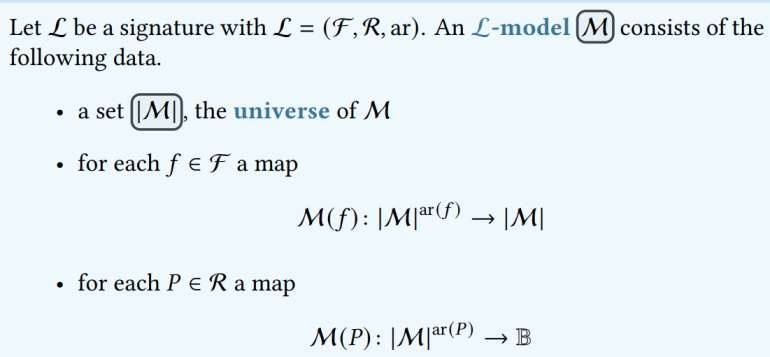
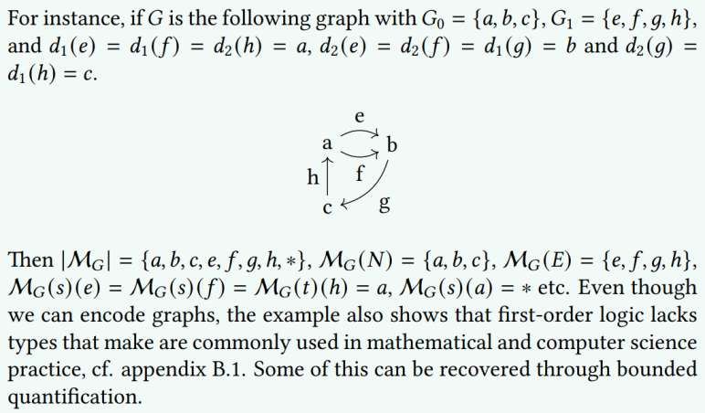
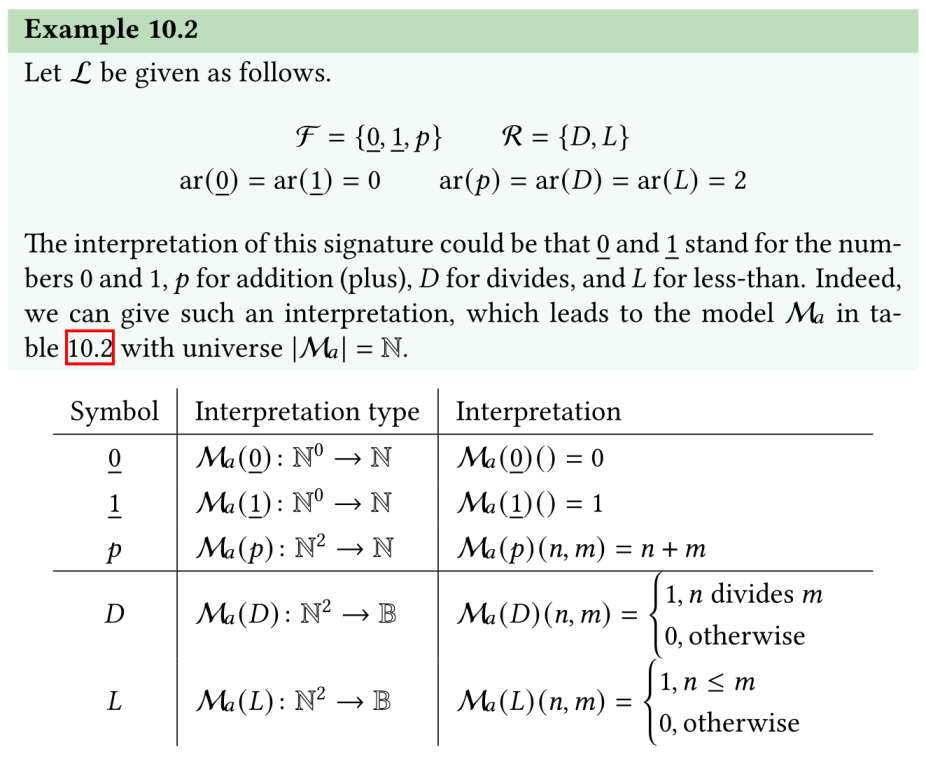
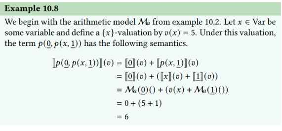
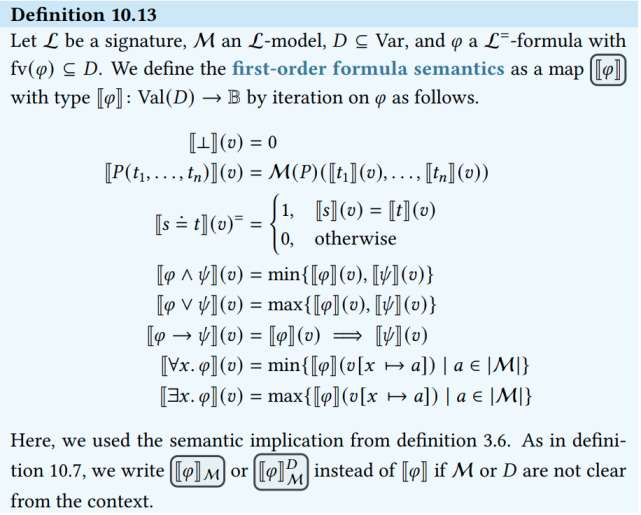

## Boolean Semantics of First-Order Logic

## Models

| Symbol s | ar(s) | Interpretation type            |
|----------|-------|--------------------------------|
| **Function Symbols** |       |                                |
| c        | 0     |  $\| \mathcal{M} (c) \| : \| \| \mathcal{M}^0 \| \rightarrow \| \mathcal{M} \|$   |
| f        | 1     |  $\| \mathcal{M}(f) \| : \| \mathcal{M}^1 \| \rightarrow \| \mathcal{M} \|$   |
| g        | 2     |  $\| \mathcal{M}(g) \| : \| \mathcal{M}^2 \| \rightarrow \| \mathcal{M} \|$   |
| **Predicate Symbols** |       |                                |
| P        | 0     |  $\| \mathcal{M}(P) \| : \| \mathcal{M}^0 \| \rightarrow \mathbb{B}$     |
| Q        | 1     |  $\| \mathcal{M}(Q) \| : \| \mathcal{M}^1 \| \rightarrow \mathbb{B}$     |
| R        | 2     |  $\| \mathcal{M}(R) \| : \| \mathcal{M}^2 \| \rightarrow \mathbb{B}$     |

### Model proof

To Prove model $\mathcal{M}$ validates $\varphi$ we need to prove [[ $\varphi$ ]]($\epsilon$) = 1

like example

$[[φ]](ε) \geq [[Ax4. O(x4, x4, x4)]](ε)$  (property maximum, the semantics of disjunction)

= $\min\{ [[O(x4, x4, x4)]](ε[x4 \mapsto n]) \mid n \in N \}$ (semantics of universal quantifier)

= $\min\{ [[M(O)([[x4]](ε[x4 \mapsto n]), [[x4]](ε[x4 \mapsto n]), [[x4)]](ε[x4 \mapsto n])] \mid n \in N \}$ (semantics of predicates)

= $\min\{ 1 \}$ (because $M(O)(x, y, z) = 1$ for all $x, y, z$)= 1.

Since $1 \geq [[φ]](ε)$ by definitions, we have $[[φ]](ε) = 1$.

### Invalidate with $\mathcal{M}$ ' ( $[[φ]]$(v) = 0 in M')

Let $|M'| = N$ the set of natural numbers and change only the interpretation of $g$:

1. $M'(d): \mathbb{N}^3 \rightarrow \mathbb{N}, \quad M'(d)(n, m, k) = 0$
2. $M'(g): \mathbb{N} \rightarrow \mathbb{N}, \quad M'(g)(n) = n$
3. $M'(i): \mathbb{N}^2 \rightarrow \mathbb{N}, \quad M'(i)(n, m) = n + m$
4. $M'(O): \mathbb{N}^3 \rightarrow \mathbb{N}, \quad M'(O)(n, m, k) = 0$
5. $M'(T): \mathbb{N} \rightarrow \mathbb{N}, \quad M'(T)(n) = 0$
6. $M'(Q): \mathbb{N}^0 \rightarrow \mathbb{N}, \quad M'(Q)() = 0$

The formula is a disjunction and thus $[[\varphi]](\epsilon) = 0$ if and only if

$[[\exists x_3. \ O(i(i(g(x_3), d(x_3, x_3, x_3)), x_3), x_3, x_3) \& T(x_3)]](\epsilon) \leq 0$ and $[[\forall x_4. \ O(x_4, x_4, x_4)]](\epsilon) \leq 0$.

Starting with the first formula we have:

$[[\exists x_3. \ O(i(i(g(x_3), d(x_3, x_3, x_3)), x_3), x_3, x_3) \& T(x_3)]](\epsilon)$

$= \max \{ [[O(i(i(g(x_3), d(x_3, x_3, x_3)), x_3), x_3, x_3) \& T(x_3)]](\epsilon[x_3 \mapsto n]) \mid n \in \mathbb{N} \}$ (definition of semantics)

$\leq \max \{ [[T(x_3)]](\epsilon[x_3 \mapsto n]) \mid n \in \mathbb{N} \}$ (property of minimum)

$= \max \{ M'(T)([[x_3]](\epsilon[x_3 \mapsto n])) \mid n \in \mathbb{N} \}$ (definition of semantics)

$= \max \{0\}$ (definition of $M'(T)$ and $|M'|$ non-empty)

$= 0$

For the second formula we have:

$[[\forall x_4. \ O(x_4, x_4, x_4)]](\epsilon)$

$= \min \{ [[M'(O)([[x_4]](\epsilon[x_4 \mapsto n]), [[x_4]](\epsilon[x_4 \mapsto n]), [[x_4]](\epsilon[x_4 \mapsto n])]] \mid n \in \mathbb{N} \}$ (definition of semantics)

$= \min \{0\}$ (definition of $M'(O)$ and $|M'|$ non-empty)

$= 0$

Hence, both disjuncts have semantics 0 and we get $[[\varphi]](\epsilon) = 0$ over $M$. Thus, $M'$ and $\epsilon$ invalidate $\varphi$.
## Proove of model morphism h:M′→M

Take $h: \mathcal{M}' \to \mathcal{M}$ to be the identity $h(n) = n$.

To define a model morphism  $h : M' \to M$  that satisfies the conditions for a model morphism, we can use the identity function:

$h(n) = n$

Here is a concise verification that  $h$  preserves the operations and truth values:

### Preserving Operations
For each operation in  $M'$  and  $M$ :

1. **For  $d$**:
   $h(M'(d)(n, m, k)) = h(0) = 0 = M(d)(h(n), h(m), h(k))$
2. **For  $g$**:
   $h(M'(g)(n)) = h(n) = n = M(g)(h(n))$
3. **For  $i$**:
   $h(M'(i)(n, m)) = h(n + m) = n + m = M(i)(h(n), h(m))$
4. **For  $O$**:
   $h(M'(O)(n, m, k)) = h(0) = 0 = M(O)(h(n), h(m), h(k))$
5. **For  $T$**:
   $h(M'(T)(n)) = h(0) = 0 = M(T)(h(n))$
6. **For  $Q$**:
   $h(M'(Q)()) = h(0) = 0 = M(Q)()$

Since the truth values in  $M$  and  $M'$  are consistently defined and the operations are the same, the identity function  $h(n) = n$  naturally preserves these values.

Thus,  $h(n) = n$  is a valid model morphism from  $M'$  to  $M$ .

### 𝐷-valuation

We start with the valuation $e \in \text{Val}_{M_{a}} (\emptyset)$. Given variables $x, z \in \text{Var}$ with $x \neq z$, we have

$$\begin{align*}
e[x \mapsto 1] &: \{x\} \to \mathbb{N} \\
e[x \mapsto 1][z \mapsto 2] &: \{x, z\} \to \mathbb{N} \\
e[x \mapsto 1][z \mapsto 2][x \mapsto 3] &: \{x, z\} \to \mathbb{N} \end{align*}$$

with

$$\begin{align*}
(e[x \mapsto 1])(x) &= 1 \\
(e[x \mapsto 1][z \mapsto 2])(x) &= 1 \\
(e[x \mapsto 1][z \mapsto 2])(z) &= 2 \\
(e[x \mapsto 1][z \mapsto 2][x \mapsto 3])(x) &= 3 \\
(e[x \mapsto 1][z \mapsto 2][x \mapsto 3])(z) &= 2 \end{align*}$$

