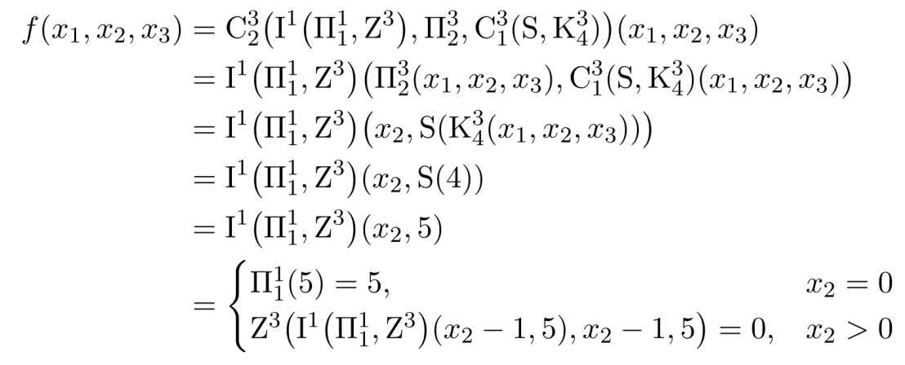

## Primitive Recursive Functions
### The basic initial functions are:
1. **Zero Function** $Z_n$: Returns zero regardless of input. $Z_2 = 0$
2. **Successor Function** $S$: Adds one to its input. $S_{34} = 35$
3. **Projection Function** $\Pi^n_k$: Returns the $k$-th element of its $n$-tuple input. $\Pi^n_k ( x_1 , ... , x_n ) = x_k$

### Operators
#### Composition
The composition of functions $g$ and $h_1, h_2, \ldots, h_n$ is denoted as $C^m_n(g, h_1, \ldots, h_n)$ and is defined as:
$C^m_n(g, h_1, \ldots, h_n)(x) = g(h_1(x), \ldots, h_n(x))$

So $C^3_1 (S, \Pi^3_1 ) = C^3_1 (S, 1) = 2$

#### Primitive Recursion
Primitive recursion involves defining a function based on its value at zero and its value at $n+1$ in terms of its value at $n$. If $g \in PR^n$ and $h \in PR^{n+2}$, then the function $I_n(g,h) \in PR^{n+1}$ is defined by:

$$I_n(g, h)(0, x) = g(x) I_n(g, h)(k+1, x) = h(k, I_n(g, h)(k, x), x)$$

## Example

### Given $f = C^3_2(I_1 ( \Pi^1_1, Z^3 ) , \Pi^3_2, C^3_1(S, K^3_4))$:

- $C^3_2$: This is a composition operator with arity 3 resulting in a function of arity 2.
- $I_1$: This indicates primitive recursion with 1 parameter plus the recursion variable.
- $\Pi^1_1$: This is the projection function returning its single input.
- $Z^3$: This is the zero function of arity 3, which always returns 0.
- $\Pi^3_2$: This projection function returns the second element of a 3-tuple.
- $C^3_1$: A composition operator with arity 3 resulting in a function of arity 1.
- $S$: The successor function.
- $K^3_4$: This constant function returns the number 4 regardless of its 3-tuple input.

1. $K^3_4$ is a constant function returning 4.
2. $C^3_1(S, K^3_4)$ composes the successor function $S$ with $K^3_4$, effectively returning 5.
3. $I_1(\Pi^1_1, Z^3)$ applies primitive recursion:
   - Base case: $I_1(\Pi^1_1, Z^3)(0, x) = \Pi^1_1(x) = x$.
   - Recursive step: $I_1(\Pi^1_1, Z^3)(k+1, x) = Z^3(I_1(\Pi^1_1, Z^3)(k, x), k, x) = 0$.

4. $C^3_2$ composes these results.
