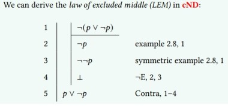

# Fitch-Style Natural Deduction

$[[𝑝]]$(𝑣) = 𝑣 (𝑝)

$[[\phi_1 → \phi_2]]$ (𝑣) = $[[\phi_2]]$ (𝑣) =⇒ $[[\phi_2]]$ (𝑣)
### Classical Logic and Completeness

In **cND** system:

$\frac{\Gamma , \neg \phi \vdash \bot}{\Gamma \vdash \phi}$ \(Contra)

Let 𝜑 be a propositional formula. We say that 𝜑 is **valid** if $[[\phi]]$ (𝑣) = 1 for
all valuations 𝑣 and **satisfiable** if $[[\phi]]$(𝑣) = 1 for some valuation 𝑣. A valid
formula is also called a **tautology** .

**Generally**:

- Satisfiability: A formula is satisfiable if there exists at least one interpretation (or model) in which the formula is true.

- Tautology: If formula is true in every possible interpretation.

- Contingent: If it's true in some equations and false in others. (satisfiable but not a tautology)