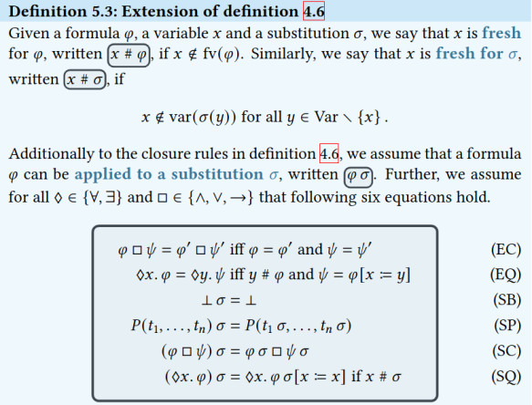
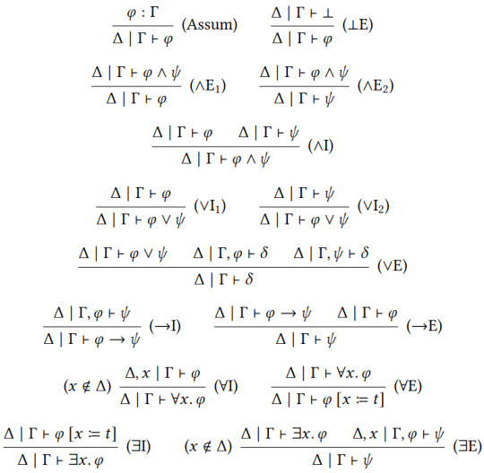

# Proof Theory of First-Order Predicate Logic

### Substitution

map 𝜎 : Var $\to$ Term. Given $t \in$ Term and $x \in$ Var, we write:

$\sigma [x := t]$

### Fresh

$x$ is fresh for $\phi$, written $x$ # $\phi$ , if $x \notin fv(\phi)$. 

So fresh means defined

if a variable is introduced by a quantifier (∃x or ∀x), it is considered "fresh" for the substitution, meaning we should not directly substitute it with another expression. Instead, we may need to rename it to avoid confusion, ensuring that the substitution process maintains the intended meaning of the formula.

- EQ (Equality of Variables):
    - Renaming bound variables to avoid variable capture.
- SQ (Substitution inside Quantifiers): 
    - Applying substitution within the scope of quantifiers while respecting their bindings.
    - In other word take the quantifiers out
- SC (Substitution in the Context): 
    - Applying substitution for each sub-formula
- SP (Substitution Process): 
    - Final application of substitution to atomic formulas.

##### Less used:

- EQ (Equality of Variables)
    - Renaming bound variables to avoid capture during substitution.
- SC (Substitution in the Context)
    - Applying substitution within the context of the logical structure.
- SP (Substitution Process)
    - Final application of the substitution to atomic formulas.

