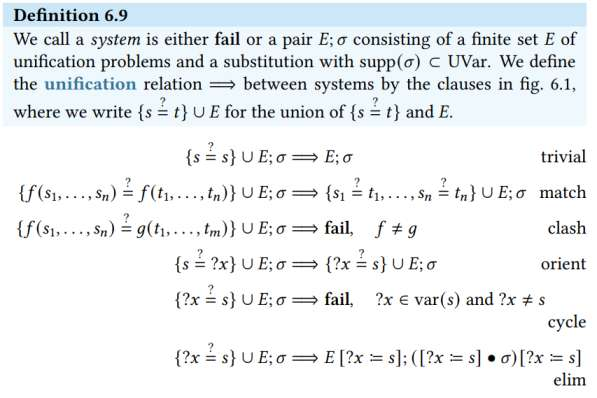

# Machine-Checked Proofs

## Proof-Checking with Explicit Substitutions

### Composition

(𝜏 • 𝜎) (𝑥) = 𝜎(𝑥) 𝜏 

**Note:** 𝜎 ⊑ 𝜏 if the substitution 𝜎 is more general than 𝜏

### Learn through Exercise

$$a) {𝑓 (𝑎, ?𝑥) = ?𝑦, 𝑔(𝑏, ?𝑦) = ?𝑧} b) {𝑓 (𝑎, ?𝑥) = ?𝑦, 𝑓 (𝑏, 𝑐) = ?𝑦}$$

