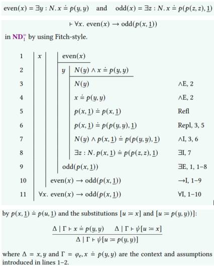
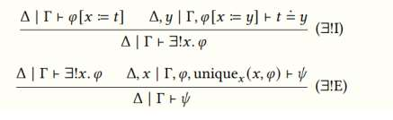

$s \stackrel{.}{=} t$ is syntactic equality which should be proved

$\forall x. \ N(x) \rightarrow p(\underline{0}, x) \stackrel{.}{=} x$ will be:

“if 𝑥 is a natural number, then adding zero to 𝑥 is equal to x

$\frac{\Delta | \Gamma \vdash s \overset{\cdot}{=} t}{\Delta | \Gamma \vdash t \overset{\cdot}{=} s}$ (Sym)

$\frac{\Delta | \Gamma \vdash s \overset{\cdot}{=} t \quad \Delta | \Gamma \vdash t \overset{\cdot}{=} r}{\Delta | \Gamma \vdash s \overset{\cdot}{=} r}$ (Trans)

$\frac{\Delta | \Gamma \vdash \phi [ x \overset{\cdot}{=} t ] \quad \Delta | \Gamma \vdash t \overset{\cdot}{=} r}{\Delta | \Gamma \vdash \phi [ x \overset{\cdot}{=} r ]}$ (Repl)

Let $\varphi$ be a formula, $t$ a term and $x$ a free variable in $\varphi$.

$\text{unique}_x(t, \varphi)$ expresses $t$ is uniquely among all objects that can be placed in the formula $\varphi$ for $x$:

$$\text{unique}_x(t, \varphi) \overset{\text{def}}{=} \forall y. \varphi[x := y] \rightarrow t = y$$

The variable $y$ is chosen to be fresh for $\varphi$ and $t$. Using uniqueness, we define the uniqueness quantifier $\exists!x.\varphi$ by

$$\exists!x. \varphi \overset{\text{def}}{=} \exists x. \varphi \land \text{unique}_x(x, \varphi)$$

and its bounded version as follows.

$$\exists!x : N. \varphi \overset{\text{def}}{=} \exists x. N(x) \land \varphi \land \text{unique}_x(x, N(x) \land \varphi)$$
$$s \dot{\neq} t \equiv \neg(s \stackrel{.}{=} t).$$

