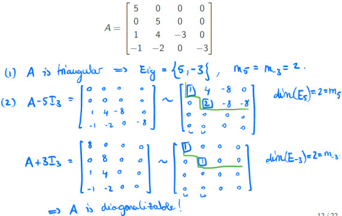

# Diagonalization, Inner Product, Length, and Orthogonality.
## Diagonalizable Matrix
If exists an invertible matrix $P$ and a diagonal matrix $D$ such that $A = P D P^{-1}$

Then $A^{k} = P D^{k} P^{-1}$
### Eigenspace
associated to the eigenvalue $k$ is the subspace
$E_{\lambda_{k}} = Nul(A-\lambda_{k}I_n)$
## How to find P and D

- Find Eignvalues of A ($\lambda_k$) with their multiplicities ($m_k$)
- If for each Eignvalues $m_k = dim(E_{\lambda_{k}})$ A is *Diagonalizable*
- Find Basis of $A-\lambda_{k} I_n$ matrices and $P$ will be Matrix of Basis
- $D$ will be a diagonal matrix of Eignvalues
#### Example

## Eigenvectors and Linear Transformations
**Standard matrix of T**: $A = [T (\underline{e_1}) . . . T (\underline{e_n})]$
## Defenitions

Norm or Length of $\underline{v}$ = $||\underline{v}|| = \sqrt{\underline{v} \cdot \underline{v}}$

Distance: $dist(\underline{u},\underline{v}) = ||\underline{u}-\underline{v}||$

**Orthogonal Vectors** (perpendicular in surface)
if 
- $\underline{u} \cdot \underline{v} = 0$
- $||\underline{u}+\underline{v}||^{2} = ||\underline{u}||^{2} + ||\underline{v}||^{2}$

**Orthogonal complement**: 
The set of all vectors that are orthogonal to $W$ are denoted as $W^{\bot}$ 

Example: W is a surface and L in a prependicular line passes through W so $ L = W^{\bot}$
#### Headup

If A is an $m \times n$ matrix, then

$(Row(A))^{\bot} = Nul(A)$ and $(Col(A))^{\bot} = Nul(A^{T}$)