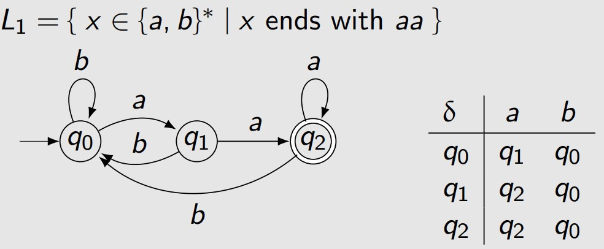

- **Abstract machines** Decide if a string belongs to a particular language.
    - **Finite Automata (FA)**: Simplest machines which processes strings by moving through a series of states based on the input string.
- **Grammars** Define a set of rules to generate all valid strings in a language, consists of:
    - **Terminals** (basic symbols like letters),
    - **Non-terminals** (intermediate symbols),
    - **Production rules** (rules to generate strings),
    - **Start symbol** (where generation starts).
- **Expressions** describe languages (e.g., regular expression for strings ending with 'ab').

### Levels of the Chomsky Hierarchy (Smaller to Bigger):

1. **Regular Languages**:
   - **Recognized by**: **Finite Automata**.
   - These are the simplest languages, describable by regular expressions.
   
2. **Context-Free Languages**:
   - **Recognized by**: **Pushdown Automata**.
   - These languages allow more complexity than regular languages, such as nested structures, making them useful for describing the syntax of programming languages.

3. **Context-Sensitive Languages**:
   - **Recognized by**: **Linear Bounded Automata (LBA)**.
   - These are more powerful than context-free languages and include those that require context to be understood (i.e., a rule depends on its surrounding symbols).

4. **Recursively Enumerable Languages**:
   - **Recognized by**: **Turing Machines**.
   - These are the most powerful class of languages, where any language that can be decided by a Turing machine belongs. This includes all computable problems.

## Recall from $\text{languages}$:

- **Letter, Symbol**: $\sigma \in \{ 0, 1, a, b, c \}$
- **Alphabet**: $\Sigma = \{ a, b, c \}$ (finite, nonempty)
  
- **String, Word**: $w$ (finite)
  - $w = a_1 a_2 \dots a_n$, where $a_i \in \Sigma$
  - Example: $abbabb$

- **Empty String**: $\lambda, \Lambda, \epsilon$
  
- **Length**: $|x|$
  - $|\Lambda| = 0$
  - $|xy| = |x| + |y|$

- **Concatenation**: $a_1 \dots a_m \cdot b_1 \dots b_n$
  - Example: $ab \cdot babb$
  - $w\Lambda = \Lambda w = w$
  - $(xy)z = x(yz)$

- **String**: $w \in \Sigma^*$
  - Example: $w \in \{ a, b \}^*$

- $\Sigma^* = \{ \Lambda, a, b, aa, ab, ba, bb, aaa, aab, \dots \}$ (canonical order)
  - **Infinite set of finite strings**

- **Language**: $L \subseteq \Sigma^*$
- **Λ** is a string with no characters.
- **{Λ}** is a set containing one element: the empty string.
- **∅** is an empty set, meaning it contains no elements, not even the empty string.

### **Concatenation**

- **One (Identity)**
    - $L{Λ} = {Λ}L = L$
- **Zero (Empty Set)**
    - $L∅ = ∅L = ∅$
- **Associativity**
    - $(KL)M = K(LM)$

- $L^0 = \{Λ\}$ (even if **L** is empty, this is like $0^0$).
- $L^1 = L$, $L^2 = LL$, and in general, $L^{n+1} = L^nL$.

**Kleene Star (L\*)**:
- Formula: $L^* = \bigcup_{n \geq 0} L^n$, meaning it includes $L^0, L^1, L^2, \dots$.

- **Example**: If $L = \{a\}$, then:

$$L^* = \{\Lambda, a, aa, aaa, \dots \}$$

### Closed under the operation

K, L ∈ F, then K∇L ∈ F.

**∇** represents an **Operation** which can be **union (∪)**, **concatenation (·)**, or **Kleene star ( * )**. The result of applying **∇** to languages **K** and **L** produces a new language, which, if the family is **closed under the operation**, remains in the same family of languages.

### Example

### Over definition

When we say $L^* = \{ \Lambda, ab, abab, ababab, \ldots \}$ is over $\{a, b\}$, it means that the strings in $L^*$ can be formed using the symbols from the alphabet $\{a, b\}$.

A language $L$ over the alphabet $\{a, b\}$ that satisfies $L = L^*$ is given by $L = \{a\}^*$.

- Cardinality : $|L_1 L_2| \leq |L_1| \cdot |L_2|$
- The inclusion property $L_1 \subseteq L_2$ ensures $L_1^* \subseteq L_2^*$