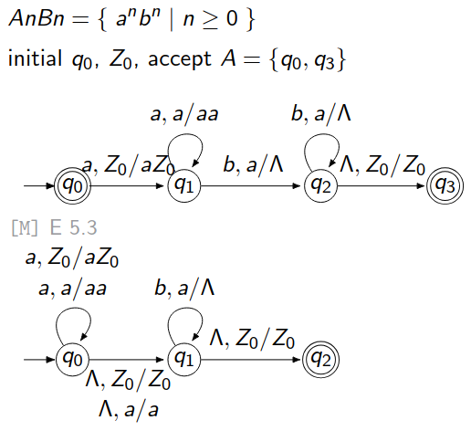
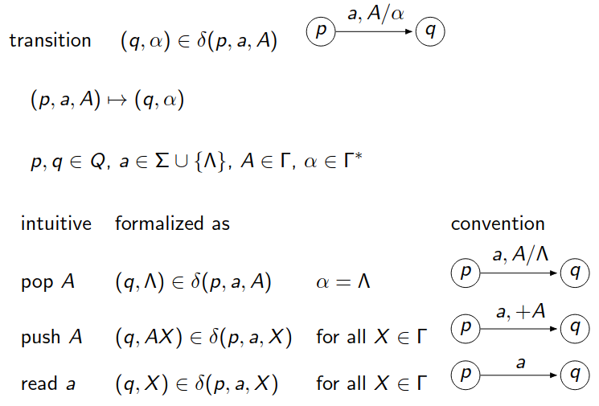
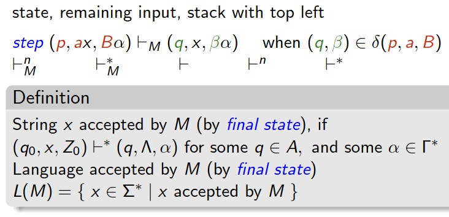

### **Arrow Notations**

$$\text{Input symbol, Stack top / Stack operation (Replaced by stack top)}$$

Where:
- **Input symbol**: Symbol read from the input string.
- **Stack top**: Symbol at the top of the stack that is required for the transition.
- **Stack operation**:
   - Replace the stack top with new symbols (or no change).
   - $ \Lambda $: Indicates "nothing" (no input or no stack symbol).

- **Λ, Z₀ / Z₀** and **Λ, a / a** are "do nothing" transitions.  

---

### **Transitions (Step by Step Explanation)**

1. **$q_0 \to q_1$**:  
   **Arrow label**: $a, Z_0 / aZ_0$  
   - **Input**: $a$.  
   - **Stack top**: $Z_0$.  
   - **Stack operation**: Push $a$ onto the stack, leaving $Z_0$ at the bottom.  
   - **Effect**: Stack becomes $aZ_0$.

2. **$q_1 \to q_1$ (loop)**:  
   **Arrow label**: $a, a / aa$  
   - **Input**: $a$.  
   - **Stack top**: $a$ (another $a$ already on the stack).  
   - **Stack operation**: Push another $a$ onto the stack.  
   - **Effect**: Stack grows with more $a$'s. Example: $aaZ_0, aaaZ_0, \dots$.

3. **$q_1 \to q_2$**:  
   **Arrow label**: $b, a / \Lambda$  
   - **Input**: $b$.  
   - **Stack top**: $a$.  
   - **Stack operation**: Pop $a$ off the stack (replace with $\Lambda$, meaning nothing).  
   - **Effect**: Stack reduces in size as $a$'s are matched with $b$'s.

4. **$q_2 \to q_2$ (loop)**:  
   **Arrow label**: $b, a / \Lambda$  
   - **Input**: $b$.  
   - **Stack top**: $a$.  
   - **Stack operation**: Pop $a$ off the stack.  
   - **Effect**: Continue matching $b$'s with $a$'s on the stack.

5. **$q_2 \to q_3$**:  
   **Arrow label**: $\Lambda, Z_0 / Z_0$  
   - **Input**: $\Lambda$ (no input is read).  
   - **Stack top**: $Z_0$ (marker at the bottom of the stack).  
   - **Stack operation**: Leave $Z_0$ unchanged.  
   - **Effect**: Transition to the accepting state $q_3$ when all $a$'s have been matched with $b$'s.

---

---

### **⊢ (Single Step Transition)**  
The symbol **⊢** represents a **single computational step** in a PDA.

$$(p, ax, Bα) \; \boldsymbol{⊢_M} \; (q, x, βα)$$

- **(p, ax, Bα):** Current configuration where:  
   - $p$ is the current state.  
   - $ax$ is the input (current symbol $a$ + remaining string $x$).  
   - $Bα$ is the stack (top symbol $B$ + remaining stack $α$).  

- **(q, x, βα):** Next configuration where:  
   - $q$ is the next state.  
   - $x$ is the remaining input after reading $a$.  
   - $βα$ is the new stack after $B$ is replaced with $β$.  

### **⊢\* (Multiple Steps / Computation Sequence)**  
The **⊢\*** symbol represents **zero or more steps** of computation in a PDA.  

- It is the **transitive closure** of the single step **⊢** notation.  

If:
1. $(p, ax, Bα) \; ⊢_M \; (q, x, βα)$  
2. $(q, x, βα) \; ⊢_M \; (r, y, γ)$  

Then:

$$(p, ax, Bα) \; \boldsymbol{⊢^*} \; (r, y, γ)$$

---

### 3. **Configuration Example (Step-by-Step)**  
Let’s consider a PDA accepting the palindrome **“aabcbaa”** with transitions as shown:

#### Initial Configuration:

$$(0, aabcbaa, Z₀)$$

1. $0, a, Z₀ → (0, aZ₀)$ (push **a**):  
   $(0, abcbaa, aZ₀) ⊢$

2. $0, a, a → (0, aa)$ (push **a** again):  
   $(0, bcbaa, aaZ₀) ⊢$

3. $0, b, a → (1, Λ)$ (pop **a**):  
   $(1, cbaa, aZ₀) ⊢$

4. Continue these steps until:  
   $(1, Λ, Z₀) ⊢ (2, Λ, Z₀)$  

This is a sequence of transitions. Representing all of these together:

$$(0, aabcbaa, Z₀) \; ⊢^* \; (2, Λ, Z₀)$$

---

### Deterministic PDA (DPDA) Simplified:

A **Deterministic Pushdown Automaton (DPDA)** is a type of PDA that has strict rules for transitions.

1. **At Most One Transition**:  
   For each state and stack symbol, there is **only one possible transition** for a given input symbol or $Λ$ (epsilon).

2. **No Mixing of Symbols and $Λ$-Transitions**:  
   At any state:
   - You cannot have a transition on **both an input symbol** and $Λ$ at the same time for the same stack symbol.

3. **Formal Definition**:  
   The transition function $δ$ satisfies:

$$δ(q, σ, X) \cup δ(q, Λ, X) \text{ contains at most one element.}$$

- $ q $: Current state.  
   - $ σ $: Input symbol.  
   - $ Λ $: Epsilon (no input).  
   - $ X $: Top of the stack.

4. **Relation to Languages**:  
   - **DPDA** can recognize **Deterministic Context-Free Languages (DCFL)**.  

---
### **Non-Determinism**:
The machine has to "guess" where to stop pushing and start popping the stack to match the second half. This guessing makes the PDA nondeterministic in `abba`.

### 5. **Key Takeaway**
- **Nondeterministic PDA** (NPDA) **can accept Pal** because it can "guess" the middle.  
- **Deterministic PDA** cannot handle the required "guesswork" for palindromes.