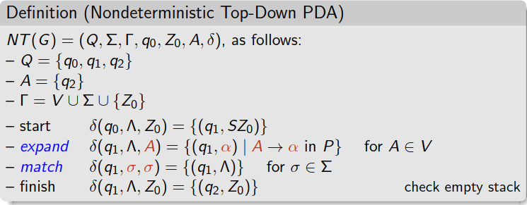
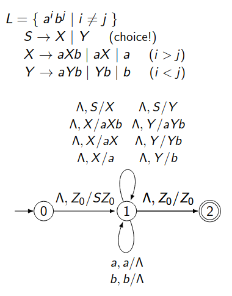
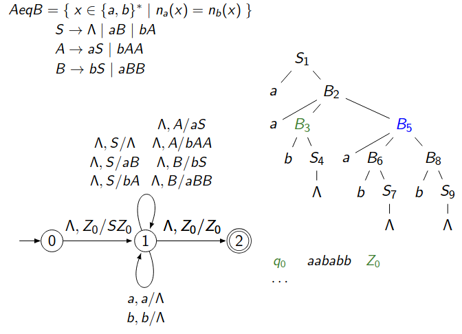
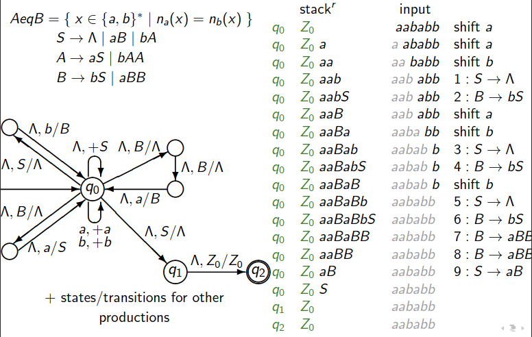
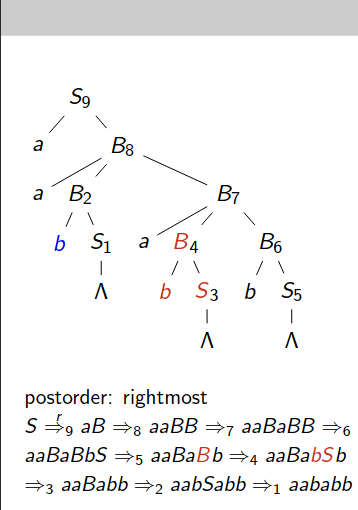

### **1. What is Special Closure $\text{pre}(L)$?**

- **Definition:**  
   $\text{pre}(L) = \{ x\#y \mid x \in L \text{ and } xy \in L \}$.  
   This operation constructs a new language where we separate $x$ and $y$ with a special symbol $\#$, and $x$ and $xy$ both belong to the original language $L$.  

#### Example:
- $L = \text{Pal}$ (Palindrome Language):  
   $\text{pre}(L)$ could contain strings like $"a\#aba"$, where $a \in L$ and $a \cdot aba \in L$.  
- $L = \{ a^i b^j \mid i < j \}$:  
   $\text{pre}(L)$ contains strings like $"a\#bb"$ where $a \in L$ and $abb \in L$.

---

### **2. CFL vs. DCFL and Closure Properties**

- **Context-Free Languages (CFLs):**
   - CFLs are **not closed under pre**.  
     Example: For certain languages like $K = \{ a^n b^n \mid n \geq 1 \} \cup \{ a^n b^m c^n \mid m, n \geq 1 \}$, $\text{pre}(K)$ is no longer context-free.  
   - CFLs are also **not closed under complement**.  

- **Deterministic Context-Free Languages (DCFLs):**
   - DCFLs **are closed under pre**.  
   - DCFLs **are closed under complement**.  
   - However, DCFLs are **not closed under union, concatenation ($\cdot$), or Kleene star ($*$)**.  

---

### **3. Construction of $\text{pre}(L)$ for DCFLs**

The construction focuses on building a **new PDA** that processes the pre-language.

- **Steps to Construct the New PDA $M_1$:**
   - Duplicate the original PDA states $Q$ into a primed set $Q'$ to "simulate" the second part $y$.  
   - Add a special **symbol $\#$** to act as a separator.  
   - Define transitions to move from the unprimed set $Q$ to the primed set $Q'$ when $\#$ is read.  
   - Continue processing in the primed copy of states.

- **Key Notations:**  
   - $Q_1 = Q \cup Q' \cup \{ q_1 \}$: State set with a primed copy of states.  
   - $Z_1$: New initial stack symbol.  
   - $δ_1$: Modified transition function to handle the pre-construction.

---

### **4. Limitations and Example:**

- For the language $K = \{ a^n b^n \mid n \geq 1 \} \cup \{ a^n b^m c^n \mid m, n \geq 1 \}$:  
   - $\text{pre}(K) = K\# \cup \{ a^n b^n \# b^k c^n \mid n \geq 1, k \geq 0 \}$.  
   - $\text{pre}(K)$ **is not context-free**, although $K$ is context-free.  

#### Why?  
- The pre-construction introduces a level of complexity (cross-dependency of counts) that cannot be handled by a nondeterministic PDA.  

---

### **5. Key Insight:**

- **Non-deterministic CFLs (CFLs):**  
   Not closed under **pre**, complement, or operations like union and concatenation.  
- **Deterministic CFLs (DCFLs):**  
   Closed under **pre** and complement but not under union or concatenation.

This distinction highlights the greater **closure properties** of DCFLs for specific operations, like pre-closure.

Would you like me to walk through the **PDA construction** step-by-step with an example?

---

### PDA process

$$\delta(\text{current state}, \text{input symbol}, \text{top of stack}) = \{ (\text{next state}, \text{new stack content}) \}$$

## **Top-down**

### **Top-Down Parsing**

- **Note**: Input symbol read, Top of the stack / Replaced by new stack content. $a,a/Λ$ means if a is read and a is on top of the stack, pop it off.

$$L = \{ a^i b^j \mid i \neq j \}$$

1. **Start Variable**: $S$  
   - $S \to X \mid Y$ (choice between two variables $X$ and $Y$)  

2. **Production Rules**:  
   - $X \to aXb \mid aX \mid a$ → for $i > j$ (more $a$'s than $b$'s)  
   - $Y \to aYb \mid Yb \mid b$ → for $i < j$ (more $b$'s than $a$'s)  

### **Top-Down PDA (Pushdown Automaton)**  

- **Start State**: Push $S$ onto the stack:

$$\delta(q_0, \Lambda, Z_0) = \{ (q_1, SZ_0) \}$$

- **Expand**: Replace variables ($S, X, Y$) using production rules:  
  - $\delta(q_1, \Lambda, S) = \{ (q_1, X), (q_1, Y) \}$  
  - $\delta(q_1, \Lambda, X) = \{ (q_1, aXb), (q_1, aX), (q_1, a) \}$  
  - $\delta(q_1, \Lambda, Y) = \{ (q_1, aYb), (q_1, Yb), (q_1, b) \}$  
- **Match Terminals**: Pop the stack when a terminal matches input:  
  - $\delta(q_1, a, a) = \{ (q_1, \Lambda) \}$  
  - $\delta(q_1, b, b) = \{ (q_1, \Lambda) \}$  
- **Finish**: Accept when stack is empty:

$$\delta(q_1, \Lambda, Z_0) = \{ (q_2, Z_0) \}$$

---
### Example: Equal amount of A and B

---

### **Bottom-up = shift-reduce**:

