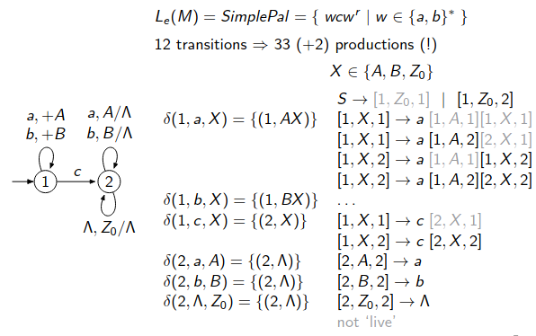
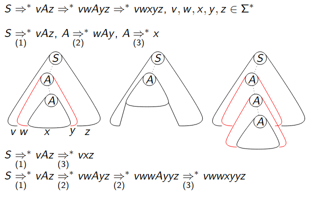

A **Pushdown Automaton (PDA)** can accept a string in two ways:

1. **Final State Acceptance**: PDA finishes in an accepting state after reading all input.
2. **Empty Stack Acceptance**: PDA finishes with the **stack empty** after reading all input.

We are now focusing on **empty stack acceptance**.

---

A PDA $M$ accepts a string $x$ **by empty stack** if:  
- Starting from the initial state $q_0$,  
- After reading the input $x$,  
- The **stack becomes empty** (all symbols popped).  

This is written as:

$$(q_0, x, Z_0) \vdash^* (q, \Lambda, \Lambda) \ \text{for some state} \ q.$$

$$L_e(M) = \{ x \in \Sigma^* \mid \exists q \in Q \text{ such that } (q_0, x, Z_0) \vdash^* (q, \Lambda, \Lambda) \}$$

---

1. **State Representation**:

$$[p, X, q]$$

- $p$: Current state.  
   - $X$: Top of the stack.  
   - $q$: Next state.

2. **Transitions**:  
   - **δ function**: Defines how the PDA behaves based on the current state, input symbol, and top stack symbol.  
   - For example:

$$δ(1, a, X) = \{ (1, AX) \}$$

- In **State 1**, reading $ a $ with $ X $ on the stack pushes $ A $ on top of $ X $.

---

$$[1, X, 1] \to a [1, A, 1][1, X, 1]$$

- **[1, X, 1]**:  
   - State **1** (current state).  $\to$ **X** is the top of the stack. $\to$ Transition **stays in state 1**.

- **a**:  
   - Input symbol being read is $a$.

- **[1, A, 1][1, X, 1]**:  
   - The stack action:  
     - **Push A** on top of the stack (associated with reading $a$).  
     - Then continue processing with **X** still remaining on the stack (recursion).

$$[1, X, 1] \to a [1, A, 2][2, X, 1]$$

- **[1, X, 1]**:  
   - State **1** (current state).  $\to$ **X** is the top of the stack.

- **a**:  
   - Input symbol being read is $ a $.

- **[1, A, 2][2, X, 1]**:  
   - Stack action:  
     - **Push A** onto the stack (associated with reading $ a $).  $\to$ Transition the automaton to **State 2**.  $\to$ Continue processing $ X $ on the stack in state 2.

#### **What does it do?**  
- This rule **pushes an "A"** onto the stack when $ a $ is read.  
- However, unlike the first rule, it moves the PDA into **State 2**.  
- State 2 marks the **pop phase**:  
   - It prepares the PDA to process the second half $ w^r $ of the palindrome.  

---

**theorem (Pumping Lemma for context-free languages):**  
For every context-free language $L$, there is a constant $n \ge 2$ such that for any string $u \in L$ with $|u| \ge n$, we can split $u$ as $u = vwxyz$ where:

1. $\lvert wy\rvert \ge 1$  
2. $\lvert wxy\rvert \le n$  
3. For all $m \ge 0,\; vw^m x y^m z \in L$.

