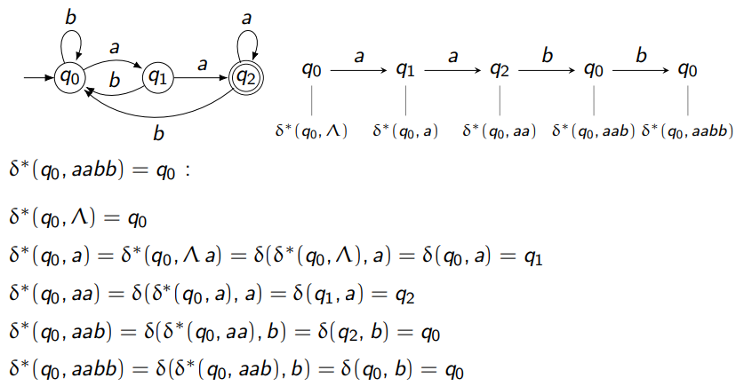

#### 1. **Finite Automaton (FA) Formalism**
   - **Definition**: A deterministic finite automaton (DFA) is a 5-tuple $M = (Q, \Sigma, q_0, A, \delta)$:
     - $Q$: Finite set of states.
     - $\Sigma$: Finite input alphabet.
     - $q_0$: Initial state where $q_0 \in Q$.
     - $A$: Accepting (final) states where $A \subseteq Q$.
     - $\delta$: Transition function, $\delta : Q \times \Sigma \rightarrow Q$.

#### 2. **Example: DFA for Language $L_1 = \{ x \in \{a, b\}^* \mid x \text{ ends with } aa \}$**
   - States: $Q = \{q_0, q_1, q_2\}$
   - Input Alphabet: $\Sigma = \{a, b\}$
   - Initial State: $q_0$
   - Accepting State: $A = \{q_2\}$
   - Transition Table:
     | State | a   | b   |
     |-------|-----|-----|
     | $q_0$ | $q_1$ | $q_0$ |
     | $q_1$ | $q_2$ | $q_0$ |
     | $q_2$ | $q_2$ | $q_0$ |

#### 3. **Extended Transition Function ($\delta^*$)**
   - **Definition**: 
     - $\delta$: This is a function that takes a current state and a single input symbol and returns the next state.
     - $\delta^*$: It takes a starting state and a sequence of symbols (string) and returns the resulting state after processing the entire string
     - $\delta^*(q, \Lambda) = q$ (no input string).
     - $\delta^*(q, y\sigma) = \delta(\delta^*(q, y), \sigma)$.

#### 4. **Theorem (Extended Transition Function Path)**:
   - $q = \delta^*(p, w)$ iff there is a path from $p$ to $q$ labeled by $w$.

#### 5. **Language Accepted by DFA**
   - The DFA $M$ accepts a string $x$ if $\delta^*(q_0, x) \in A$.
   - The accepted language $L(M) = \{ x \in \Sigma^* \mid \text{x is accepted by } M \}$.

#### 6. **Complement of a Language**
   - For DFA $M = (Q, \Sigma, q_0, A, \delta)$:
     - $M^c = (Q, \Sigma, q_0, Q - A, \delta)$
     - The language $L(M^c) = \Sigma^* - L(M)$.

#### 7. **Boolean Operations (Union, Intersection, Difference)**
   - Product Construction for combining DFAs $M_1$ and $M_2$:
     - States: $Q = Q_1 \times Q_2$
     - Transitions: $\delta((p, q), \sigma) = (\delta_1(p, \sigma), \delta_2(q, \sigma))$
     - Acceptance criteria based on:
       - Union: $A = \{(p, q) \mid p \in A_1 \text{ or } q \in A_2\}$
       - Intersection: $A = \{(p, q) \mid p \in A_1 \text{ and } q \in A_2\}$
       - Difference: $A = \{(p, q) \mid p \in A_1 \text{ and } q \notin A_2\}$

### Regular Languages

- **Definition:** A language is *regular* if it can be represented by a finite automaton (FA). 

### Closure Properties of Regular Languages

**Theorem:** Regular languages (REG) are closed under certain operations, meaning if you apply these operations to regular languages, the result will still be regular.
1. **Complement**
2. **Union**
3. **Intersection**

### Pumping Lemma for Regular Languages

The *pumping lemma* is a property that all regular languages satisfy. It’s commonly used to prove that certain languages are *not* regular by contradiction.

**Theorem** (Pumping Lemma):  
For any regular language $L$ with a finite automaton that has $n$ states:
- If you have any string $x \in L$ where $|x| \geq n$ (the length of $x$ is at least $n$),
- Then $x$ can be split into three parts $x = uvw$ such that:
  1. $|uv| \leq n$ (the length of the first two parts is within $n$),
  2. $|v| \geq 1$ (the part $v$ is non-empty),
  3. For any $m \geq 0$, the string $uv^m w$ is also in $L$ (repeating $v$ any number of times keeps the string in $L$).

### Example Using the Pumping Lemma

Let’s use an example to see how the pumping lemma works to prove that a language is not regular:

#### Example 1: $L = \{ a^n b^n \mid n \geq 0 \}$
- **Goal**: Show $L$ is not regular.
- **Assume** $L$ is regular (for contradiction). If it were regular, it would satisfy the pumping lemma.
- Choose $x = a^n b^n$. The length $|x| = 2n \geq n$, so we can split $x$ into $uvw$.
- By the pumping lemma, $v$ should contain only $a$’s because $|uv| \leq n$. Now if we remove $v$ (by setting $m = 0$), we get fewer $a$’s than $b$’s, which is not in $L$, contradicting the assumption.

This contradiction shows that $L$ is not regular.

#### Example 2: $L = \{ x \in \{a, b\}^* \mid \text{number of } a\text{'s} = \text{number of } b\text{'s} \}$

- Use the same argument: assume it’s regular and use the pumping lemma.
- You’ll see that by manipulating $v$, you end up with a string where the number of $a$’s and $b$’s is unequal, which means it’s not in $L$, leading to a contradiction.