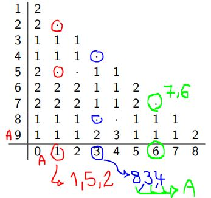
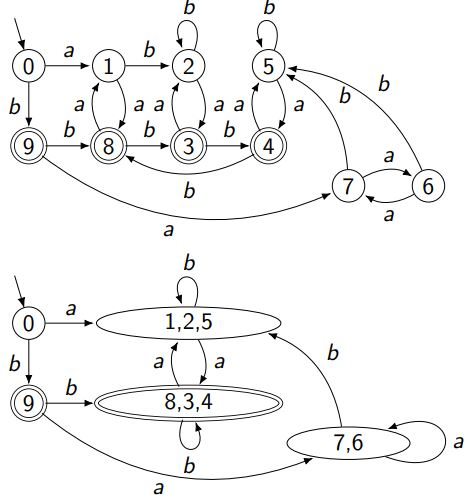

### "L/..." (quotient)

- **L/Λ** means: What happens if we remove (or apply) the empty string $\Lambda$? The language stays the same, so **$L/Λ = L$**.
- **L/b** means: What happens if we remove the prefix "b"? It means you look at all strings in $L$ that **do not start with "b"**. For example, in $L$, this would include strings like "a", "aa", "ab", etc., but not "b" or "bb".
- **L/bb** means: What happens if we remove the prefix "bb"? In this case, **no string in $L$** can start with "bb", so **$L/bb = \emptyset$**.

---

## Characterization
If there is an **infinite set** of pairwise L-distinguishable strings in $\Sigma^*$, then $L$ **cannot** be accepted by a finite automaton. 

Thus, **infinite L-distinguishable sets** require more states than a finite automaton can provide, so **L is not regular** and cannot be accepted by a finite automaton.

---

# DFA Minimization

1. For states $x$ and $y$:
    - If **only one** of them is an accepting state, mark it with 1 and leave the rest as 0.

2. For all non-marked pairs left, such as $(1,2)$:
    - a: $\delta(1,a) = m$, $\delta(2,a) = n$
    - b: $\delta(1,b) = l$, $\delta(2,b) = s$

    If $(m,n)$ or $(l,s)$ were marked from step 1, mark it with 2.

3. If it was marked with 2 before, mark it with 3.

4. Draw the minimized graph:
    - 4a: The completed column (mostly $q_0$ or 0) will be the starting point. The final state, which doesn't fit in the table (9), is the accepting state. Draw $A$ and $q_0$ first.
    - 4b: Look at a column to see which ones have a dot and group them. Shape different groups and check in the original graph which states are connected to each other to apply the same grouping. Finally, make the previous accepting states group the new accepting state.

