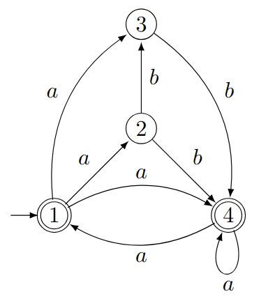
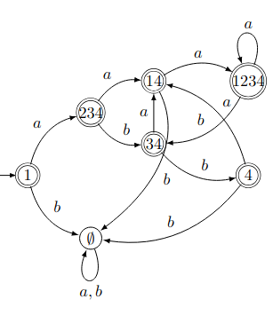
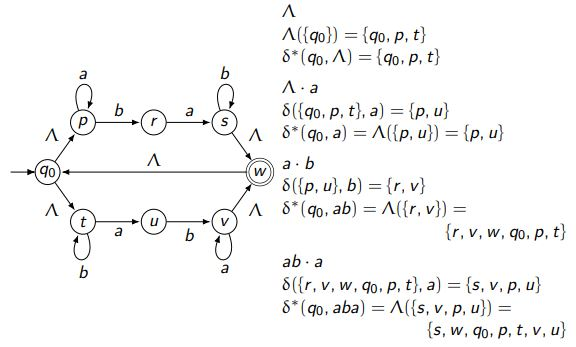
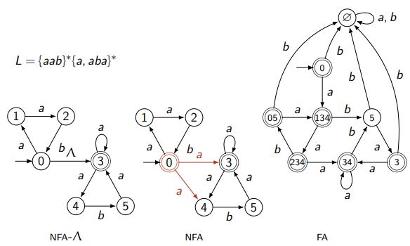

# Formalism

A finite automaton is formally defined as a 5-tuple:  
$M = (Q, \Sigma, q_0, A, \delta)$

### Deterministic Finite Automaton (DFA):
- **Transition Function**:  
  $\delta : Q \times \Sigma \to Q$  
  This means that for each state ($Q$) and input symbol ($\Sigma$), there is exactly one next state.

### Nondeterministic Finite Automaton (NFA):
- **Transition Function**:  
  $\delta : Q \times (\Sigma \cup \{\Lambda\}) \to 2^Q$  
  This allows multiple possible next states for a given state and input symbol, including $\Lambda$ (epsilon, or empty) transitions.  

---

## **Subset construction (From $NFA \to DFA$)**

First we make a transition table with the head $|State (q)| \delta(q,a)| \delta (q,b)$ then start from the initial state and find the next states for each input symbol. Finally we will draw a new graph with the states as the nodes and the transitions as the edges.

##### Example:

| state \( q \) | \( \delta(q, a) \) | \( \delta(q, b) \) |
|--------------|-------------------|-------------------|
| 1            | 234               | ∅                 |
| 234          | 14                | 34                |
| 14           | 1234              | ∅                 |
| 34           | 14                | 4                 |
| 1234         | 1234              | 34                |
| 4            | 14                | ∅                 |
| ∅            | ∅                 | ∅                 |

---
## $\Lambda$-Closure (Epsilon-Closure)

### Definition:
- $\Lambda(S)$: The set of states reachable from a set $S \subseteq Q$ through **only $\Lambda$-transitions**.
  - $S \subseteq \Lambda(S)$: Every state in $S$ is included in its own $\Lambda$-closure.
  - If $q \in \Lambda(S)$, then $\delta(q, \Lambda) \subseteq \Lambda(S)$: If a state $q$ is in the closure, all states reachable via $\Lambda$-transitions from $q$ are also included.

---

Finite Automata (FA):
- **Deterministic Finite Automaton (DFA)**: For each state and input symbol, there's exactly one next state.
- **Non-deterministic Finite Automaton (NFA)**: From a given state and input symbol, there can be multiple next states.