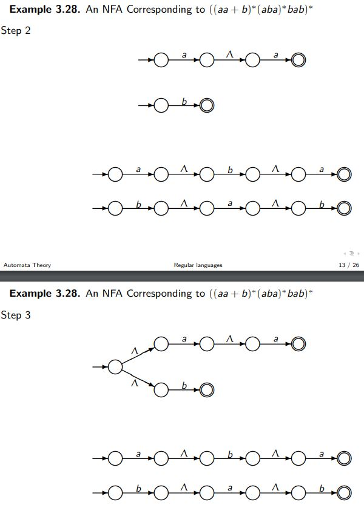
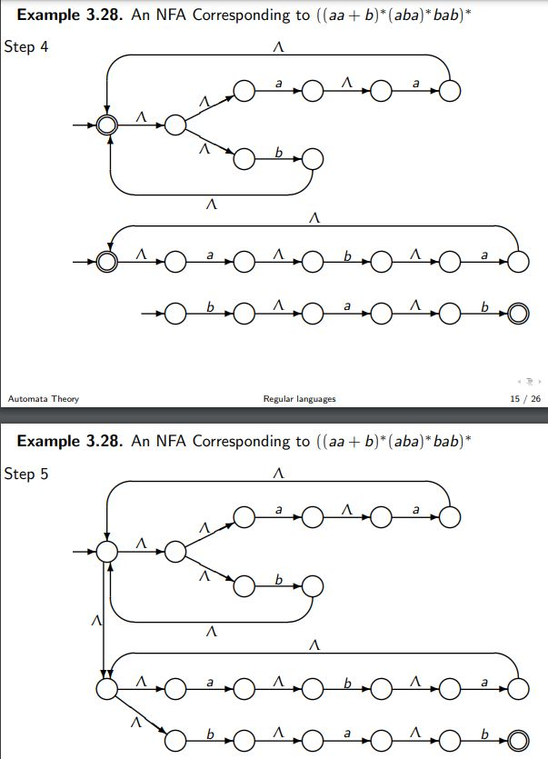
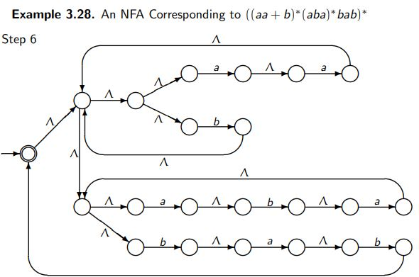
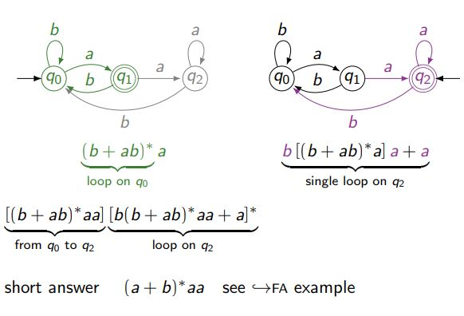
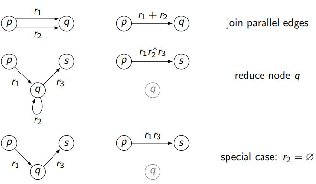

### **Regular Expressions (RegEx)**

#### Definition:
- Basic components: $\emptyset, \Lambda, a$.
- Operators: Union ($+$), Concatenation, Kleene Star ($*$).

#### Examples:
1. **Odd number of "a"**:
   - RegEx: $b^* a b^* (ab^* a b^*)^*$

2. **Even number of "a" and "b"**:
   - RegEx: $(aa + bb + (ab + ba)(aa + bb)^*(ab + ba))^*$

---

#### Conversions:
- **From RegEx to FA**: Thompson’s construction.
- **From FA to RegEx**: Algorithms like those by McNaughton and Yamada.

---

### Thompson’s Construction (RegEx to NFA):
Converts a RegEx into an equivalent NFA. For example:
- RegEx: $(aa + b)^* (aba)^* bab$
- Step-by-step builds an NFA by combining subcomponents.

### **Kleene’s Theorem**
- **Statement**: Regular languages are equivalent to those accepted by FA and those defined by RegEx.
- **Conversion**:
  - RegEx → FA: Use Thompson’s construction.
  - FA → RegEx: Use algorithms like Brzozowski and McCluskey.

#### **Note**:

- For $(bb + aa)$, pick one of $bb$ or $aa$.
- For $ba^*b$, include $bb$ when there are zero $a$'s.

### **Finding a regular expression**

### Brzozowski et McCluskey

