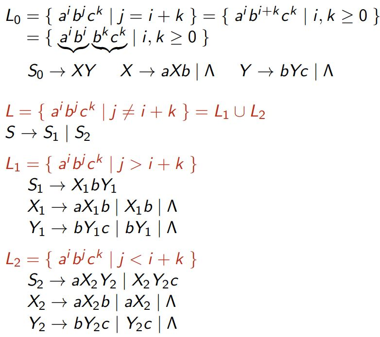

### **Overview of Language Classes**
Languages are classified into different categories based on their complexity and the type of machine that recognizes them:

| **Language Class** | **Recognized By**            | **Example Grammar** |
|---------------------|------------------------------|----------------------|
| Regular Languages   | Finite Automata (FA)        | Regular Grammar      |
| Context-Free (CFL)  | Pushdown Automata (PDA)     | Context-Free Grammar |
| Context-Sensitive   | Linear Bounded Automata     | Context-Sensitive    |
| Recursively Enumerable (RE) | Turing Machines         | Unrestricted Grammar |

---

### **Advanced Context-Free Language Examples**

#### **$L_1 = \{a^i b^j c^k \mid i = j + k\}$**
**Grammar**:

$$S \to aSc \,|\, T, \quad T \to aTb \,|\, \Lambda$$

#### **Derivation for $ aaa \, b \, cc $:**
1. $ S \to aSc \to aaScc \to aaTcc $
2. $ aaTcc \to aaaTbcc $
3. $ aaaTbcc \to aaabcc $

---

#### **$L_2 = \{a^i b^j c^k \mid j = i + k\}$**
**Grammar**:

$$S \to XY, \quad X \to aXb \,|\, \Lambda, \quad Y \to bYc \,|\, \Lambda$$

#### **Derivation for $a \, bbb \, cc$:**
1. $S \to XY \to aXbYc$
2. $aXbYc \to abYc \to abbbYcc$
3. $abbbYcc \to abbbcc$



$$a^i b^i b^k c^k$$

---

### **Context-Free vs. Non-Context-Free**
Some languages **cannot** be represented by a CFG, such as:
1. $A_nB_nC_n = \{a^n b^n c^n \mid n \geq 0\}$: Requires all three counts $n$ to match, which a PDA cannot handle.
2. $XX = \{xx \mid x \in \{a, b\}^* \}$: Requires comparing two identical substrings.

#### **Reason**:
- Context-free languages cannot handle multiple dependencies simultaneously, as PDAs have a single stack.

---

### **Regular Grammars**
A **regular grammar** is a simplified type of CFG that generates regular languages. Productions are of the form:
- $A \to \sigma B$: A variable produces a terminal followed by another variable.
- $A \to \Lambda$: A variable produces the empty string.

#### **Example**:
- **Grammar**:

$$S \to aA \,|\, bS, \quad A \to bS \,|\, \Lambda$$

- **Generated Strings**: $ ab, abb, abbb, \dots $

---


### **CFG for Arithmetic Expressions**

#### **Grammar**:

$$S \to a \,|\, S + S \,|\, S \ast S \,|\, (S)$$

- Terminals: $ \{a, +, \ast, (, )\} $ (actual symbols in the string).
- Non-terminal: $ S $ (represents an expression).

#### **String to Derive**: $ a + (a \ast a) $

#### **Leftmost Derivation**:
Expand the **leftmost variable** first at every step:
1. $ S \to S + S $ (start expanding $ S $).
2. $ S + S \to a + S $ (expand the **leftmost $ S $** to $ a $).
3. $ a + S \to a + (S) $ (next, expand the **leftmost $ S $** to $ (S) $).
4. $ a + (S) \to a + (S \ast S) $ (expand the **leftmost $ S $** inside the parentheses).
5. $ a + (S \ast S) \to a + (a \ast S) $ (expand the leftmost $ S $ to $ a $).
6. $ a + (a \ast S) \to a + (a \ast a) $ (expand the last $ S $).

### **Derivation Tree**

Both leftmost and rightmost derivations produce the **same string**, but the order of rule application differs. The derivation tree for $ a + (a \ast a) $ looks like this:

```
         S
       / | \
      S  +  S
     a     / | \
          (   S  )
             / | \
            S   *  S
           a       a
```