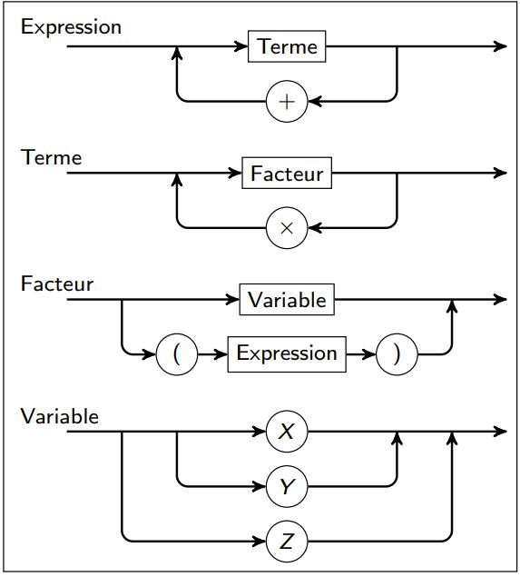

### **Ambiguity in Context-Free Grammars (CFGs)**

- A CFG is **ambiguous** if there is at least one string $x \in L(G)$ (language of the grammar) that has **more than one derivation tree** or **more than one leftmost/rightmost derivation**.
- If no such string exists, the grammar is **unambiguous**.

#### **Example**

- **Grammar**:

$$S \to a \,|\, S + S \,|\, S \ast S \,|\, (S)$$

- **String**: $a + a \ast a$
  
#### **Derivation Trees**:
1. **Tree 1**: $a + (a \ast a)$
   ```
         S
       / | \
      S  +  S
     a     / | \
          S   *  S
         a       a
   ```

2. **Tree 2**: $(a + a) \ast a$
   ```
         S
       / | \
      S   *  S
     / | \    a
    S  +  S
   a       a
   ```

#### **Fixing Ambiguity with Unambiguous Grammar**

- **Revised Grammar**:

$$S \to S + T \,|\, T T \to T \ast F \,|\, F$$

$$F \to a \,|\, (S)$$

- **Purpose**:
  - Explicitly states that $ \ast $ has higher precedence than $ + $.
  - Groups operators correctly to avoid ambiguity.

---

### Expressions: railroad diagram

