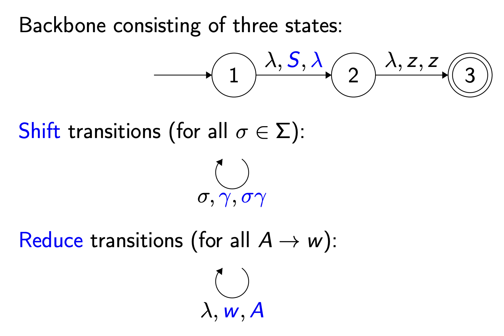
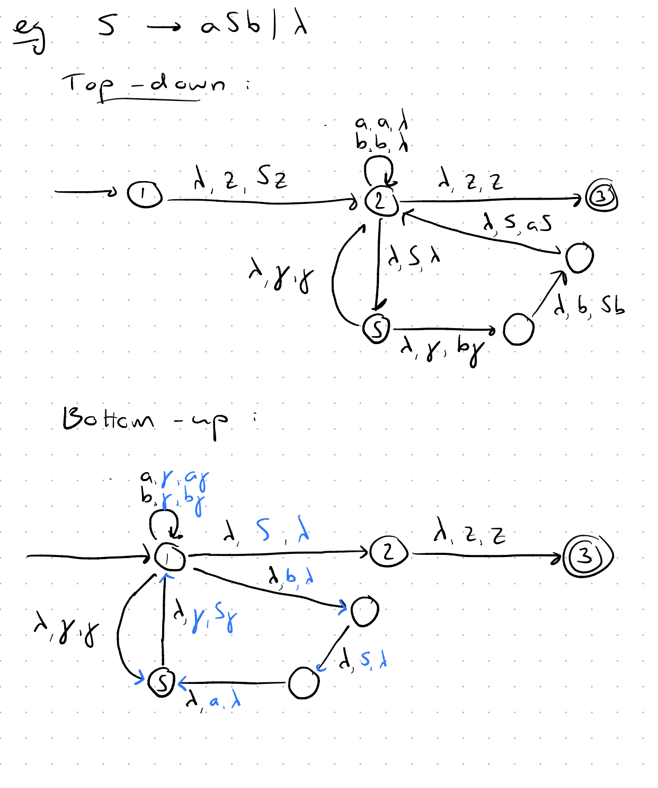
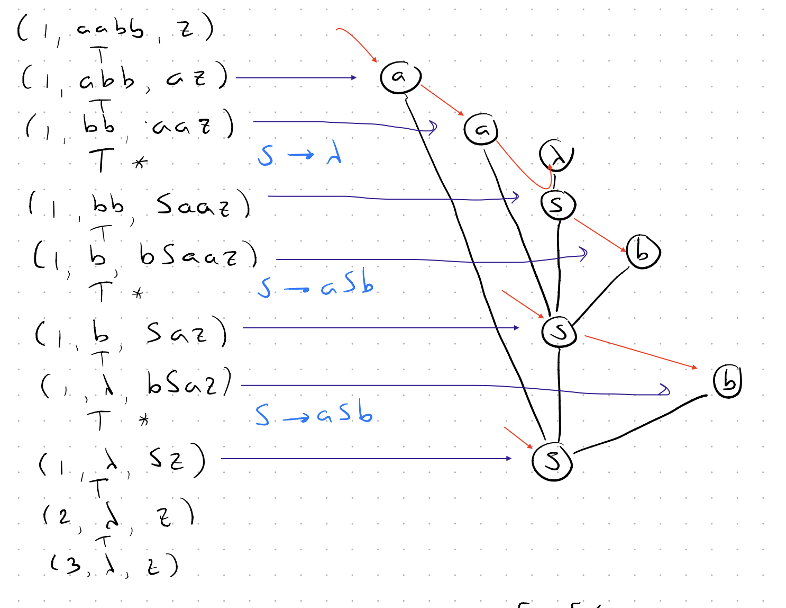
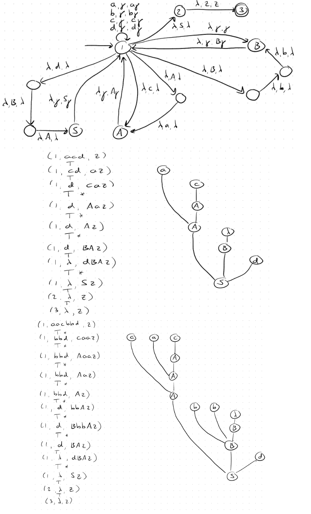
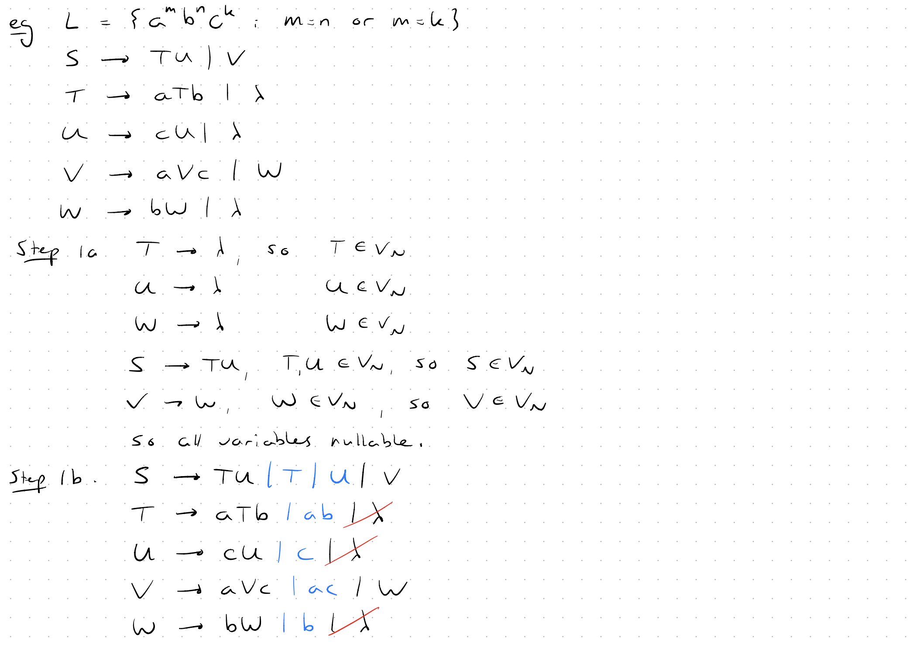
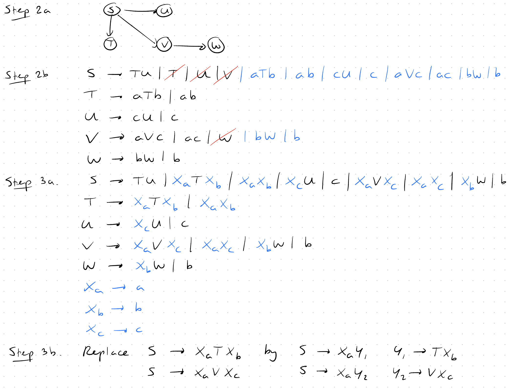
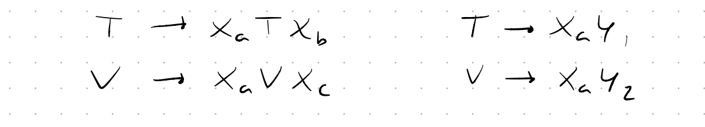

$$G = (V, T, S, P)$$
### Context-Free Grammars vs Regular Grammars Distinction

| Grammar | LHS | RHS | Example |
|---------|-----|--------|---------|
| Regular Grammar | Single Non-terminal | Single Terminal or Terminal + only one Non-terminal | A → aB , B → b | $\lambda$ |
| Context-Free Grammar | Single Non-terminal | Any combination of Terminals and Non-terminals | A → aABb , B → a \| $\lambda$ |


For **Shift Transition**: Read symbol, whatever we have on stack, we push the symbol on the stack.

For **Reduce Transition**: We look at the stack, and see if we have the right side of any production rule on top of the stack. If we do, we pop those symbols off the stack, and push the left side of that production rule onto the stack.

- If $U \to a|b|\lambda$ from state 1 we make a $(\lambda, \gamma, \gamma$), ($\lambda, a, \lambda$), or $(\lambda, b, \lambda)$ reduce transition to $U$ then return to 1 with $(\lambda, \gamma, U\gamma)$.





The blue lines are **Reduction Transitions**

---

#### Full Example on Bottom-Up Parser

Consider the CFG:

$$S → ABd A → aA | c$$

$$B → bbB | λ$$
- a. Construct the bottom-up parser for this grammar.
- b. Use the npda constructed to parse the string $acd$.
- c. Use the npda constructed to parse the string $aacbbd$.



---

### Chumsky Normal Form (CNF)

- A -> BC (A non-terminal produce B and C non-terminals)
- A -> a (A non-terminal produce a terminal)


Algorithms to convert grammer to CNF:
- 1a) **Identify nullable variables**: ($S,T,U,.. \in V_N$)
- 1b) **Eliminate Null Productions** and **Add new productions**:
    - If $T \rightarrow aTb$ and $T$ is nullable then remove $T$ and add the rest to productions $T \rightarrow aTb | ab$
    - If we have two Nullables we write them each or combination like:
        - $S \rightarrow TU$ will be $S \rightarrow TU | T | U$
        - For $S \rightarrow ACB$ we have $S \rightarrow ACB | CB | AB | AC | A | B | C$
- 2a) **Draw a directed graph for nullable variables**
- 2b) **Remove lonely Nullable productions in RHS and add derivations to production**
- 3a) **For terminals define a production and replace**
- 3b) **To make it CNF we need to break down productions with more than 2 non-terminals in RHS**

 <br>

 <br>


---

**Only these closure properties are closed under Contect Free Language**

- $L_1 \cup L_2$
- $L_1 L_2$
- $L^*_1$
- $L^R_1$

---

- Each TM can describe at most one recursivly enumerable language.
- **Recursive Language**: Makes TM halts for a recursivly enumerable language (Y/N) (Also complementary language is recursive).
---

### Arithmetic Operations on Turing Machines

#### Sum

```python
WHILE y ≠ 0 DO
    subtract 1 from y
    add 1 to x
END WHILE

erase y and #
OUTPUT x
```

#### Multiplication

```python
IF x = 0 OR y = 0 THEN
    erase input
    OUTPUT 0
END IF

result = 0 (another #)

WHILE y ≠ 0 DO
    result = result + x
    subtract 1 from y
END WHILE

erase x, y, #
OUTPUT result
```

#### Division

```python
IF y = 0 THEN
    reject
END IF

quotient := 0

WHILE x ≥ y DO
    subtract y from x
    add 1 to quotient
END WHILE

erase x and y
OUTPUT quotient

```

#### Power

```python
IF y = 0 THEN
    erase input
    OUTPUT 1
END IF

result := 1

WHILE y ≠ 0 DO
    result := result · x
    subtract 1 from y
END WHILE

erase x and y
OUTPUT result
```

#### Factorial

```python
Write 1 (call x): n#1
WHILE x ≠ 1 DO
    copy n (n#x#y)
    subtract 1 from n ((n-1)#x#y)
    multiply x and y (n-1)#x(x.y)
END WHILE

erase n and #
OUTPUT x

---

- Pushdown automaton makes problems **partially decidable**(Yes but not always No).

- Everything in **CFG** is **Decidable** except:
  - Ambiguity Problem
  - Equality or common string Problem

##### Complexity classes
- $P$: Problems that can be solved in polynomial time by a deterministic Turing machine. $|\text{input}| = n \Rightarrow$ Time Complexity: $O(n^k)$ for some constant $k$, denoted as $P$.
  - Like sorting, prime checking, finding shortest path in graphs.
- $NP$: Problems for which a proposed solution can be verified in polynomial time by a non-deterministic Turing machine. $|\text{input}| = n \Rightarrow$ Time Complexity: $
  - We can verify a solution fast if we are given proposed solution.
  - Most of daily problems which we can check solution fast but finding solution is hard like Sudoku, Hamiltonian path, k-clique.

* **P** = easy to solve
* **NP** = easy to check
* **NP-complete** = hardest problems in NP
* **Cook–Levin** = NP = SAT in polynomial time