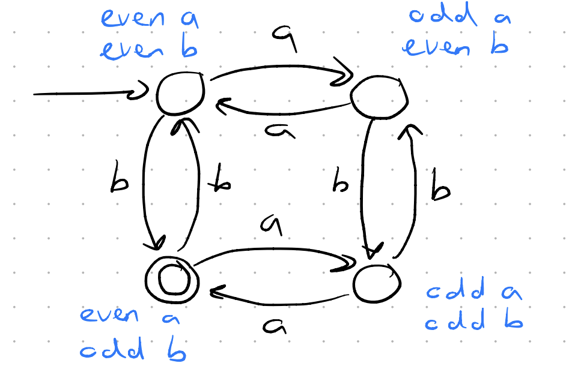

**Chomsky hierarchy** – a way to classify languages (sets of strings) based on how complex they are and what machines can recognize them.

1. **Regular languages**

   * Recognized by: **Finite automata**
   * Simple patterns, no memory.
   * Example: Strings with only `a`s and `b`s where every `a` is followed by `b` (`(ab)*`).

2. **Context-free languages (CFLs)**

   * Recognized by: **Pushdown automata** (uses a stack for memory)
   * Example: Balanced parentheses: `(()())` or `{[()]}`.

3. **Context-sensitive languages (CSLs)**

   * Recognized by: **Linear bounded automata**
   * Example: `{ a^n b^n c^n | n ≥ 1 }` → same number of `a`s, `b`s, and `c`s.

4. **Recursively enumerable languages**

   * Recognized by: **Turing machines**
   * Most general class, includes problems that may not always halt.
   * Example: `{ <M,w> | M is a Turing machine that accepts input w }`.

---

- **Alphabet** $\Sigma$ **finite, non-empty set** of **symbols** $\sigma$
- **Word (string)**: $w = \sigma_1\sigma_2 \dots \sigma_n, \quad \sigma_i \in \Sigma, \; n \in \mathbb{N}$
- **Empty String**: $\lambda$ or $\Lambda$ or $\varepsilon$
- **Length of a String** $|w|$
- **Concatenation**: Joining two strings $v$ and $w$, $v \cdot w = vw$
-  **Reverse of a String**: if $w = abcd$, then $w^R = w^r = dcba$
- **Power of a String**: $w^n = \underbrace{ww \dots w}_{n \, \text{times}}$
- **Kleene Star**: $\Sigma^* = \{ \text{all strings of zero or more symbols from } \Sigma \}$ : if $\Sigma = \{a,b\}$, then $\Sigma^* = \{ \lambda, a, b, aa, ab, ba, bb, aaa, … \}$
- **Canonical (shortlex) order**: Strings are ordered by **length first**, then **alphabetically**
- **Positive closure (Σ⁺)**: $\Sigma^+ = \Sigma^* - \{\lambda\}$
- **Language**: $L \subseteq \Sigma^*$ like $\Sigma = \{0,1\}$, $L = \{ w | w \text{ ends with 0} \}$
- **Complement**: $\overline{L} = \Sigma^* - L$
- **Concatenation of Languages**: $L_1 L_2 = \{ xy | x \in L_1, y \in L_2 \}$: $L = \{a, b\}, L^2 = \{aa, ab, ba, bb\}$.
- **Kleene closure of a language**: $L^* = \bigcup_{n \geq 0} L^n$
- **Positive closure of a language**: $L^+ = \bigcup_{n \geq 1} L^n$ = $L^*$ without the empty string.
---

#### Grammar ($G$)
A **set of rules** that tells us how to build strings from an alphabet.

$$G = (V, T, S, P)$$

- **$V$: Variables (non-terminals)**, Symbols used as placeholders, like $V = \{S, A\}$.
- **$T$: Terminals** alphabet symbols, letters like $T = \{a, b\}$.
- **$S \in V$: Start variable** usually $S$ which is variable where derivations begin.
- **$P$: Productions (rules)** like $S \to aSb \mid \varepsilon$.

##### Example of language generated by grammar $G$:

* $V = \{S\}$
* $T = \{a, b\}$
* $S = S$ (start symbol)
* $P = \{ S \to aSb, \; S \to \varepsilon \}$

This generates: {$\varepsilon$, $ab$, $aabb$, $aaabbb$, …} So, $ L(G) = \{ a^n b^n \mid n \geq 0 \} $

---

### Excercises

- DFA for all strings with Odd number of b's and even number of a's over {a,b}

