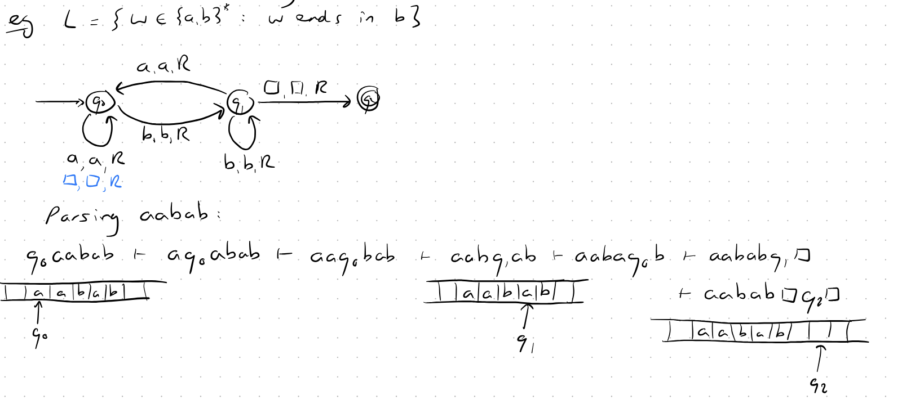
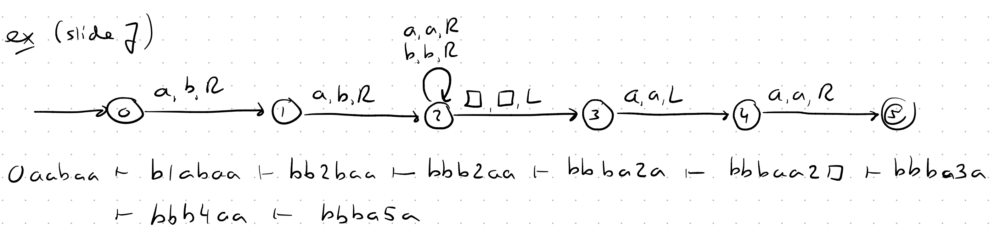
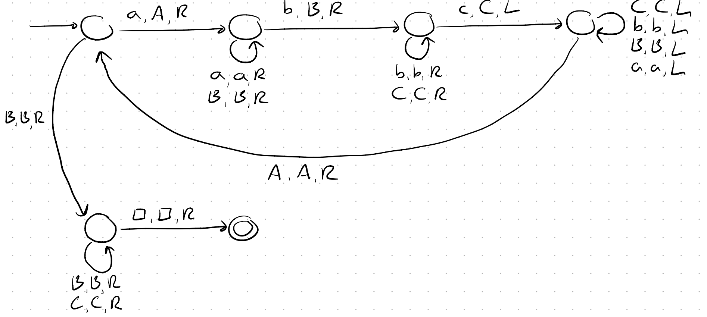
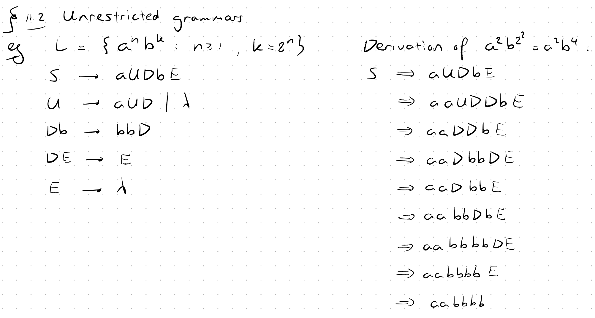
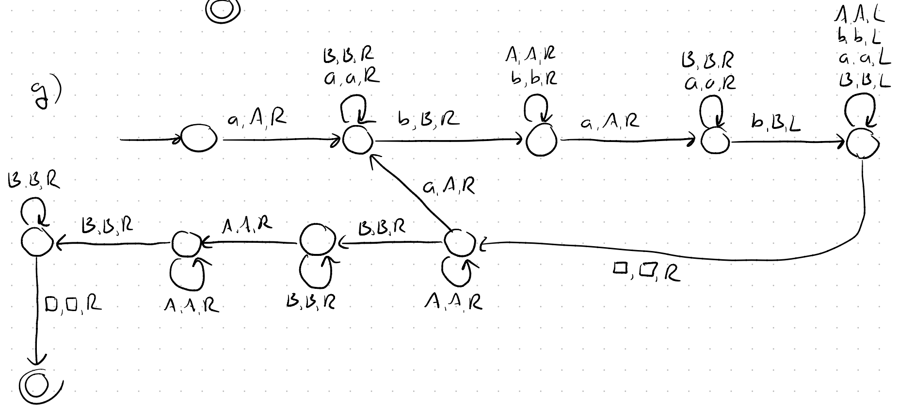
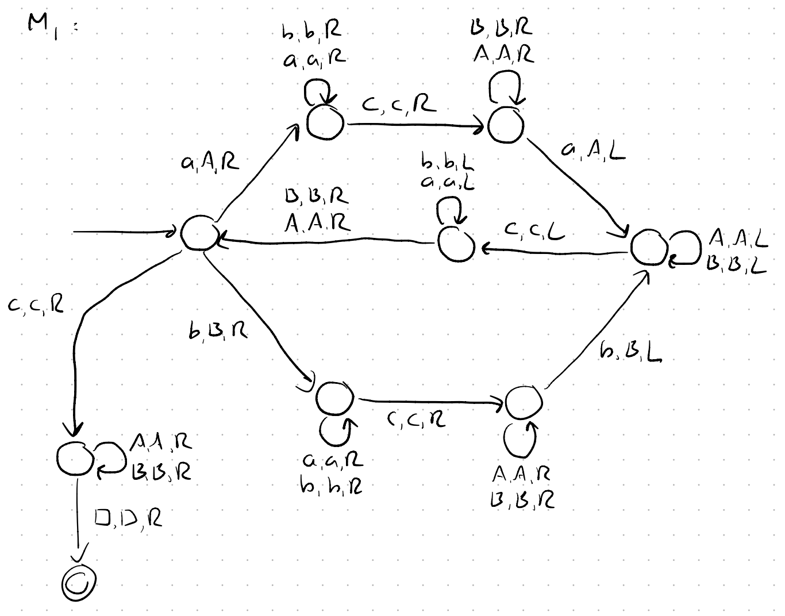

## The standard Turing machine

**A Deterministic Turing machine** is defined by:

* **states** ($Q$)
* **input alphabet** ($Σ$) blanck item not included (like $lambda$ in FA or $\square$ here)
* **tape alphabet** ($Γ$)
* **transition function** ($δ: Q × Γ → Q × Γ × \{L, R\}$) 
* **start state** ($q_0$)
* **blank symbol** ($\square \in Γ - Σ$)
* **accepting states** ($F$) once we got to Final state we stop the computation and cannot move back anymore

The notation $a,a,R$ means: read $a$, replace $a$, move Right

- The tape is infinite in both directions and we can move R ot L once at a time.
- The machine halts when it reaches an accepting state or when there is no valid transition defined

#### Configuration step:
$x_1 q_i x_2 {\;\vdash\;}^{*} y_1 q_j y_2$
If star on top: few steps at once

---

Let $L = \{ aawaa : w \in \{a,b\}^* \}.$ Construct a Turing machine $M$ for which $L = L(M)$. Show the parsing of the word $aabaa$

Some notes on this excercise:
- We can endup in middle of sentence as long as parsed $\square$ at the end
- We made the approach to replace with b and move left to handel the case of accepting two a's
- Example $L = \{ a^n b^n c^n : n \geq 1 \}$ :

---

### Unrestricted Grammars

If **turing machine** can accept $L \to L$ is **Recursively Enumerable** $\to$ **unrestricted grammar** that can generate $L$.

We can have Languages which are not Recursively Enumerable:

> Each Turing machine can describe at most one recursively enumerable language. Since there are more languages than machines, some languages cannot be described by any Turing machine.

- **Halt**: means the turing machine stops $\to$ Reach Final State
- **Recursive Language**: A language which make turing machine halt for all inputs. Accept (YES) or Reject (NO) all inputs.
- There can be a language which is **Recursively Enumerable** but not **Recursive** (Halting problem): Turing machine halts for all accepted inputs but may loop forever for rejected inputs.
- If a language is recursive $\to$ it's complement is also recursive.

---

### Example:
Construct Turing machines for $L = \{ a^n b^n a^n b^n : n \neq 0 \}$

### Answer:

First we imagine tape and $a^3 b^3 a^3 b^3$ on, then find algorithm to mark and move to next steps to be able to parse and count.

### Example:

Make a Turing machine for $L = \{ wcw^R : w \in \{a,b\}^* \}$

### Answer:
